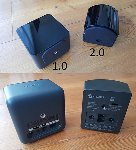
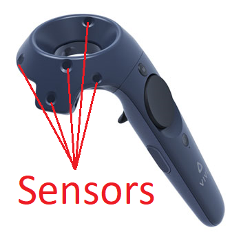
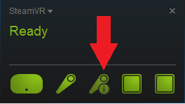

[Support Home](Support_Forum.md)

# Controllers Stop Tracking

## Troubleshooting tips

1. check that each of the lighthouses are on and broadcasting. a lighthouse that is broadcasting will have a green status light on its face, as well as a channel letter in one of its corners. If you have lighthouse 2.0 units then it's just the green status light. *(lighthouse 2.0 has a curved face, where 1.0 has a flat face)*

	
	
2. check to see if there is anything blocking the controller from the lighthouses. This can include the player themselves or other players crowding around each other.

3.  check the play area for reflective surfaces. because of the way lighthouses work, having a mirror or shiny surface often cause unpredictable tracking issues. if you can see yourself reflecting off a surface, its best to get it out of the play area.

4. anything covering the Controller sensors. the dimples on the controller are how it tracks its position, anything covering those will cause tracking problems. 
	
	
	
5. check the controllers status on SteamVR `(While connected to the internet)`. if it requires a firmware update, an **i** icon will display infront of the controller icon. click the icon on the controller and click update firmware. then follow the prompts on screen.

	
	

[Support Home](Support_Forum.md)