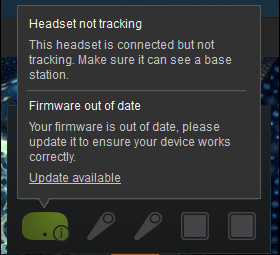

[Support Home](Support_Forum.md)

# Head Mounted Display goes blank

## Troubleshooting Steps

1. Check HMD 3-in-1 cable connection. Most likely a cable has come loose and just needs to be plugged back in. 

2. If you have a link box, check if it is on, and that it is still plugged in. 

3. Check for SteamVR errors by plugging into a helper station or using TightVNC.

	

4. If 1 and 2 do not work you may need to replace either the 3-in-1 cable or the Link box. you shnuld be able to pinpoint which one is causing the issue by swaping 3-in-1 cables or the link box between backpacks and see if the problem moves to the other backpack.

[Support Home](Support_Forum.md)