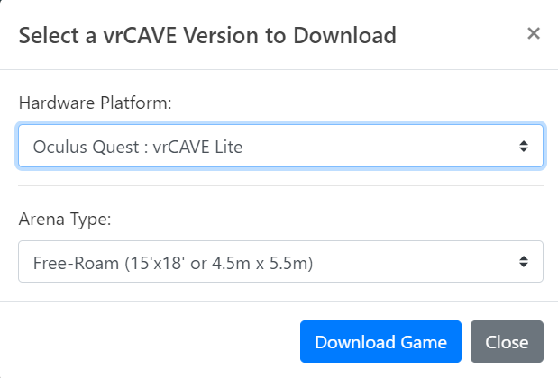
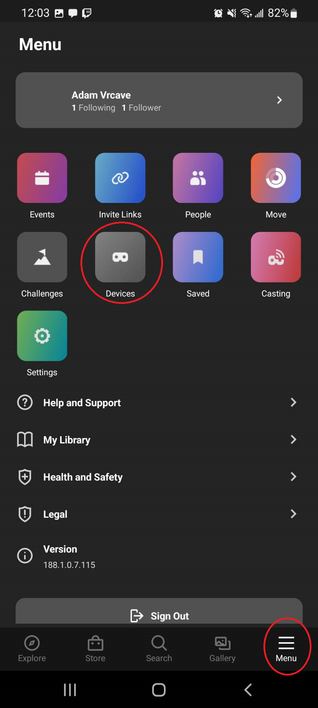
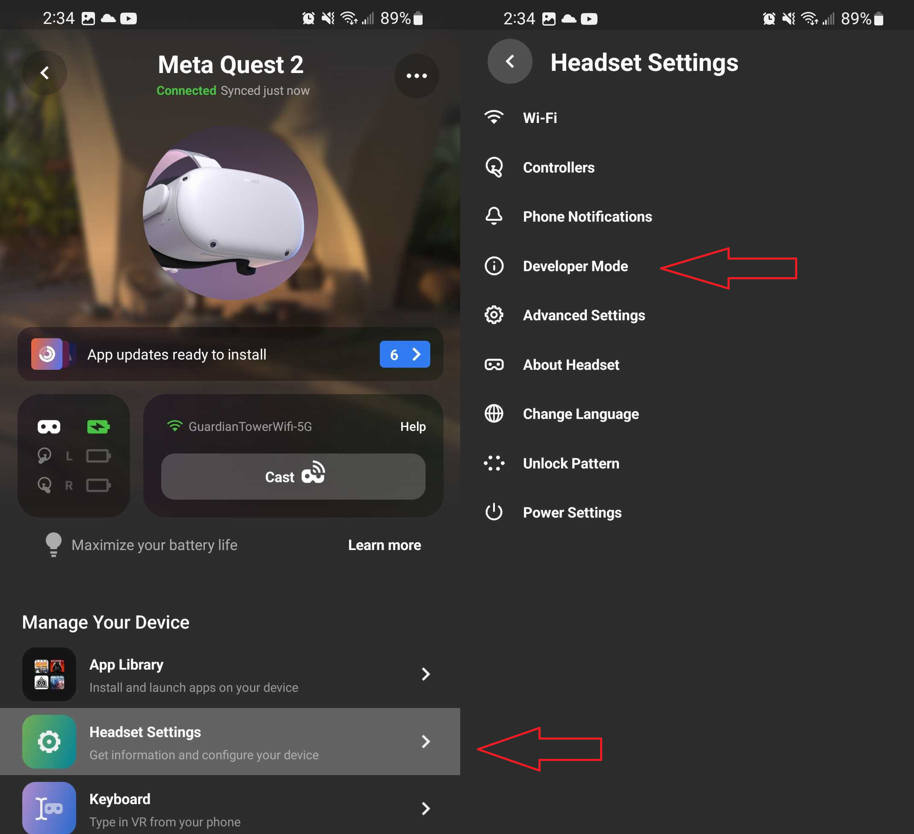
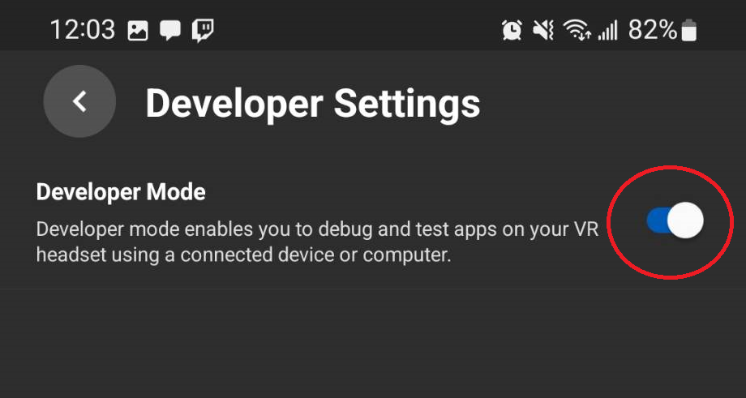
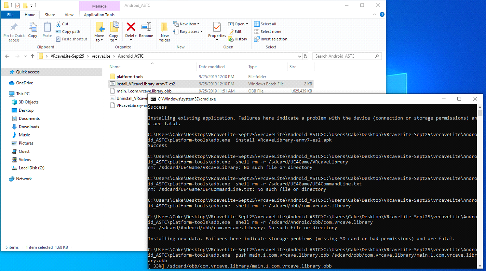
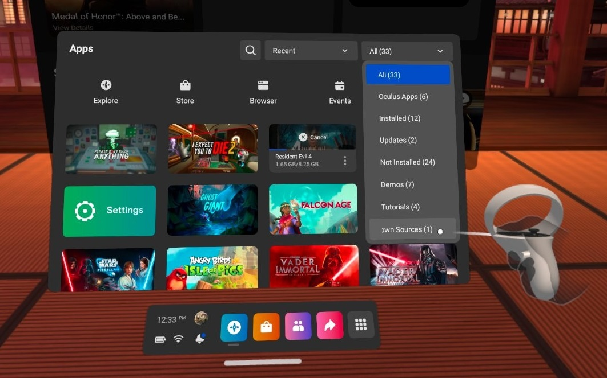
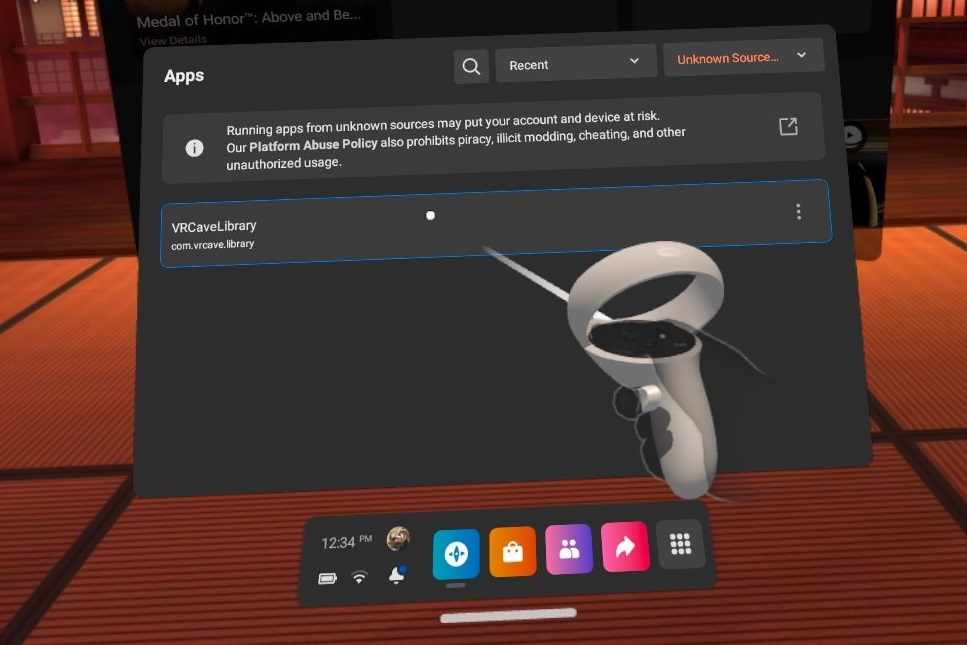

# Quest Setup One-on-One Call
** Internal VRCAVE Document, do not send to customers **

### Identify where they are in the setup
<!--
 First ask where they are in the setup, This can be difficult as the customer may not recognize the terminology we would use. 

*What have you done so far? Have you done the Initial setup for the Quests? * If no, then we will begin at the very beginning.

*Have you created a developer account? * -->

#### Setup Steps in order 
This isn't the only order to do these steps. 

1. [Download VRCaveLite ](QuestSetupSupportGuide#download-vrcavelite)	
2. [Quest 2 initial setup ](QuestSetupSupportGuide#quest-2-initial-setup)
3. [Create a Developer account ](QuestSetupSupportGuide#create-a-developer-account)
4. [Enable Developer mode on each Headset](QuestSetupSupportGuide#activate-developer-mode)
5. [Download and install ADB drivers](QuestSetupSupportGuide#download-and-install-adb-drivers)
6. [Move vrcaveLite folder to the desktop](QuestSetupSupportGuide#move-vrcavelite-folder-to-the-desktop)
7. [Sideload vrcavelite onto the Quest](QuestSetupSupportGuide#sideload-vrcavelite-onto-the-quest)
8. [Start vrcave server and Install Unreal Pre-requisites ](QuestSetupSupportGuide#start-vrcave-server-and-install-unreal-pre-requisites)
9. [Start game in headsets](QuestSetupSupportGuide#start-game-in-headsets)
10. [Verify the headsets join the server](QuestSetupSupportGuide#verify-the-headsets-join-the-server)
	
	
	
# Download VRCaveLite

1. Go to the [Partner Success Portal](https://partnersuccess.vrcave.ca/) 

	

2. Log in using the Login credentials provided by VRCave

3. Find the "Download Latest vrCAVE Version" Button

	
	
4. Select the Download details that best describe your VR Setup

	 

	

# Quest 2 initial setup

1. Turn on the headsets and go through their setup process, the headsets should walk them through everything they need to do. 

2. During this process,  they will need to create a Meta account and use the mobile app to sign in and pair each headset. *This account will be required when creating a developer account later*

3. They will know a headset is finished with initial setup when they are able to browse the Oculus store. 

# Create a Developer account

To be allowed to sideload games onto an Oculus Quest, you will need a developer account which will allow any headset on your account to be set to developer mode. 

1. [Click here and Sign in to the Meta account you used to set up your Oculus Quest headsets.](https://developer.oculus.com/manage/organizations/create/) 

2. Once logged in, you will be prompted to enter an organization name, fill this out however you like, Organization name will not come up again. 

	

3. This is all that needs to be done for your account to allow you to enable Developer Mode on your Quest headsets

# Activate Developer Mode 

1. On the Oculus Phone app, navigate to the menu screen, then the devices screen

	

2. Select the headset from the list, and then touch the **Developer Mode** option in the headset settings section 

	

3. Enable Developer Mode 

	
	

# Download and install ADB drivers

1. [Click Here to download the Oculus ADB Drivers](https://developer.oculus.com/downloads/package/oculus-adb-drivers/)

2. Extract the *oculus-adb-driver-2.0.zip* folder

2. Navigate to the *usb_driver* folder and right click on **android_winusb.inf** file and select **Install**

# Move vrcaveLite folder to the desktop

1. Extract the vrcaveLite folder and make sure vrcaveLite folder is placed on the desktop so the shortcut can find the exe. 

2. If the desktop is being backed up by OneDrive, you will need to add OneDrive to the startup shortcut target path. [Shortcut troubleshooting details can be found here](Shortcut_Troubleshooting.md)

# Sideload vrcaveLite onto the Quest

Make sure your Quest is connected to your Windows PC via USB.

- Download and extract the `vrCAVELite-<version>.zip` from the provided link. Navigate into the **vrcaveLite\Android_ASTC\** folder and double-click on **Install_VRcaveLibrary-arm64.bat**. 

- The first time you sideload the software, you will need to put the headset on while plugged into the Windows PC Via USB and sellect **Allow** On the popup that appears. The popup should appear every time you connect via USB, but only needs to be allowed the first time. 

	

- It should take 2-3 minutes - if the install completes successfully, the window will close with no further feedback. Restart the Oculus Quest headset. 

# Start vrcave server and Install Unreal Pre-requisites 

- This step should be very simple. Just double click the startup shortcut and follow the prompts to download and install the Unreal Engine pre-requisites

- If the link cannot find the vrcavelibrary.exe, check to see if the folder structure is correct. by clicking into the vrcaveLite folder, and then clicking the address bar on the windows explorer window. 
 The file path after the current user name should be /Desktop/vrcaveLite 
 
 If one drive is present, you will need to add OneDrive to the start server shortcut. 
 
 [Detail instructions on how to do that can be found here](Shortcut_Troubleshooting.md)

# Start game in headsets

In VR, from the main menu bar at the bottom of the screen, click on the **Navigate** tab, then the **Library** button. In the Library window, click on the **Unknown Sources** category on the left-hand panel. (If you don’t see **Unknown Sources**, you’ll need to reboot your headset - hold the power button on the right side of the headset for 3 seconds, then, in VR, click on the **Restart** button.)

In the **Unknown Sources** category, click on **VRcaveLibrary** to launch it.
	
	
	

# Verify the headsets join the server

This is done simply by launching the vrcaveLite server and launching the game in the headsets. 

Wait a few seconds, if the network has been properly set up, the players should join and show up in the player list on the upper righthand corner. If they do not show up, there are a few things you can troubleshoot 

1. Verify the headsets are on the correct Wifi network

2. Verify the server computer is on the same network (either by Lan cable or wifi)

3. Verify the server computer has only one active network. open a cmd window and type the command *ipconfig* All but one of the listed adapters should be "disconnected" and one adapter, preferably the ethernet adapter, has IP addresses listed

4. Check the customer PC for additional firewalls beyond Windows Defender. If they have another firewall like Norton or Mcafee, add a firewall exception for vrcaveLite.exe 

