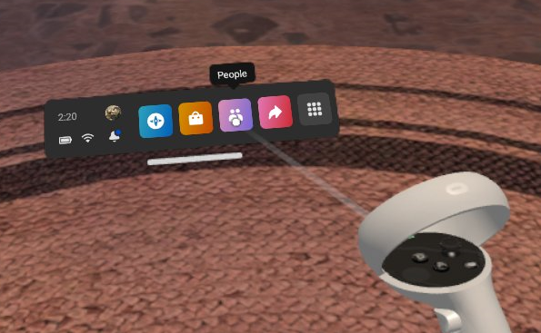
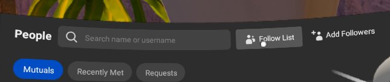
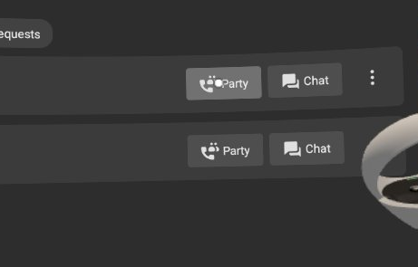
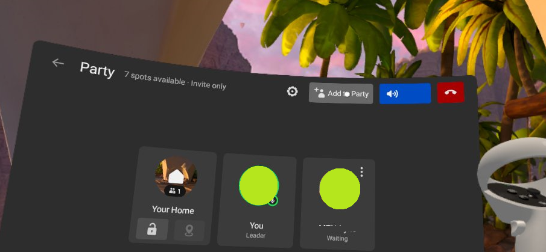

## Creating a Party for Voice Chat

- Click on the *People* Button and then click on the *Follow List* to bring up the Meta accounts. 

	 

	
	
- If you haven't added the other meta accounts to your follow list, go to *Add Followers*  and find the other meta accounts by name. 

- Select Party next to the first name to start a party with that headset.

- Once that party has started, click on *Invite to Party* to add the rest of the headsets to the voice chat. 

- The other headsets will receive a notification to join the party, Accept the invite and they should be able to voice chat now.

