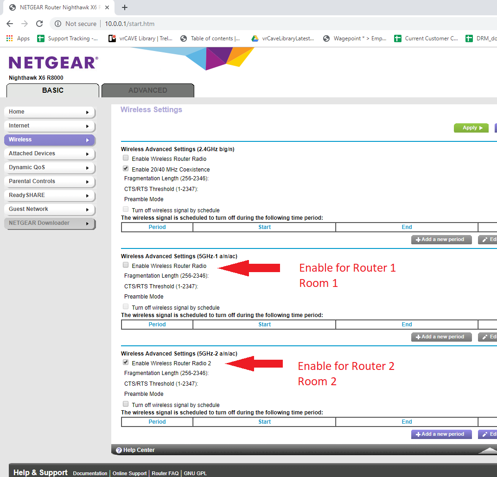

# Setting Up a Second VR Escape Room

1. It is possible to have more than one VR escape room setup, but it does require some setup that is not a part of establishing your first room. 

2. Lets begin by assuming you have already set up Room 1, Room 2 should be set up the same way, except for the router. 

### First Room

3. for Room 1, Using the vrCAVE server computer, open a web-browser and type in <http://192.168.1.1> to go to the router administration page. 
**Note:** If the page does not open (possibly because you are using a different router) you need to find your specific Default Gateway: <https://www.noip.com/support/knowledgebase/finding-your-default-gateway/>   

4. If prompted for the user name and password, the default is User name: admin, Password: password unless you have changed it in the past, or are using a different router model than the Nighthawk X6 R8000.

5. In the Basic tab, select Wireless, make sure **only one** of the wireless router radio is selected. for this room, Enable 5GHz-1 

	
	
6. **Click Apply**

7. Make sure your server and backpack computers connect to *NETGEAR71-5g-1*

### Second Room

7. for Room 2, Using the vrCAVE server computer that is **connected to the second router,** open a web-browser and type in <http://192.168.1.1> to go to the router administration page. 
**Note:** If the page does not open (possibly because you are using a different router) you need to find your specific Default Gateway: <https://www.noip.com/support/knowledgebase/finding-your-default-gateway/>   

8. If prompted for the user name and password, the default is User name: admin, Password: password unless you have changed it in the past, or are using a different router model than the Nighthawk X6 R8000.

9. In the Basic tab, select Wireless, make sure **only one** of the wireless router radio is selected. for this room, Enable 5GHz-2 

	

10. **Click Apply**

7. Make sure your server and backpack computers connect to *NETGEAR71-5g-2*