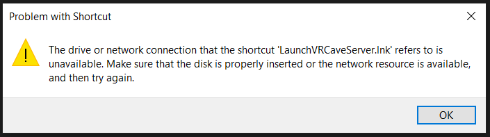
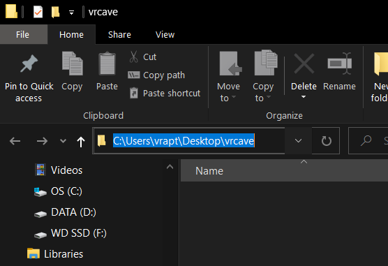

# Shortcut Troubleshooting

- If you have encountered this error message after trying to launch the vrcave library, this page will provide possible solutions:

 

## Troubleshooting tips

1. The most common cause of this is the **vrcave** folder or the **vrcavelite** is not on the desktop, after you extract the vrcavelibrary zip file, you need to move the vrcave folder onto the desktop so that your path looks something similar to this:

 
 

2. If you have a folder path that contains OneDrive before Desktop, there are 2 solutions to this. 

	- Remove OneDrive from you computer. We have no way of doing this ourselve so we cannot walk you through the process. but if your desktop is no longer being backed up by OneDrive, it should return to normal.
	
	- Add OneDrive to your vrcave shortcuts, right click on the shortcut you are using and choose properties, add **\OneDrive** to the *Target path* and *Start in* line between userprofile and Desktop as shown below
	

 
 
 
	
