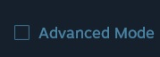

# SteamVR Room Setup

*HTC has created a very good step-by-step process for running room calibration.  SteamVR may give a warning about the lighthouses being too far apart, this is just a warning and it can be safely ignored.  We have added additional instructions to help optimize the installation as the tracking volume is larger than recommended.*

***Note:**  You will only setup a single pair of lighthouses*

1. Find SteamVR, and click on the top bar with **STEAMVR versionNumber**, and click room setup.

    The following page specific modifications need to be made:

    - *Choose Room-Scale*

    - Locate your monitor: Place the controller on the ground in the center of the room and orientate it so that the head of the controller points at one of the long walls.

    - Locate the floor: Place the controllers upside-down as far apart as possible within the room bounds.  If nothing happens when you click [CALIBRATE FLOOR], bring the controller in a little bit closer and try again.

    - Trace your space: Click on the [Advanced Mode] check box on the right side of the tutorial window.

        

        You will then bring the controller to each of the corners of room that you had previously marked, and pull the trigger. \*\*\*Be sure that the controller has direct line of sight to both lighthouses when in the corner, try to orientate yourself so that you will not be blocking line of sight to the lighthouses\*\*\*

    - Set your play area: Once all four corners have been marked, and light blue rectangular outline has been drawn, click the [EDIT] button located in the bottom right of the tutorial window.

    - You will now need to adjust the green square so that it is as close to the center as possible.  Click-Dragging will allow you to move the green box, while tugging on the corners will allow you to adjust the rotation.  Be sure the white middle arrow is pointing towards a long wall.

        

    - Click [NEXT], room calibration is now completed.

