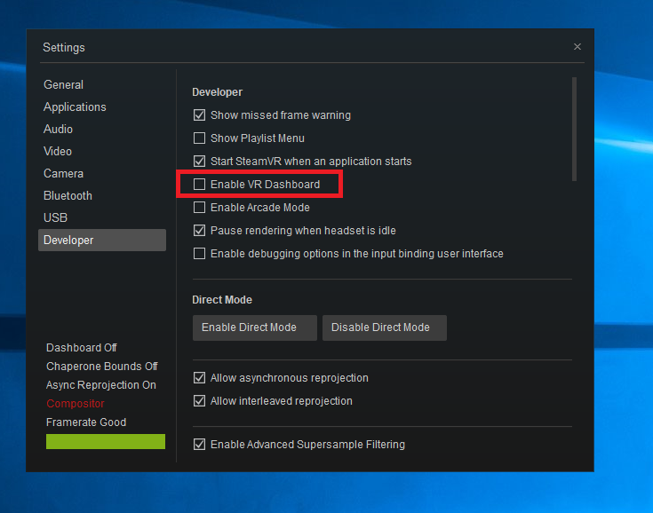

# Support Forum

 - If your issue is not addressed below, please contact our support team at support(at)vrcave.ca 

## Common Issues 

  - [Head Mounted Display Goes Blank](HMD_blank.md)

  - [Controllers Stop Tracking](Controller_Tracking.md)

  - [Players Not Connecting at All](Players_Not_Connecting.md)
  
  - [Players Not Connecting at All (Quest)](Players_Not_Connecting_Quest.md)

  - [Player Tracking is Not Reliable](Player_tracking.md)
	
 

# Error Messages

## SteamVR Compositor Error

- Most common cause is the USB cable that is part of the 3-in-1 cable is not connected or damaged, securing it or replacing it should do the trick

## Headset Not Detected

- Similar to the compositor error, part of the 3-in-1 cable is not connected or damaged. Just unplugging and plugging back it might work, otherwise the cable may need to be replaced.

# Quick Fixes

## Players Suddenly Disconnect

- The most common occurance of this is version missmatch, the server computer and client are running different versions of the game. Deleting the vrcave folder on the backpack and replacing it with a copy of the server computer vrcave folder should resolve it.

## Backpack Not Shutting Down

- If the backpack does not shut down when you press the power button, plug it into a helper station to diagnose the problem.
   - **Steam VR not closing:** if not properly set up, steam vr will halt shutdown because it is running the vrcave library. If you go into the vrcave folder and follow the path vrcave->utilities and run the `AutoEndTasksOnShutdown.reg` this will force steam and the vrcave library to close when shutting down.
   - **Windows Update:** Its best to let the update finish. If you are in a hurry, pulling the batteries will force a shutdown and it should start up again *without too many problems.* do not forget to let it complete that update later or this will keep happening. 
	
## Players Start On The Ground

- Your Lighhouses are not on or on standby mode. Try unplugging the power and plugging it back in. If they do not turn on, you may have to replace them

## Steam Menu Pops up

- To disable this, you must go into steamVR menu on the backpack and select settings, then select the Developer Section and **Uncheck** VR Dashboard 

	
