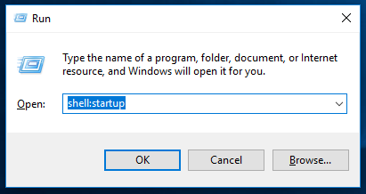

# Initial Setup

*This Guide is still a work in progress.*

*(Assumes a space of 4.5Mx5.5M (approx. 15’x18’) or greater.)*

## General Order

1. Setup Server Computer
2. Wifi 6e Router Setup
3. VR PC Setup for each Vive Focus 3
4. VIVE Focus 3 Setup for each PC
5. Installing the vrCAVE game


----

## Server Computer Setup

*The server computer comes pre-installed with Windows 10 and little else.
The purpose of the server computer is to supervise and run the vrCAVE Library game.  This computer hosts the game, and is used by your game operator to start the game.  When you want to load a new game, add hints, skip puzzles, etc, this is the computer that is used.*

1. The very first time you set up the computer, Windows will take you through a one-time setup of language, region, and other settings.  Follow the on screen prompts until the setup tutorial is complete. You may need to connect this server computer to the internet through your own WiFi to complete some Windows 10 setup steps.

2. Download or USB transfer the **vrcaveVersion1.X.zip** file as well as the setup script, e.g. **Setup - Your Company Name.bat** onto the desktop; the links to these files should have been provided to you by vrCAVE. 

3. Once on the desktop, unzip **vrcaveVersion1.X.zip** so that the folder **vrcave** is sitting on your desktop, the shortcut **“LaunchVRCaveServer”** should be placed next to it on your desktop too.  

    

<!--5. Double-click the setup script; e.g. **Setup - Your Company Name.bat**

    

6. You should receive a message stating "Updated license information successfully"

    

7. You can launch the vrCAVE Library Server by double-clicking on the **“LaunchVRCaveServer”** shortcut. Note that the first time you launch, it may need to perform some additional installations. Also, ensure that Windows Update has installed the latest video drivers (you can search for updates through Windows Update to make sure this happens). Windows Firewall will also likely ask if you want to give permission for the application to use the network; make sure you click **Allow**.

8. If you see the error below, [you can troubleshoot the issue here](Shortcut_Troubleshooting.md)

	 -->

*** *At this point, the server is ready and waiting for the client PCs. However, you need to perform the router setup and restart everything before the client PCs will be able to connect.*

----

## Router Setup

*The server computer communicates game data to the client PCs, this is done by setting up a local network with this router for the server computer and backpacks to all be on. Leaving the Server connected to the internet will allow automatic license updates*

*This Router will also be communicating the vive focus 3 data between the headset and the client PCs. For this to be reasonably low latency, the router needs to be Wifi 6e.*

1. Connection: Make sure your router is plugged in and powered on. Use its provided ethernet cable to connect the server computer to LAN port 1 on the back of the router (do **NOT** plug it into the port titled "INTERNET''). **This may differ based on the router, normally there is 1 'in' port, and multiple 'out' ports. internet should go to the 'in' port, and each PC should be connected to 'out'

2. Put the server computer in airplane mode so that it doesn’t have a chance to connect to other networks, and is only connected to the router.

----

## VR PC Initial Setup

*The PC should come pre-installed with Windows 10 and little else.*
*The VR PC (with connected VIVE Focus 3) is for each player to run their own version of the game which is supervised by the server computer.*

1. The very first time you set up the computer, Windows will take you through a one-time setup of language, region, and other settings.  Follow the on screen prompts until the setup tutorial is complete.

2. Once you have completed the Windows 10 setup you will need to connect to the internet to download and install Steam.  Using a web browser on the PC, navigate to <http://store.steampowered.com/about/> and left-click on **"Install Steam Now"** to download the installer for Steam.

    

3. Once downloaded, double-click on the executable to begin installing.  A creation of a new Steam account (or use of a pre-existing one) will be required. Creating steam accounts is free, but write down your username and password so as to not lose them.

4. Once steam is installed, you need to install SteamVR to actually use your HTC Vive Focus 3 VR Headsets. Open Steam, and look under **Library->Tools->SteamVR**. Right-click on SteamVR and tell Steam to install it (this may take some time to complete).

    

5. When SteamVR is finished you will want to disable SteamVR dashboard, the dashboard can block players view if they accidentally open it. Go to steamVR->Settings->General, click SHOW under Advanced Settings and turn off SteamVR Home and Motion Smoothing. Go to Dashboard tab Set VR Dashboard on System Button to Off.

	
	
	

6. While in the steamVR settings, it is a good idea to go to the Startup/Shutdown settings and set the "Turn off controllers after" option to something higher than 5 minutes. 

	
	
7. Next we need to install Vive Business Streaming so the PC can connect wirelessly to the Vive Focus 3. Go to <https://www.vive.com/ca/support/vbs/category_howto/preparing-your-computer-for-streaming.html> and follow the instructions to download and install VBS.


8. After everything is installed, it is also a good idea to make sure that all important windows updates have been installed as well. In particular, ensure that the latest video drivers are installed on the PCs (if running Windows 10, this will eventually be done through an automatic windows update (restart required) whilst connected to the internet).


9. For consistency all backpacks should have their volume set for 75.

    


----

## Vive Focus 3 Setup

1. Follow the installation instructions that came with the VIVE Focus 3 <!--(a more in-depth guide can be found here: <https://support.steampowered.com/kb_article.php?ref=2001-UXCM-4439> ).-->

2. Draw a boundary that encompases your 15' x 18' (4.5m x 5.5m) play area entirely. Be sure that the corners of the room are at least a few inches inside the boundary as it will make calibration difficult if it isn't. 

3. When you choose your 'forward direction' it is a good idea to make that consistent with all headsets.

4. Once the headset is in the vive menu virtual environment, navigate to **Library** and choose Vive Business Streaming. It should already be included in your pre-installed apps. Select the PC you want to connect to. you can verify the IP address from the VBS window on the PC. 

----

## Installing vrCAVE Library on Client PC

1. Download or USB transfer the **vrcaveVersion1.X.zip** folder onto the desktop, this link should have been provided to you by vrCAVE staff.

2. Once on on the desktop, unzip the folder the same way you did for the Server so that the **vrcave** folder sits on the desktop.

3. Open the vrcave folder and navigate to the utilities folder. copy the **launchVRCaveClient** shortcut to the desktop. 

4. Double click **launchVRCaveClient** to start the game.


<!--
3. Left-click the Windows icon in the bottom-left of you screen and type in **‘run’**, select the Run application on the top of the list

     

4. Type in **‘shell:startup’** in the Run Window, and hit enter.  This should cause the startup folder window to open.

     

5. On the desktop, open the folder “vrcave”, then open utilities.  Inside you you will find a .bat file labelled **VRCaveClientLaunchHelper.bat** click and drag this to the startup folder you opened on the previous step. This will cause the game to run as soon as the VR backpack is booted up.

     

6. In order for the game to find the server computer, make sure that the VR backpack automatically connects to the WiFi network of the Nighthawk X6 router that the computer is plugged into. By default, the Nighthawk X6 router broadcasts 3 different WiFi networks. The VR backpacks should connect to the one that ends in “...-5G-2”. It’s full name will be something like <b>NETGEAR</b>22<b>-5G-2</b> by default.

7. At this point, you should be able to test if the setup so far has been success: Ensure both the backpack and server computer are on the same network, double-click **“LaunchVRCaveServer”** on the server computer, and then double-click **“VRCaveClientLaunchHelper.bat”** on the backpack you have connected.  Within a couple seconds you should see the number of connected players on the server computer now states "1". -->

4. Repeat steps 1. to 3. for each PC.

## In Game Calibration

- To make sure that each player is where they are supposed to be in game, you will need to perform a calibration on each headset, you can start the calibration from the server by clicking on the gear next to the player name and then clicking the crosshairs that appear when the gear is clicked. 

	
	
-  In the selected headset, you will see the calibration window pop up and a red ball attached to the left hand. 

	
	
- You will need to touch the controller to all 4 corners of the room like the diagram below, It helps to mark out the corners with numbers so the first corner can be quickly identified when calibration needs to be done. You must place the markers in the corners on the floor of your real world space as the calibration also sets the games floor height. You will need to keep the headset on, while also looking out from under the headset to see where you are going. 


	
	
	
- When you are done, point the laser pointer on the right hand at the Confirm Calibration button, the play area should visibly shift into position, you can test the calibration by performing a "high five" with another player who is calibrated in the game, you will know the calibration worked if the controllers clack against each other when your hands are close to each other. If the hands connect in game but miss In real life (or using the professional VR Developers term: "Meat Space") then the calibration was not successful and one or both of the players needs to calibrate again. 


----
## Optional

### Setting up each backup to have a name and designated color

- Launch the server. See the [Operations Guide](operations_guide.md) for instructions if needed. Connect the backpack to the game. A name should pop up in the top right corner with a color. Click on the color palette to cycle it through the available 7 colors. Clicking on the name will let you update it to whatever you want. When the backpack joins next time, it will remember its color and name.

     


### Changing the number of given hints and default time limit

- Navigate to the vrcave library config folder by following this path: **vrcave\WindowsNoEditor\VRcaveLibrary\Saved\Config\WindowsNoEditor\Game.ini**

- Open **Game.ini** with notepad and add these lines:

```
[/Game/Maps/DragonTower/DragonTower_GameState.DragonTower_GameState_C] 
defaultMaxGameTime=2100 
defaultMaxHints=2

[/Game/Maps/Manor/Manor_GameState.Manor_GameState_C]
defaultMaxGameTime=2100
defaultMaxHints=2

[/Game/Maps/SST/SST_GameState.SST_GameState_C]
defaultMaxGameTime=2100
defaultMaxHints=2

[/Game/Maps/TimeTravel/TimeTravel_GameState.TimeTravel_GameState_C]
defaultMaxGameTime=2700
defaultMaxHints=2

[/Game/Maps/underwater/USA_GameState.USA_GameState_C]
defaultMaxGameTime=2100
defaultMaxHints=2

[/Game/Maps/Pirate/Pirate_GameState.Pirate_GameState_C]
defaultMaxGameTime=2700
defaultMaxHints=2  

[/Game/Maps/LaserBlocks/LaserBlocks_GameState.LaserBlocks_GameState_C]
defaultMaxGameTime=600
defaultMaxHints=2  
```

- defaultMaxGameTime is measured in seconds, so 2100 seconds is 35 minutes.  


----
