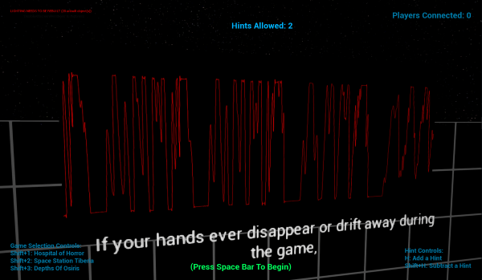

# Automatic Introduction Configuration

## Getting Started

The VRCave library allows for the individual customization of the introductory videos that play before escape experiences.

This guide will walk you through how you can change either the:
1. General Virtual Reality Explanation
2. Automatic Hint System introduction
3. Each available experience's narrative introduction

----

## Configurable Automatic Introduction Sequence Options

**MediaPath** - Allows for retargeting the video's source file.

**MediaVolume** - Allows for video volume adjustment.

**Picture Box Options**

- Picture boxes are displays that can show an image during a sequence.

- Each Picture box configurable option affects each individual picture box in a sequence so the first picture box will use the first 'PicturePaths', the first PicBoxStartTimes', etc.

- *PicturePaths* - The file path to a folder containing a picture used in a picture box.
- *PicBoxStartTimes* - The time during the video where the picture box should start.
- *PicBoxLifeSpans* - How long the picture box should persist before disappearing.
- *PicBoxPos* - Where the picture box should appear in relation to the video screen.

4: Top Left   9 : Left Center   7 : Bottom Left | 2: Top Center   1 : Center   5 : Bottom Center| 3 : Top Right   8 : Right Center   6 : Bottom Right

- *PicBoxScales* - The 3 dimensional scale of the picture box.

**UseLevelColours** - Only affects non narrative introduction sequences, links the VR and Hint introduction sequence's level's waveform and background colour to the colour used by the level's narrative introduction sequence.

**WaveFormColour** - RGB values to set the video waveform colour for this sequence.

 

**BackGroundColour** - RGB values to set the video background colour for this sequence.

**SubtitleTextParsed** - The text to display during video playback as subtitles.

- Separate subtitle sections by `/s#}` replacing `#` with the seconds into the video that this subtitle should start at, use the `}` to split the subtitle from any text that comes after it.

----

## Customizing the Virtual Reality Introduction

This section is a step by step guide on how one could completely customize the virtual reality explanation.
This can easily be applied to any of the other Automatic Introduction Sequences.

1. Start by creating a audio file that will be used as the sequence video.

2. Convert this audio file to a wmv video file. 
    - If making a waveform video then make sure it is on a black background with white waveforms.
        - An easy way to make waveform videos from an audio file is the software: ffmpeg.
        - The command: './ffmpeg -i ./newSSTIntro.wav -filter_complex "[0:a]showwaves=s=1280x720:mode=p2p:colors=white,format=yuv420p[v]" -map "[v]" -map 0:a -c:v libx264 -c:a copy SSTNarrative.mkv' will convert an input wav to a output mkv video which can then be converted to wmv with some movie maker software.

        

    - Non waveform videos will need to have their background and waveform colours set to black (0,0,0) to avoid any tints.

3. In the Engine.ini in the VrCaveLibrary/Saved/Config/WindowsNoEditor folder put the following line in at the bottom:
    - [/Game/Maps/AutoIntroAssets/VrExplanationConfig_BP.VrExplanationConfig_BP_C]
    - This line dictates that the following lines will be customizing the Virtual Reality Explanation.

     

4. Place the wmv file in the VRcaveLibrary/Content/Movies folder and set up the path to it with the following line, replacing the name of the file as needed.
    - MediaPath=./Movies/VrExplanation.wmv

    

5. Adjust the media's playback volume with the following on the next line, default videos use 0.025 typically.
    - MediaVolume=0.025

6. Set up the subtitles for the video with the following line, refer to 'Configurable Automatic Introduction Sequence Options' for details on how to format the subtitle text block.
    - SubtitleTextParsed="Subtitles Go Here"

7. Set up the waveform colours for the video with 'WaveFormColour=(X=0.000000,Y=1.000000,Z=0.000000)' XYZ==RGB, changing the values as desired.

8. Set up the background colours for the video with 'BackGroundColour=(X=0.000000,Y=0.000000,Z=0.000000)' XYZ==RGB, changing the values as desired.

9. Set the video to override the colours set here and instead match the colours of the level it is being used in with 'UseLevelColours=True'.

10. Next set up some picture boxes to help illustrate things.

    

11. Place a picture in it's own folder in 'VRcaveLibrary/Content/Movies/PictureBoxImages/' and set up a path to it like this 'PicturePaths=./Movies/PictureBoxImages/VRControllerTrigger/', only one picture should be placed in the folder.

    

12. Next set when the picture box should appear during the sequence, you can have multiple picture boxes that start or are visible at the same time, they should just be in different positions. 'PicBoxStartTimes=3'.

13. Next set how long this picture box should appear for, 'PicBoxLifeSpans=10'.

14. Next set where the picture box should appear in regards to the video which it will appear in front of, 'PicBoxPos=1', refer to 'Configurable Automatic Introduction Sequence Options' for details on how to format the subtitle text block.

    

15. Next set the 3 Dimensional scale of the picture box, 'PicBoxScales=(X=4.000000,Y=4.000000,Z=1.000000)'.

16. Repeat steps 11 - 15 for as many picture boxes as needed.

----

## Default Configurations

----

Default Virtual Reality Explanation:

[/Game/Maps/AutoIntroAssets/VrExplanationConfig_BP.VrExplanationConfig_BP_C] 
MediaPath=./Movies/VrExplanation.wmv 
MediaVolume=0.025 
PicturePaths=./Movies/PictureBoxImages/VRControllerTrigger/ 
PicturePaths=./Movies/PictureBoxImages/VRControllerTop/ 
PicturePaths=./Movies/PictureBoxImages/VRLobbyTrackingFade/ 
PicturePaths=./Movies/PictureBoxImages/VRLobbyChaperone/ 
PicBoxStartTimes=3 
PicBoxStartTimes=3 
PicBoxStartTimes=24 
PicBoxStartTimes=40 
PicBoxLifeSpans=10 
PicBoxLifeSpans=10 
PicBoxLifeSpans=8 
PicBoxLifeSpans=9 
PicBoxPos=1 
PicBoxPos=2 
PicBoxPos=1 
PicBoxPos=1 
PicBoxScales=(X=4.000000,Y=4.000000,Z=1.000000) 
PicBoxScales=(X=2.000000,Y=2.000000,Z=1.000000) 
PicBoxScales=(X=4.000000,Y=4.000000,Z=1.000000) 
PicBoxScales=(X=5.000000,Y=5.000000,Z=1.000000) 
UseLevelColours=True 
WaveFormColour=(X=0.000000,Y=1.000000,Z=0.000000) 
BackGroundColour=(X=0.000000,Y=0.000000,Z=0.000000) 
SubtitleTextParsed="Welcome to VR!/s0} For this experience, the only controls you need worry about, are the triggers you use with your index fingers;/s3} these open and close your virtual hands and are used to grab objects./s8}If your hands ever disappear or drift away during the game,/s13} this means that someone is blocking the controllers and waving them lightly above your head should bring them back./s17}Similarly, if your headset display goes white-grey,/s24} then this means that someone is standing too close to you and you will need to spread out a bit more./s28}Everyone, notice the virtual walls around you,/s32} please don’t reach through or over these virtual railings,/s37}there are physical walls on the other side and they will hurt if you walk into them,/s40} a thin red line will appear to warn you when you get too close./s45}Finally, no running, no jumping and please be sure to give each other lots of space./s49}Now everyone, prepare for your mission.../s55" 

----

Default Hint Explanation:

[/Game/Maps/AutoIntroAssets/HintExplanationConfig_BP.HintExplanationConfig_BP_C] 
MediaPath=./Movies/HintExplanation.wmv 
MediaVolume=0.025 
PicturePaths=./Movies/PictureBoxImages/HintIdle/ 
PicturePaths=./Movies/PictureBoxImages/HintActivating/ 
PicturePaths=./Movies/PictureBoxImages/HintCooldown/ 
PicBoxStartTimes=7 
PicBoxStartTimes=16 
PicBoxStartTimes=24 
PicBoxLifeSpans=9 
PicBoxLifeSpans=8 
PicBoxLifeSpans=8 
PicBoxPos=1 
PicBoxPos=1 
PicBoxPos=1 
PicBoxScales=(X=5.000000,Y=5.000000,Z=1.000000) 
PicBoxScales=(X=5.000000,Y=5.000000,Z=1.000000) 
PicBoxScales=(X=5.000000,Y=5.000000,Z=1.000000) 
UseLevelColours=True 
WaveFormColour=(X=0.000000,Y=1.000000,Z=0.000000) 
BackGroundColour=(X=0.000000,Y=0.000000,Z=0.000000) 
SubtitleTextParsed="One key feature we would like to make special mention of is the in-game hint system./s0}Represented by a hand print, the hint station is located in a different spot in every level./s7}If ever you and your team are stuck on a puzzle, any team member can request a hint/s14}simply by holding their controller on the hand icon for 7 seconds./s19}There is a 5 minute cooldown between hints./s24}Be sure to confirm with the rest of your team prior to requesting a hint/s28}as you have a limited number of hints per play through./s32" 

----

Default Space Station Tiberia Narrative Introduction:

[/Game/Maps/AutoIntroAssets/SSTIntroConfig_BP.SSTIntroConfig_BP_C] 
MediaPath=./Movies/SSTNarrative.wmv 
MediaVolume=0.08 
PicturePaths=./Movies/PictureBoxImages/SSTExteriorCrane/ 
PicturePaths=./Movies/PictureBoxImages/SSTMeteor/ 
PicturePaths=./Movies/PictureBoxImages/SSTExteriorHigh/ 
PicturePaths=./Movies/PictureBoxImages/SSTObservation/ 
PicturePaths=./Movies/PictureBoxImages/SSTExterior/ 
PicBoxStartTimes=4 
PicBoxStartTimes=11 
PicBoxStartTimes=23 
PicBoxStartTimes=30 
PicBoxStartTimes=39 
PicBoxLifeSpans=7 
PicBoxLifeSpans=12 
PicBoxLifeSpans=7 
PicBoxLifeSpans=9 
PicBoxLifeSpans=6 
PicBoxPos=1 
PicBoxPos=1 
PicBoxPos=1 
PicBoxPos=1 
PicBoxPos=1 
PicBoxScales=(X=7.500000,Y=5.000000,Z=1.000000) 
PicBoxScales=(X=7.500000,Y=5.000000,Z=1.000000) 
PicBoxScales=(X=7.500000,Y=5.000000,Z=1.000000) 
PicBoxScales=(X=7.500000,Y=5.000000,Z=1.000000) 
PicBoxScales=(X=7.500000,Y=5.000000,Z=1.000000) 
WaveFormColour=(X=0.000000,Y=0.874015,Z=1.000000) 
BackGroundColour=(X=0.000000,Y=0.000000,Z=0.000000) 
SubtitleTextParsed="Astronauts, do you copy? This is mission control. Prepare to dock with Earth-Meteor Defense Platform Tiberia./s0}Time is of the essence so let’s review the mission parameters./s7}The largest meteor humanity has ever encountered is enroute to Earth./s11}In a matter of minutes it will impact the station, shortly after that it will end life as we know it./s16}Platform Tiberia holds a Anti-Meteor Laser Array. Tiberia, however, was recently crippled by a devastating radiation storm. /s23}You must restore functionality to the station immediately./s30}After docking, restore the critical internal systems before proceeding to the station exterior in order to repair the Anti-Meteor Laser Array./s34}You’re moving out of communications range./s43}Remember, astronauts, humanity is counting on you./s46} Good luck, and godspeed.../s49" 

----

Default Depths of Osiris Narrative Introduction:

[/Game/Maps/AutoIntroAssets/DepthsIntroConfig_BP.DepthsIntroConfig_BP_C] 
MediaPath=./Movies/OsirisNarrative.wmv 
MediaVolume=0.025 
PicturePaths=./Movies/PictureBoxImages/OsirisTemple/ 
PicturePaths=./Movies/PictureBoxImages/OsirisCrown/ 
PicBoxStartTimes=10 
PicBoxStartTimes=18 
PicBoxLifeSpans=8 
PicBoxLifeSpans=13 
PicBoxPos=1 
PicBoxPos=1 
PicBoxScales=(X=7.500000,Y=5.000000,Z=1.000000) 
PicBoxScales=(X=5.000000,Y=5.000000,Z=1.000000) 
WaveFormColour=(X=0.000000,Y=1.000000,Z=0.000000) 
BackGroundColour=(X=0.000000,Y=0.000000,Z=0.000000) 
SubtitleTextParsed="Welcome to deep-sea platform Oceanus 5./s0}Our team of deep sea archaeologists have been stumped for months/s6} after discovering the lost temple of Osiris./s10}This is why we have called in you and your team of specialists to help us gain access to the temple./s13}Records point to the ancient Crown of Osiris being located inside this temple./s18}This is your primary objective aquanauts, find your way into the temple and retrieve the Crown of Osiris./s25}You will have a limited oxygen supply for this mission,/s31} the gauge on your right wrist will let you know how much time you have left./s35}If you need help during your expedition you can contact the surface support vessel twice./s39}Good luck aquanauts and godspeed.../s44" 

