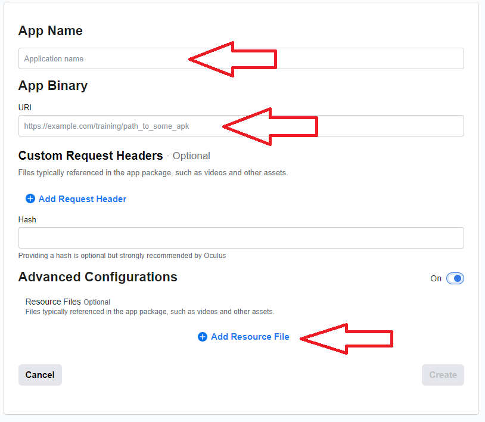
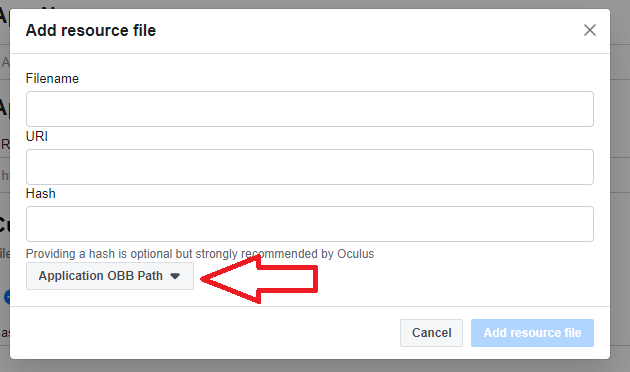
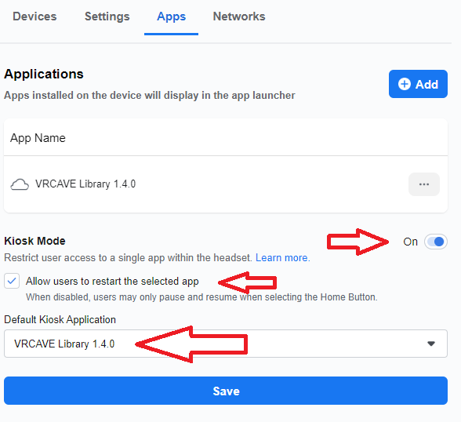

# vrCAVE Business Edition
This setup guide is to help new owners of the Oculus Quest Enteprise Edition. If you already have one setup, skip to step 4

If you have purchased a Oculus Quest Business Edition, you would have recieved and email with steps to setup, this guide will include those steps and links in case you do not have them.

## 1.	Create a Workplace Profile

If you do not already have a Workplace profile, you will need to [create one](https://work.workplace.com/work/email/?invite_id=4091762844232296&nonce=3XvN4Ti9). Oculus for Business is powered by Workplace.

## 2.	Confirm Your Order

[Connect](https://workplace.workplace.com/device_management/create/?invite_id=2514206348801897) Workplace to Oculus for Business. Then you will be able to confirm your order.

## 3.	Configure Your Headsets With the Setup App

Open this page on an *Android phone* and tap [here](https://www.oculus.com/download_app/?id=2293756633999712) to install the Device Setup App. Accept all security permissions to complete the app installation process.
If you cannot open this page on an Adroid phone, copy the link address above, and send it to the phone through email or other messaging system. 

## 4.	Manage Your Headsets in Device Manager

Once device setup is complete, go to [Device Manager](https://workplace.workplace.com/device_management/devices/) on your desktop to add apps and configure Wi-Fi networks. Wi-Fi networks can also be adjusted within the headset.

## 5.	Create VRCAVE Library App

On the Device Manager, click on **Apps** at the top to go to the App Library. then click **+ Add App**

 - Name the App whatever you want, this is for Device managers purposes, the app name in the headset is set by us. 
 - under *App Binary*, paste this link: 
 - Turn on *Advanced Configurations* , and then click **+ Add Resource File**
 
 
 
 
 
- Name the Filename: main.1.com.vrcave.library.obb
- Under URI paste this link: 
- make sure the dropdown is on "Application OBB Path"
- Click the **Add resource file** button

 - Click the **Create** button
 
## 6.	Add the VRCAVE Library App to your devices. 
 
 On the Device Manager, click on *Device Fleet* at the top and select your device (you can also do this for multiple devices at once if you group them.) 
 
 Click on *Apps* and then click *+ Add*. Select the app from the dropdown then click the **Add App** button.
 
 
 
 You can turn on *Kiosk Mode* if you don't want your players to be able to close the game. It will make the headset start the game on startup and the only thing players can do is restart the app.
 
 If you want to run other apps besides VRCAVE Library, then Kiosk mode is not for you. 
 
 Once the app is added to the device manager, the Quests should automatically update.
 
 
