# Initial Setup

*(Assumes a space of 4.5Mx5.5M (approx. 15’x18’) or greater.)*

## General Order

1. Setup Server Computer
2. Router Setup
3. VR Backpack Setup for each backpack
4. VIVE Pro Setup for each backpack, though the lighthouses only need to be installed once (the headset will need to be connected to a backpack connected to the helper station)
5. Installing the vrCAVE game

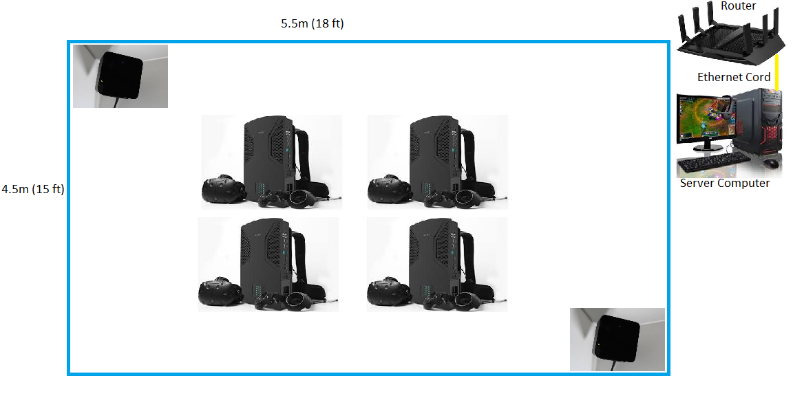
----

## Downloading the Lastest Version 

1. Go to the [Partner Success Portal](https://partnersuccess.vrcave.ca/) 

	

2. Log in using the Login credentials provided by VRCave

3. Find the "Download Latest vrCAVE Version" Button

	
	
4. Select the Download details that best describe your VR Setup

	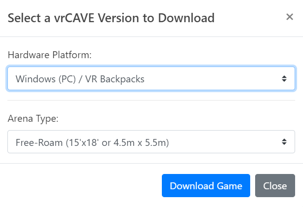
	
## Server Computer Setup

*The server computer comes pre-installed with Windows 10 and little else. The purpose of the server computer is to supervise and run the vrCAVE Library game.  This computer hosts the game, and is used by your game operator to start the game.  When you want to load a new game, add hints, skip puzzles, etc, this is the computer that is used.*

1. The very first time you set up the computer, Windows will take you through a one-time setup of language, region, and other settings.  Follow the on screen prompts until the setup tutorial is complete. You may need to connect this server computer to the internet through your own WiFi to complete some Windows 10 setup steps.

2. Download or USB transfer the **vrcaveVersion1.X.zip** file as well as the setup script, e.g. **Setup - Your Company Name.bat** onto the desktop; the links to these files should have been provided to you by vrCAVE. 

3. Once on the desktop, unzip **vrcaveVersion1.X.zip** so that the folder **vrcave** is sitting on your desktop, the shortcut **“LaunchVRCaveServer”** should be placed next to it on your desktop too.  

    

5. Double-click the setup script; e.g. **Setup - Your Company Name.bat**

    

6. You should receive a message stating "Updated license information successfully"

    

7. You can launch the vrCAVE Library Server by double-clicking on the **“LaunchVRCaveServer”** shortcut. Note that the first time you launch, it may need to perform some additional installations. Also, ensure that Windows Update has installed the latest video drivers (you can search for updates through Windows Update to make sure this happens). Windows Firewall will also likely ask if you want to give permission for the application to use the network; make sure you click **Allow**.

8. If you see the error below, [you can troubleshoot the issue here](Shortcut_Troubleshooting.md)

	

*** *At this point, the server is ready and waiting for the VR Backpacks. However, you need to perform the router setup and restart everything before the VR Backpacks will be able to connect.*

----

## Router Setup

*The server computer communicates game data to the VR Backpacks, this is done by setting up a local network with this router for the server computer and backpacks to all be on. Leaving the Server connected to the internet will allow automatic license updates*

1. Connection: Make sure your Nighthawk Netgear X6 R8000 router is plugged in and powered on. Use its provided ethernet cable to connect the server computer to LAN port 1 on the back of the router (do **NOT** plug it into the port titled "INTERNET'').

2. Put the server computer in airplane mode so that it doesn’t have a chance to connect to other networks, and is only connected to the Nighthawk X6 router.

----

## VR Backpack Initial Setup

*The backpacks should come pre-installed with Windows 10 and little else.
The VR backpacks (with connected VIVE Pro) is for each player to run their own version of the game which is supervised by the server computer.  The VR backpacks can be thought of as specialized, high-powered gaming laptops.  After the initial setup, the backpacks only need to be connected to a monitor and keyboard to update and troubleshoot issues.*

1. Use the power adapter that came with the backpack to power the computer, and connect your helper station’s monitor, keyboard, and mouse to the available ports.

2. The very first time you set up the computer, Windows will take you through a one-time setup of language, region, and other settings.  Follow the on screen prompts until the setup tutorial is complete. **DO NOT** put a password on the VR backpack (leave it blank).

3. Once you have completed the Windows 10 setup you will need to connect to the internet (WiFi is probably the easiest) to download and install Steam.  Using a web browser on the backpack, navigate to <http://store.steampowered.com/about/> and left-click on **"Install Steam Now"** to download the installer for Steam.

    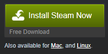

    Once downloaded, double-click on the executable to begin installing.  A creation of a new Steam account (or use of a pre-existing one) will be required. Creating steam accounts is free, but write down your username and password so as to not lose them.

4. Once steam is installed, you need to install SteamVR to actually use your HTC Vive Pro VR Headsets. Open Steam, and look under **Library->Tools->SteamVR**. Right-click on SteamVR and tell Steam to install it (this may take some time to complete).

    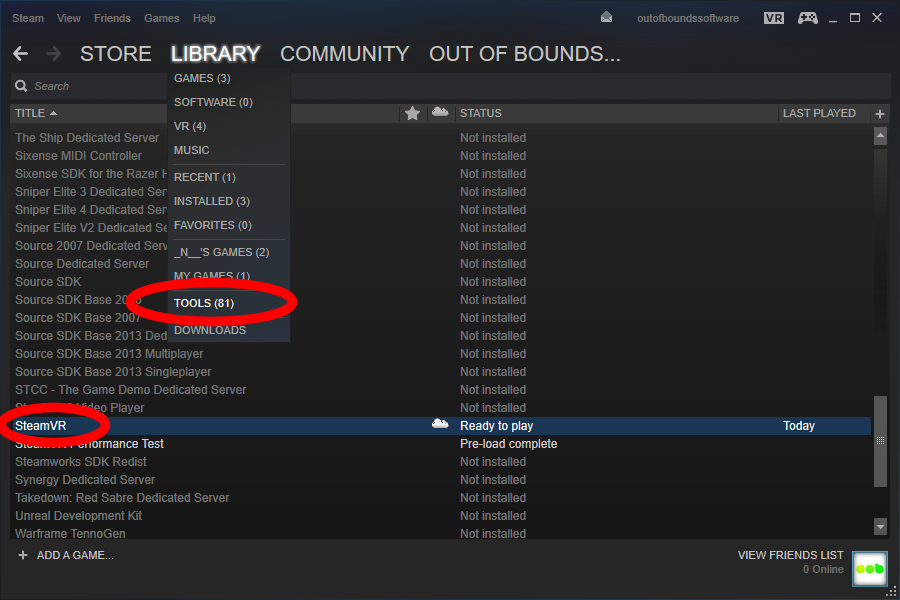

5. When SteamVR is finished you will want to disable SteamVR dashboard, the dashboard can block players view if they accidentally open it. Go to steamVR->Settings->General, click SHOW under Advanced Settings and Set VR Dashboard to HIDE, also turn off SteamVR Home and Motion Smoothing

	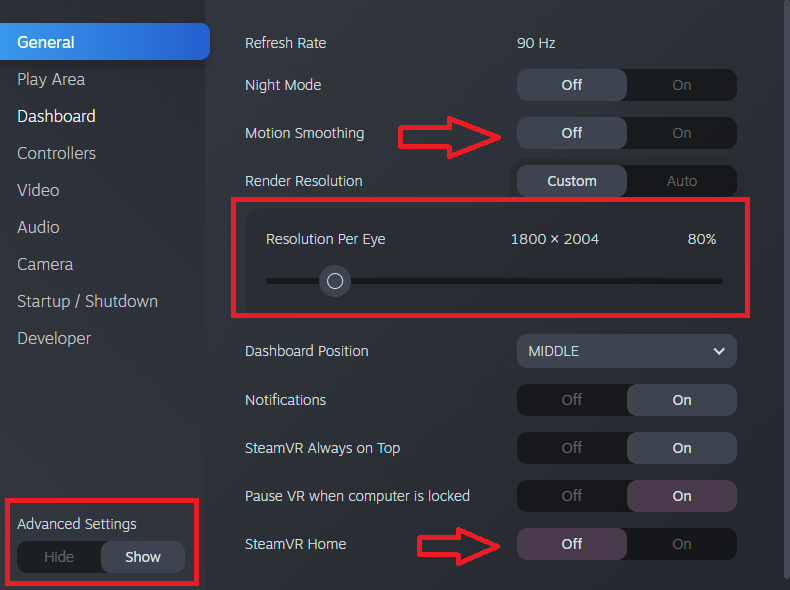 

<!--	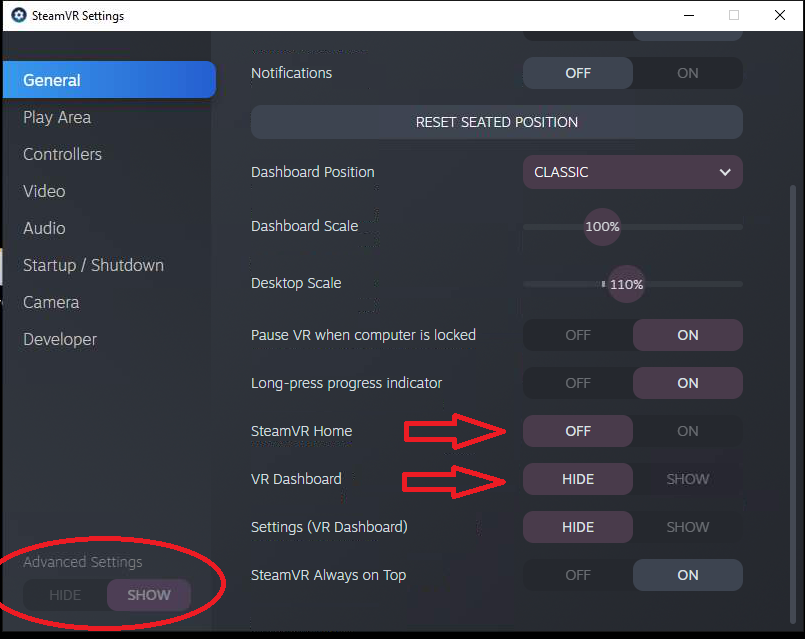
	
	 --->


6. While in the steamVR settings, it is a good idea to go to the Startup/Shutdown settings and set the "Turn off controllers after" option to something higher than 5 minutes. 

	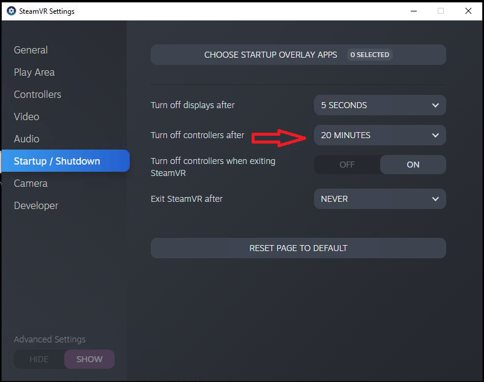

7. After SteamVR is installed, it is also a good idea to make sure that all important windows updates have been installed as well. In particular, ensure that the latest video drivers are installed on the VR backpacks (if running Windows 10, this will eventually be done through an automatic windows update (restart required) whilst connected to the internet).

8. For the sake of convenience, it’s ideal to make sure that pressing the power button on a VR backpack shuts it down. You can do this by right-clicking on the Power Options in the taskbar.

    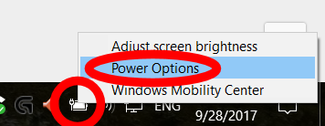

    Make sure that the power plan is on high performance (should be the default) and click where it says you can **choose what the power button does**.

    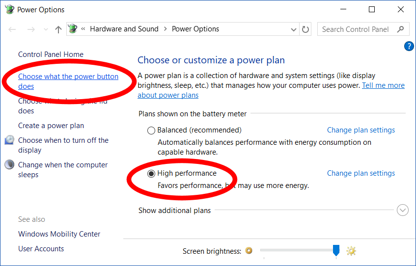 

    In the menu with the power button options, change all the options to **“Shutdown”**. Then hit **Apply** to save these changes.

     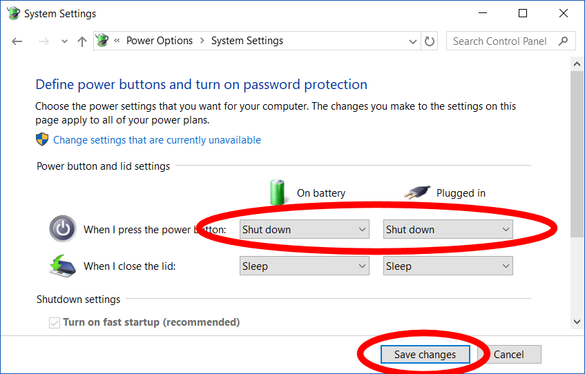

9. Your VR backpack should now properly shut itself down a few seconds after you tap the power button.

10. For consistency all backpacks should have their volume set at 75.

    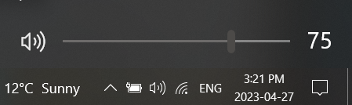

11. Finally we will want to turn off automatic windows updates, open the run window and type in **services.msc**, then press Enter

	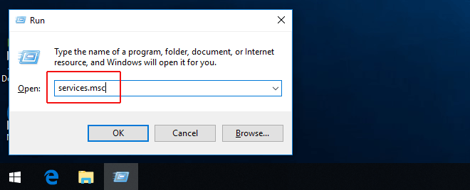

12. Find **Windows Updater** in the list and double click, Under **startup type** select **Disabled**

	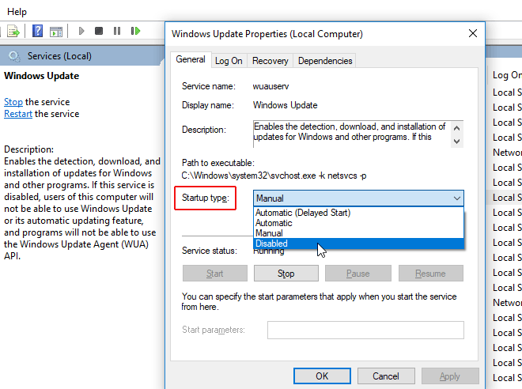
----

## Vive Pro Setup (for VR Backpacks)

*HTC has created a very good step-by-step process for running room calibration.  SteamVR may give a warning about the lighthouses being too far apart, this is just a warning and it can be safely ignored.  We have added additional instructions to help optimize the installation as the tracking volume is larger than recommended.*

***Note:**  You will only setup a single pair of lighthouses*

1. Follow the installation instructions that came with the VIVE Pro (a more in-depth guide can be found here: <https://support.steampowered.com/kb_article.php?ref=2001-UXCM-4439> ).

    <span style="color:red">The following modifications need to be made:</span>

    - Room size is 4.5Mx5.5M (approx. 15’x18’) instead
    - Mount the lighthouses higher up, ideally 8 - 9 ft. above the ground, attached to a structure that is will not get bumped or moved in any way.  This should be in opposite corners of the play space.
    - Lighthouses need to face each as much as possible, but be angled at 45 degrees towards the ground.
    - \*\*\* Mark with tape the corners of the room dimension of 4.5Mx5.5M (approx. 15’x18’).  This will be needed later \*\*\*
    - Once the room has been outfitted with your lighthouses, plug a VIVE Pro into the backpack you’d like to set up and try to have the headset as close to the center of the play space as possible.  You will need that backpack connected to the monitor, keyboard, and mouse to follow the on-screen prompts.

2. If you did not do so earlier, the first time you connect a VIVE Pro to a backpack, you will be prompted to install SteamVR. Follow the instruction in downloading and install SteamVR. Once installed, Run Room Setup.

    <span style="color:red">The following page specific modifications need to be made:</span>

    - *Choose Room-Scale*

    - Locate your monitor: Place the controller on the ground in the center of the room and orientate it so that the head of the controller points at one of the long walls.

    - Locate the floor: Place the controllers upside-down as far apart as possible within the room bounds.  If nothing happens when you click [CALIBRATE FLOOR], bring the controller in a little bit closer and try again.

    - Trace your space: Click on the [Advanced Mode] check box on the right side of the tutorial window.

        

        You will then bring the controller to each of the corners of room that you had previously marked, and pull the trigger. \*\*\*Be sure that the controller has direct line of sight to both lighthouses when in the corner, try to orientate yourself so that you will not be blocking line of sight to the lighthouses\*\*\*

    - Set your play area: Once all four corners have been marked, and light blue rectangular outline has been drawn, click the [EDIT] button located in the bottom right of the tutorial window.

    - You will now need to adjust the green square so that it is as close to the center as possible.  Click-Dragging will allow you to move the green box, while tugging on the corners will allow you to adjust the rotation.  Be sure the white middle arrow is pointing towards a long wall.

        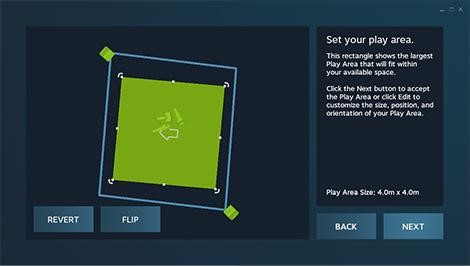

    - Click [NEXT], room calibration is now completed.

----

## Installing vrCAVE Library (VR Backpacks)

1. Download or USB transfer the **vrcaveVersion1.X.zip** folder onto the desktop, this link should have been provided to you by vrCAVE staff.

2. Once on on the desktop, unzip the folder the same way you did for the Server so that the vrcave folder sits on the desktop.

3. Left-click the Windows icon in the bottom-left of you screen and type in **‘run’**, select the Run application on the top of the list

     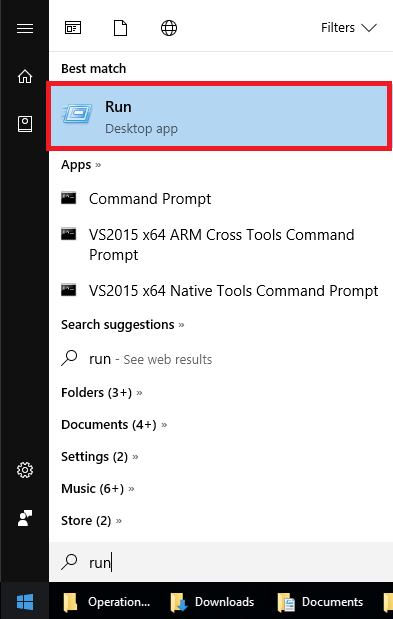

4. Type in **‘shell:startup’** in the Run Window, and hit enter.  This should cause the startup folder window to open.

     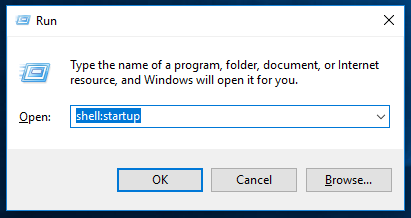

5. On the desktop, open the folder “vrcave”, then open utilities.  Inside you you will find a .bat file labelled **VRCaveClientLaunchHelper.bat** click and drag this to the startup folder you opened on the previous step. This will cause the game to run as soon as the VR backpack is booted up.

     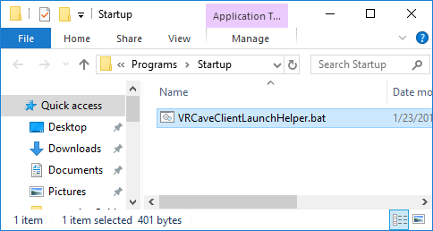

6. In order for the game to find the server computer, make sure that the VR backpack automatically connects to the WiFi network of the Nighthawk X6 router that the computer is plugged into. By default, the Nighthawk X6 router broadcasts 3 different WiFi networks. The VR backpacks should connect to the one that ends in “...-5G-2”. It’s full name will be something like <b>NETGEAR</b>22<b>-5G-2</b> by default.

7. At this point, you should be able to test if the setup so far has been success: Ensure both the backpack and server computer are on the same network, double-click **“LaunchVRCaveServer”** on the server computer, and then double-click **“VRCaveClientLaunchHelper.bat”** on the backpack you have connected.  Within a couple seconds you should see the number of connected players on the server computer now states "1".

8. Repeat steps 1. to 6. for each backpack.

----
## Optional

### Setting up each backup to have a name and designated color

- Launch the server. See the [Operations Guide](operations_guide.md) for instructions if needed. Connect the backpack to the game. A name should pop up in the top right corner with a color. Click on the color palette to cycle it through the available 7 colors. Clicking on the name will let you update it to whatever you want. When the backpack joins next time, it will remember its color and name.

     


### Changing the number of given hints and default time limit

- Navigate to the vrcave library config folder by following this path: **vrcave\WindowsNoEditor\VRcaveLibrary\Saved\Config\WindowsNoEditor\Game.ini**

- open **Game.ini** with notepad and add these lines:

```
[/Game/Maps/DragonTower/DragonTower_GameState.DragonTower_GameState_C] 
defaultMaxGameTime=2700 
defaultMaxHints=2

[/Game/Maps/Manor/Manor_GameState.Manor_GameState_C]
defaultMaxGameTime=2700
defaultMaxHints=2

[/Game/Maps/SST/SST_GameState.SST_GameState_C]
defaultMaxGameTime=2700
defaultMaxHints=2

[/Game/Maps/TimeTravel/TimeTravel_GameState.TimeTravel_GameState_C]
defaultMaxGameTime=2700
defaultMaxHints=2

[/Game/Maps/underwater/USA_GameState.USA_GameState_C]
defaultMaxGameTime=2700
defaultMaxHints=2

[/Game/Maps/Pirate/Pirate_GameState.Pirate_GameState_C]
defaultMaxGameTime=2700
defaultMaxHints=2  

[/Game/Maps/LaserBlocks/LaserBlocks_GameState.LaserBlocks_GameState_C]
defaultMaxGameTime=600
defaultMaxHints=2  

[/Game/Maps/RunawayTrain/RunawayTrain_GameState.RunawayTrain_GameState_C]
defaultMaxGameTime=2700
defaultMaxHints=2 
```

- defaultMaxGameTime is measured in seconds, so 2100 seconds is 35 minutes.  


----
