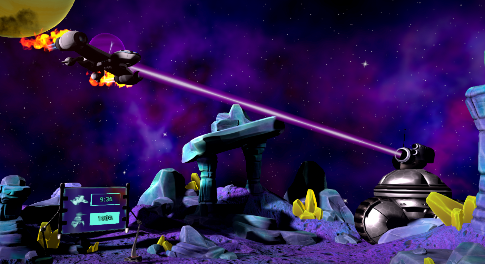
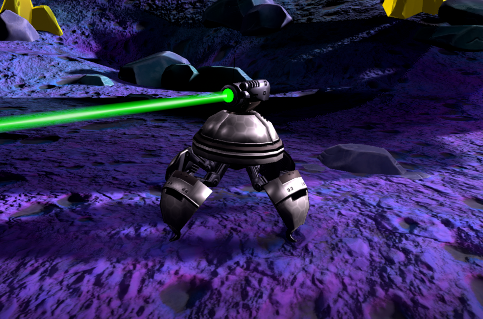
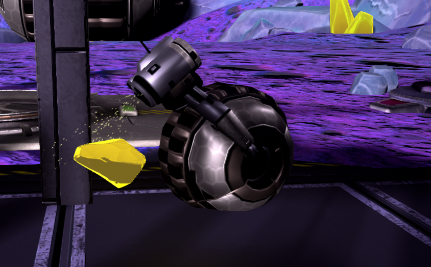

# Laser Bots

## Narrative

- You are on a mining platform on an asteroid mining yellow crystals. Your team is preparing for evacuation when a giant robot on wheels shoots your evacauation ship out of the sky! You'll need to destroy the giant robot before your ship can come back in and you've only got 10 minutes before the giant robot crushes you! Fortunately, your team has access to a giant laser that is powered by yellow crystals that can be found powering the robots around here. Using your laser swords and shields, you will have to deflect lasers, collect crystals and explode robots to survive.

    
    
    

----
## Gameplay basics

Players have to defeat the massive robot before it runs them over. 

To start the first wave of robots, players must place the yellow crystal into the center console. This will fire the plasma cannon and deal damage to the boss. After this initial attack, players must collect more crystals to shoot again.

Players have to reflect the bots' lasers back at the bots to defeat them. Upon being destroyed, they will sometimes drop crystals and the players will have to collect them in the central console. As well, robots will appear from time to time trying to steal the crystals from the players, which will need to be destroyed to prevent losing already collected crystals.

Some bots will have shields that can block lasers that do not match the color of the shield. Matching laser colors will penetrate the shield and destroy the bot inside. Likewise, the shield only covers the frontside of the robot, so you can in some puzzles bounce a laser off another bot's shield into the backside of a bot. 

Shield bots and flying rocket bots can generate a shield to protect laser bots, but when they are defeated, the shield they generate disappears. 

The crystal in a cube in the center can split the laser beams into their base colors of Red, Green and Blue, or combine colors as appropriate, allowing you to create Cyan, Yellow, Magenta or even White Light. Note that Cyan beams go through the players' shields.

Once the large robot is destroyed, there is an opportunity to do some bonus rounds, featuring trickier puzzles for players to attempt to overcome. The game ends once all the bonus rounds have been finished or time runs out. If the boss has been destroyed when time runs out, the evacuation ship will return and pick up the players. Otherwise, the boss will crush the players.

## Laser splitter

- The crystal in the center of the playspace will split lasers into their base colors. the 3 basic examples

	

- This also works to combine colors by reflecting the same combinations into the cube

- Red + Green = Yellow

- Red + Blue = Magenta

- Green + Blue = Cyan

- Red + Green + Blue = White

## Hardmode Changes

The normal mode is primarily aimed at kids but if you need a bit more of a challenge for an older group, hardmode is the place to go for Laser Bots! Hardmode changes the majority of the waves to be tougher. Many puzzles will require team work and much more use of the laser splitter cube.

Some puzzle solutions/hints:

- A laser can be bounced multiple times to get around an obstacle, such as a shielded bot

- Bots are only shielded from the front, and lasers can be bounced off a shielded bot into the backside of a bot (There is one or two puzzles that use this as a solution)

- To reflect the cyan laser, shoot it through the cube and reflect it immediately back in with a single player, and rotate the splitter, letting you control the direction of the beam.

- Don't be afraid to move the splitter around to make things easier, such as putting it on the ground in front of a shield bot and shining the appropriate lasers in.

- Black shields cannot be pierced, so you will need to destroy the corresponding shield bots/missile bots. 

## Laser Bots Keyboard Shortcuts

The keyboard is used from the server computer to control several in-game functions.  There are some keyboard commands that apply to the game.

### General Commands

> Y - toggles ‘spectator mode’, allowing the camera to fly around and observe the game.  The server computer starts in this mode automatically.
>
> W, A, S, D, Q, E - when in ‘spectator mode’, this freely moves and re-orientates the camera position
>
> 0 - warps all players to the lobby
>
> 1 - warps all players to the Asteroid Level
>
> Numeric Keypad Plus - adds 1 minute to the timer
>
> Numeric Keypad Minus - subtracts 1 minute from the timer
>
> Shift+[number] - loads a different game/experience, list is shown in lobby levels

### Lobby Commands

> Spacebar - begins playing the automated intro (VR safety, Hint description, mission), then starts the game
> 
> M - plays the mission intro only, then starts the game (This game mode does not have a mission intro at this time)
>
> V - starts the game
>
> Shift+Insert - toggles the in-game mic feature on/off (Need to do [Mic Chat Setup](mic_chat.md) first)
>
> R - toggle showing/hiding of the score message
>
> U - cycles through a list of available languages and apply the new language after 5 seconds (It restarts the server and wipes the current score.)

----

### Asteroid Commands

<em>Version 1.8.1 and earlier</em>
 

>K - destroys all bots currently on the map. This will end the current wave immediately. The next wave will then start, unless the players need to collect crystals to progress, in which case thief bots will continue to spawn until the players have successfully powered the plasma cannon.
>
>O - similar to K, but ends the current wave as if the timeout expired.
>
>T - immediately fills all yellow crystal receptacles to fire the plasma cannon, causing damage to the boss bot. This shortcut only works when the crystal receptacle indicators are visible.
>
>V - blows up the boss bot, causing the game to end in victory. The rescue ship will arrive and players will be sent back to the lobby with their scores.
>
>B - returns all players back to the lobby

<em>Version 1.8.2 and later</em>
 

>K - destroys all bots currently on the map. This will end the current wave immediately. The next wave will then start, unless the players need to collect crystals to progress, in which case thief bots will continue to spawn until the players have successfully powered the plasma cannon.
>
>L - similar to K, but ends the current wave as if the timeout expired.
>
>J - immediately fills all yellow crystal receptacles to fire the plasma cannon, causing damage to the boss bot. This shortcut only works when the crystal receptacle indicators are visible.
>
>V - blows up the boss bot, causing the game to end in victory. The rescue ship will arrive and players will be sent back to the lobby with their scores.
>
>B - returns all players back to the lobby

