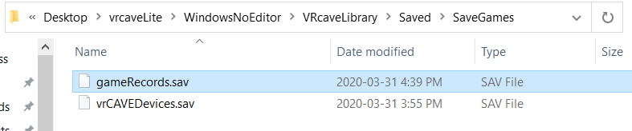

## How to renew your license

1. **Keep your server computer connected to the Internet.** We have automated our license system so that your VRCAVE license should update automatically every time you start the VRCave Library server. 

### How to Manually Send Game Data for a License Renewal 

- *If you do not have an internet connection for your server computer, this is how you can request an extention to your license*
 
 1. Go to your vrcave folder and follow this path: vrcave\WindowsNoEditor\VRcaveLibrary\Saved\SaveGames
 *For vrcaveLite: vrcave\WindowsNoEditor\VRcaveLibrary\Saved\SaveGames*

	
 
 2. Copy the file *gameRecords.sav* and save it somewhere for later.

 3. Email [support@vrcave.ca](mailto:support@vrcave.ca) that you want a license update and attach the gameRecords.sav file.

 4. We will communicate with you if you need to provide more.

### Manually Applying the License File

 1. When you receive your new license .bat file, save the .bat to your desktop, (or the same folder as your vrcave *or vrcaveLite* folder).

	
 
 2. Make sure your VRcave Library is not running.

 3. Double click the license file, and command window will pop up and will inform you if it was successful.

	
 
 4. Start the vrcave server and observe the log on the upper lefthand corner. a message should display "no prior DRM successes" this means it updated properly and should be showing an active license in the lobby. 
