# Mic Chat Setup

## Server Computer Configuration File Setup

Make sure you've completed the Initial Setup and installed your VRcave license before setting up Mic Chat.

- Open the `vrcave` folder on your Desktop.
- Double-click to open the following folders, in order:

    1. WindowsNoEditor
    2. VRcaveLibrary
    3. Saved
    4. Config
    5. WindowsNoEditor

- The contents of the WindowsNoEditor should look similar to the following:

    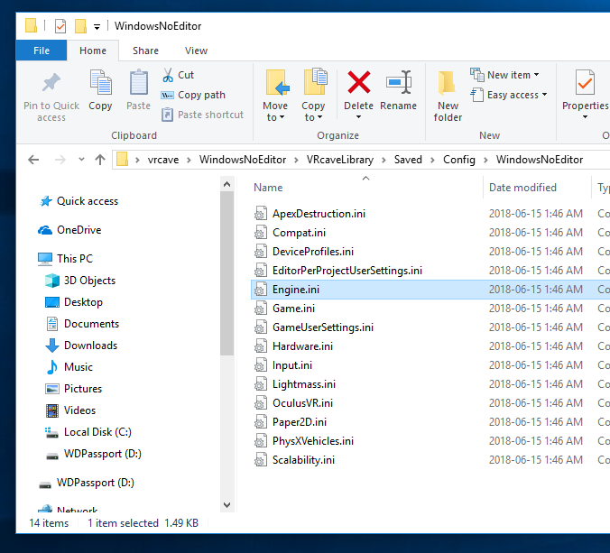

- **Select the following text** and press <kbd>Ctrl</kbd>+<kbd>C</kbd> to copy it:

    ```
    [Voice]
    bEnabled=true

    [OnlineSubsystem]
    bHasVoiceEnabled=true
    ```
    
- Double-click on **Engine.ini**. You should see something similar to the following:

    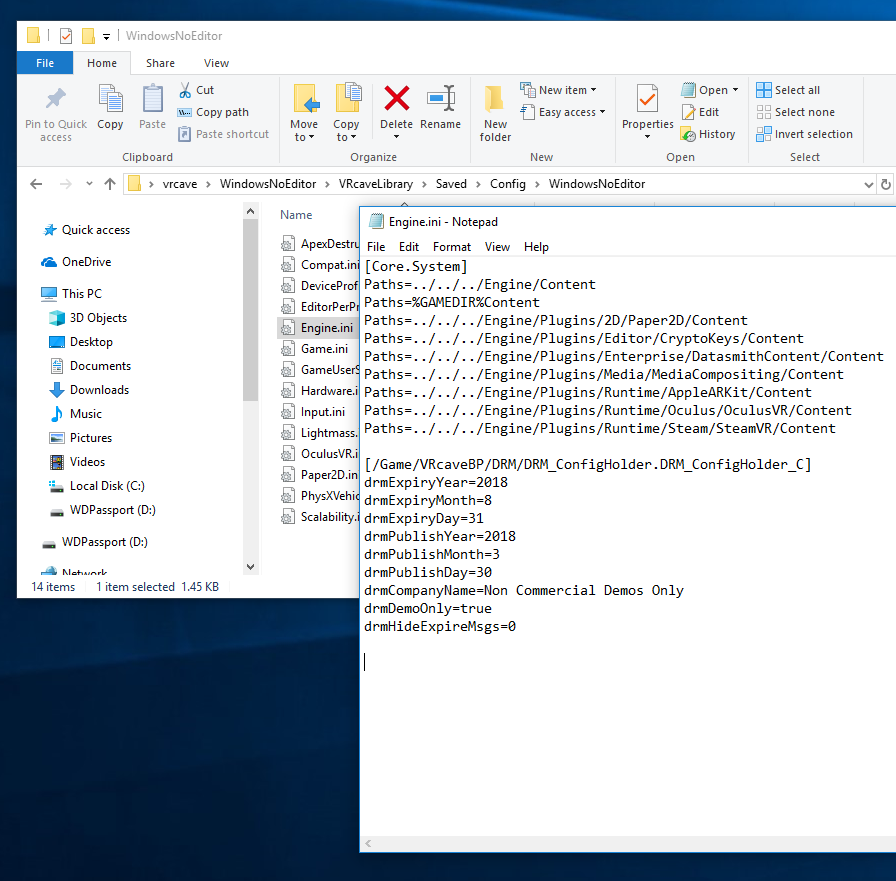


- Click at the end of the currently open **Engine.ini** file in **Notepad**, pressing **Enter** if needed so the text cursor has a blank line above it, as shown above.

- Press <kbd>Ctrl</kbd>+<kbd>V</kbd> to paste the clipboard contents. The file should look like this after pasting:

     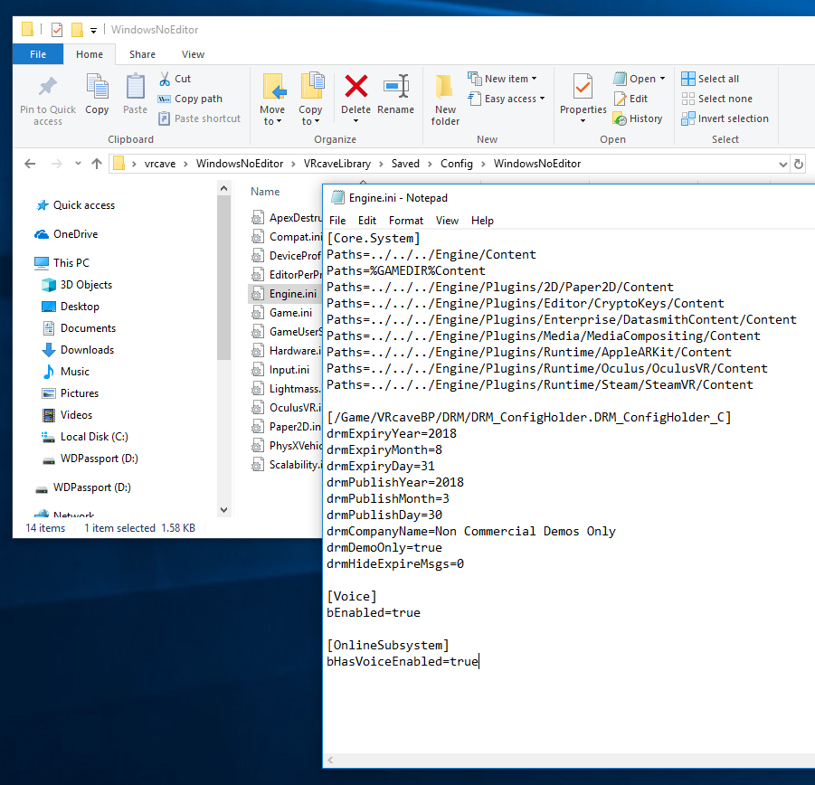

- Press <kbd>Ctrl</kbd>+<kbd>S</kbd> to save the **Engine.ini** and close **Notepad**.

- Insert a USB memory stick and copy **Engine.ini** to it. You'll need to copy this file to the VR backpacks.

## Server computer microphone setup (Required)

Before enabling VOIP, it's critical that the server computer has a microphone which is enabled in Windows, even if you don't intend to use it to chat with players.

Follow the instructions below to check the microphone on your server computer is set up correctly:

1. Left-click the Windows icon in the bottom-left of you screen and type in **‘run’**, select the Run application on the top of the list

     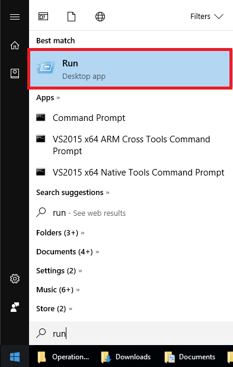

2. Type in `mmsys.cpl` in the Run Window, and press enter.

    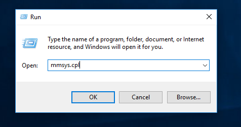

3. The sound settings window should appear. Click on the **Recording** tab.

    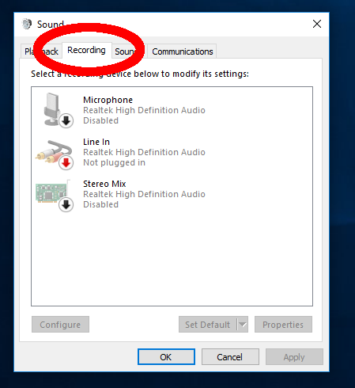

4. Check whether any of the microphone icons have a green checkmark next to them, like this:  . If there is already an enabled mic, you can skip to the next section.

5. The computer in the above screenshot would not work because there is no enabled mic. To fix it, look for a microphone in the list, right click on it, and click on **Enable** in the context menu. If there is no microphone in the list, contact VRcave.

    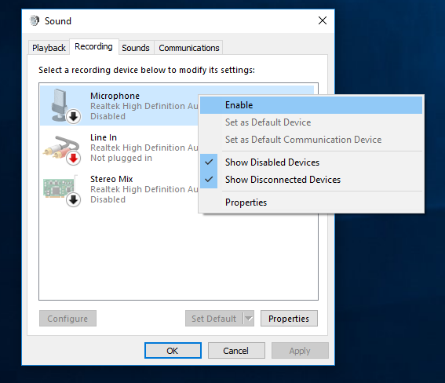

6. When the microphone is correctly set up, your device list should look like this:

    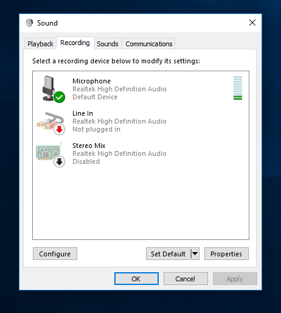

    Click on OK to complete the server computer setup.


## Backpack Configuration File Setup

Each backpack needs some additional setup.

For these steps you'll need to connect a keyboard, mouse, and monitor to the backpack, as well as the HTC Vive. 

Ensure the HTC Vive is connected and working. Since VRcave should have automatically started up, press <kbd>Alt</kbd>+<kbd>F4</kbd> to close VRCave and return to the desktop.

- Insert the USB stick with **Engine.ini** that you copied in the section [Server Computer Configuration File Setup](#server-computer-configuration-file-setup). Select the **Engine.ini** file and click on the **Copy** button in File Explorer.

    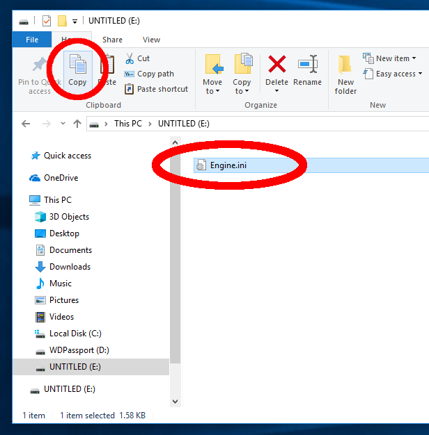

- Open the `vrcave` folder on your Desktop.
- Double-click to open the following folders, in order:

    1. WindowsNoEditor
    2. VRcaveLibrary
    3. Saved
    4. Config
    5. WindowsNoEditor

- You should see an existing **Engine.ini** file in the **WindowsNoEditor** folder. Click on **Paste** to overwrite it with the file copied from the USB stick. When the "Replace or Skip Files" dialog appears, choose **Replace the file in the destination**.

    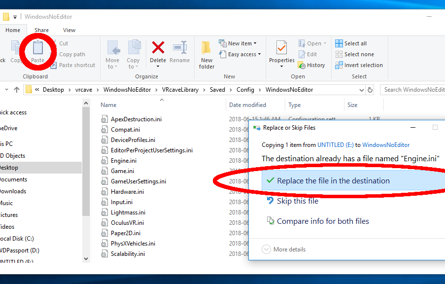

## Backpack Mic Setup

Each backpack's mic configuration should be double-checked to ensure the right device is active and the volume is correct.

- Left-click the Windows icon in the bottom-left of you screen and type in **‘run’**, select the Run application on the top of the list

    

- Type in `mmsys.cpl` in the Run Window, and hit enter.

    

- Click on the **Recording** tab.

    At this point you will want to identify the device in the list belonging to the HTC VIVE. The original VIVE may be called **USB Audio Device** and the VIVE PRO should be called **VIVE PRO Multimedia Audio**. The goal is to have this particular device enabled and set as the default device, which looks like this: .

- Here is an example situation where the wrong microphone is the default device (Realtek).

    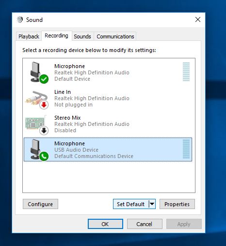

    To correct the problem, click on the **USB Audio Device** (which is the VIVE microphone), then click on the **Set Default** button. Here is the list after the correct default has been set:

    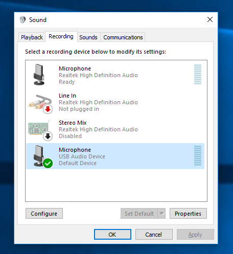

    Try tapping on the VIVE microphone (on the bottom of the headset). The green bars pictured in the above screenshot, to the right of the **Microphone (USB Audio Device)** label, should light up when you tap on the VIVE mic.

- Here is an example VIVE PRO that is correctly set as the default device:

    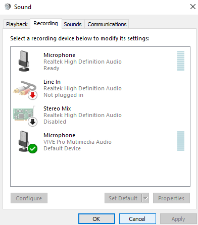

- Once your **HTC VIVE** or **VIVE PRO** is correctly set as the default device, make sure the device is selected, and then click on the **Properties** button.

    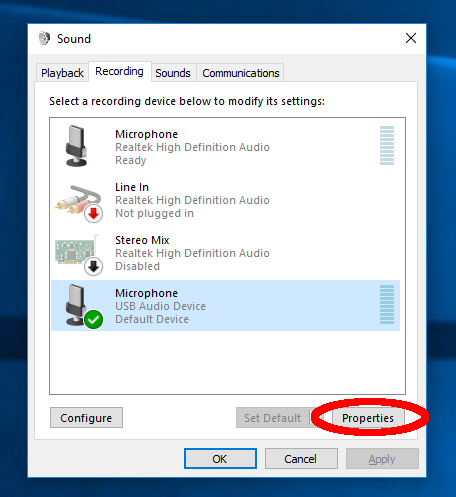

- Click on the **Levels** tab.

    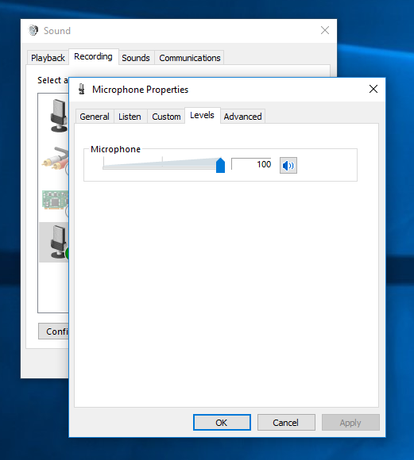

    Check that the **Microphone** slider is set to **100**, adjust it to **100** if needed.

- Click **OK** and **OK** again to close the control panel.

Once you've followed these steps on each backpack, the Mic Chat setup should be complete.

## In-game controls

Finally, once the server computer is running VRcave Library, **you'll need to press <kbd>Shift+Insert</kbd> to enable mic chat**. This will need to be done each time the server restarts. A log message "VOIP Unmuted" should be printed in the upper-left corner of the server screen.

Once that is done, players can talk through the Mic Chat by **holding this button continuously while talking**:

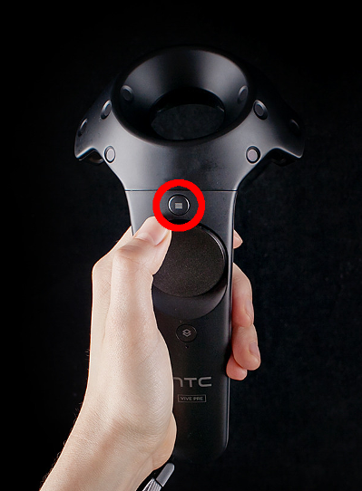

Additionally, the <kbd>Insert</kbd> keyboard key can be held down on the Server computer to allow the game operator to chat through the in-game audio as well.
