# Mic Chat Setup
**Before setting up the server, The server computer should have a static IP. [You can find out how to do that HERE](static_ip.md)**
## Server Configuration

- Open the `vrcave` folder on your Desktop.

- Open the `Mumble` folder inside `vrcave`

- Double click **murmur.exe**

	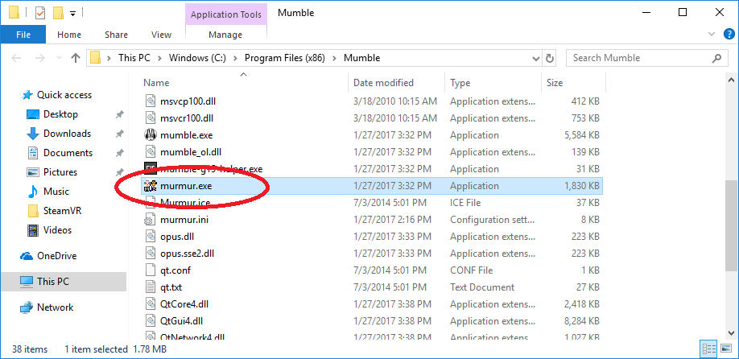
	
- That's it. this computer is now running a mumble server, you can verify by checking for this icon:

	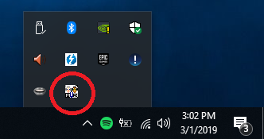
 
- Add a shortcut for **murmur.exe** to the desktop so the server can be quickly started.

- Add a shortcut of the **MumbleServerStartup.exe** to your shell:startup by clicking the windows button, typing run, pressing enter and entering **shell:startup** in the run application

- Open a command prompt, this can be done in the windows search by by typing *cmd* and pressing **Enter** 

- Type *ipconfig* and press **Enter** 

- Record the IVP4 for your server computer so the client backpacks can connect to it. 

    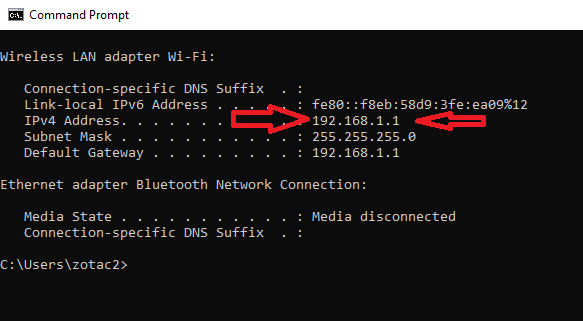

- Open the `vrcave` folder on your Desktop.

- Open the `Mumble` folder inside `vrcave`

- Double click **mumble.exe**. 

	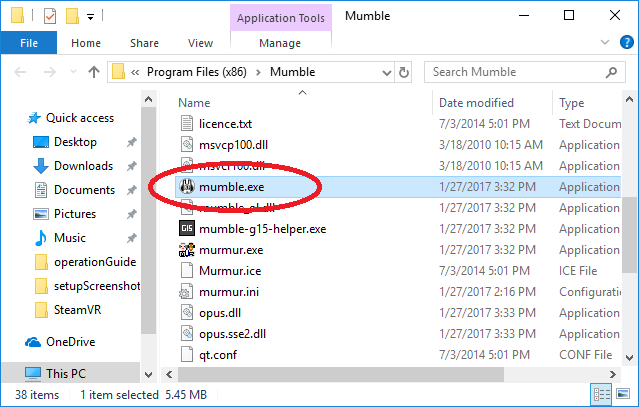
	
- First time this is opened it will start the Audio Wizard, if this does not open, you can start it by clicking here:

	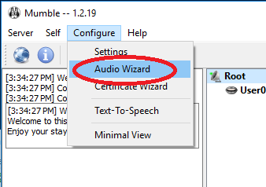
	
- On *Device Selection* you will want to select default device for input and output, and uncheck these boxes.

	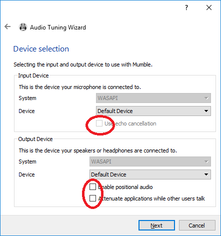
	
- On *Device Tuning* you will want to set the dial as low as possible. 20ms is best.

	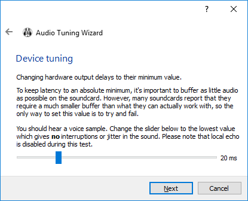
	
-  On *Voice Activity Detection* you will want to set *Push To Talk* to a key of your choice, you can do this by clicking the box and then pressing the desired key. (for example this currently has Insert as the push to talk button.

	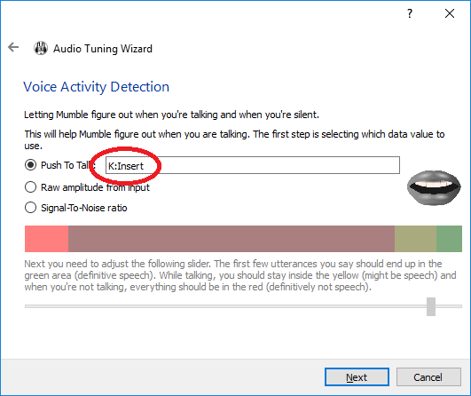
	
- On *Quality & Notifications* you will want to leave *Text-To-Speech* on, this will talk to you when something happens, this is only temporary and we will disable it later. 

	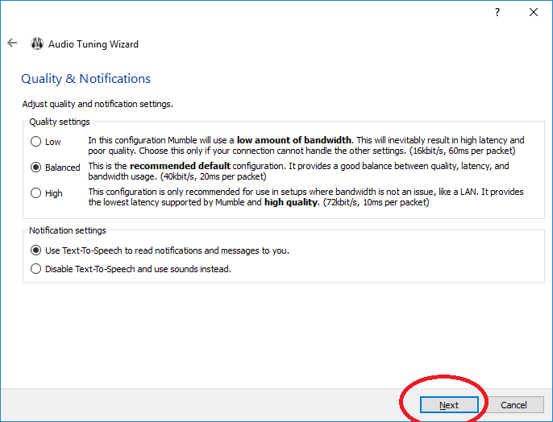	
	
- when a screen comes up asking about Certificate Authentication, Select **Automatic certification creation**
	
- If the network settings don't show up right away, Select the network icon, the Blue earth with lights and lines

	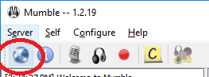
	
- Ignore the Public Internet if present, click *Add New*

	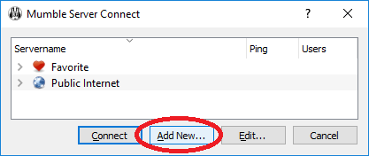

- Here the only really important box is **Address** type in the address you recorded of your server and make a user name for your server. Don't touch Port.

	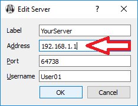
	
- Select the newly created favorite server and *Connect*

	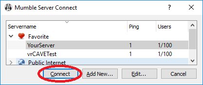
	
- The server will talk to you, we can (and should) disable this here. select configure and uncheck the **Text-To-Speech** option, this will silence the notifications entirely.

	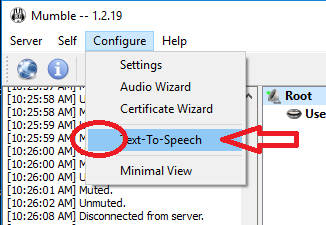
	
- Next you have to go to *Configure* and select *Settings*

	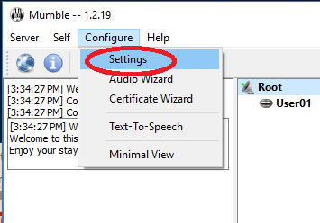

- Select *Network* and under *Connection* check both boxes and under *Mumble Services* uncheck both boxes. click Apply

	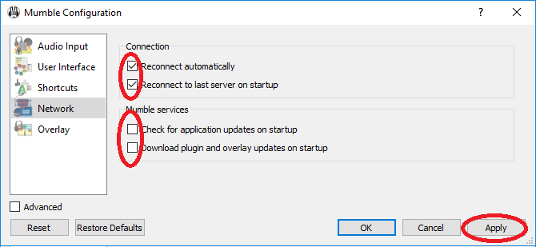
	

Now the server should automatically join this VOIP chatroom on start up. 
	
- **(_OPTIONAL_)** Select Advanced and check Display push to talk window. this will create a button that will always be on top of the screen that can be clicked to talk for the administrators. 

    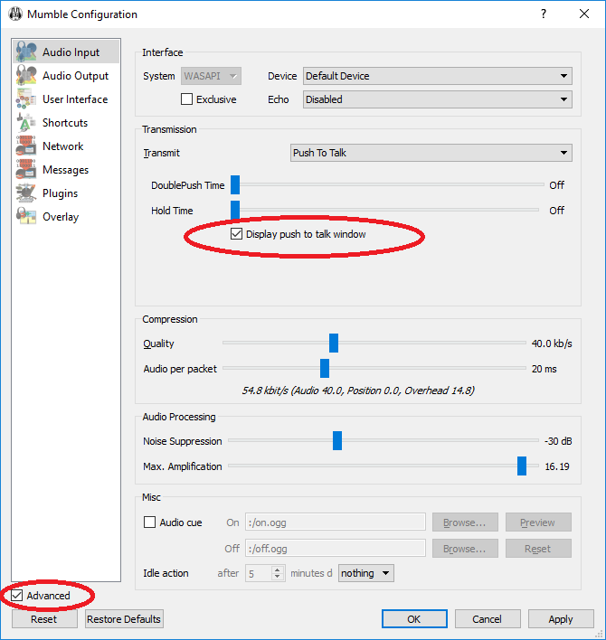

## Backpack Configuration Setup

Each backpack needs some additional setup

**You must install and initialize the _server computer_ before the backpacks.**

For these steps you'll need to connect a keyboard, mouse, and monitor to the backpack, as well as the HTC Vive. 

Ensure the HTC Vive is connected and working. Since VRcave should have automatically started up, press <kbd>Alt</kbd>+<kbd>F4</kbd> to close VRCave and return to the desktop.

- Open the `vrcave` folder on your Desktop.

- Open the `Mumble` folder inside `vrcave`

- Double click **mumble.exe**. 

	
	
- First time this is opened it will start the Audio Wizard, if this does not open, you can start it by clicking here:

	
	
- On *Device Selection* you will want to select default device for input and output, and uncheck these boxes.

	
	
- On *Device Tuning* you will want to set the dial as low as possible. 20ms is best.

	
	
	
- On *Device Selection* you will want to set *Signal-To-Noise ratio* and test each headset for voice pickup, adjust the dial so your voice activates green. don't be shy, be as loud as you think players will get. 

	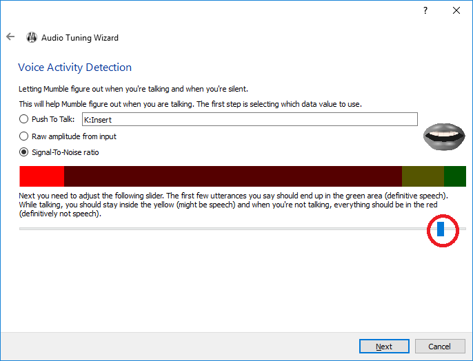	
	
- On *Quality & Notifications* you will want to leave *Text-To-Speech* on, this will talk to you when something happens, but we will disable it later. 

		
	
- when a screen comes up asking about Certificate Authentication, Select **Automatic certification creation**
	
- If the network settings don't show up right away, Select the network icon, the Blue earth with lights and lines

	
	
- Ignore the Public Internet if present, click *Add New*

	

- Here the only really important box is **Address** type in the address you recorded of your server and make a user name for each backpack. don't touch Port. I don't know how that works just leave it.

	
	
- Select the newly created favorite server and *Connect*

	
	
- The server will talk to you, we can (and should) disable this here. select configure and uncheck the **Text-To-Speech** option, this will silence the notifications entirely.

	
	
- Next you have to go to *Configure* and select *Settings*

	

- Select *Network* and under *Connection* check both boxes and under *Mumble Services* uncheck both boxes. click Apply

	
	
- Next click the advanced checkbox and go to **Audio Input.**  Under Transmission you will want to select **Amplitude** radio button and adjust the **Silence Below** and **Speech Above** bars to your microphone input. This helps with cutting down on echos in speech.

	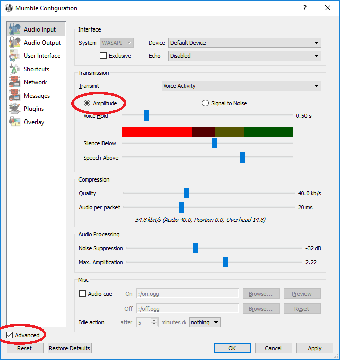
	
Now each backpack should automatically join this VOIP chatroom on start up. 
	

	

	
	
	
	
	
	