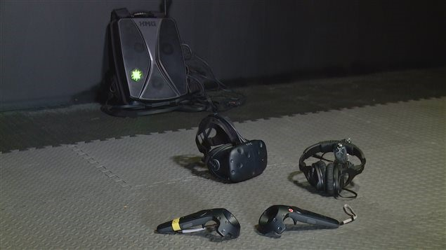
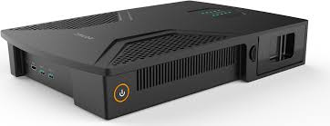
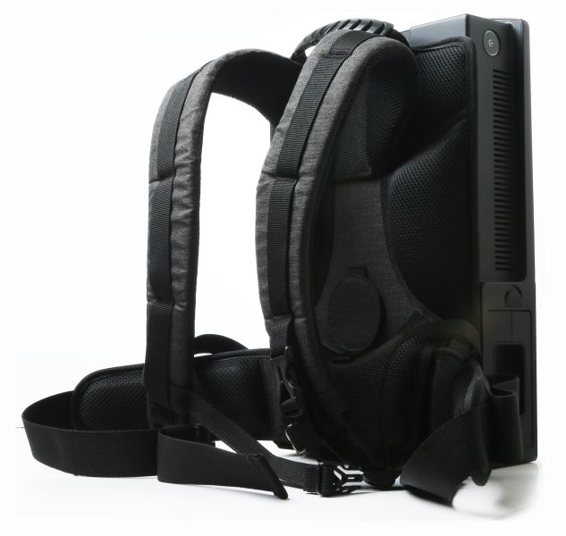
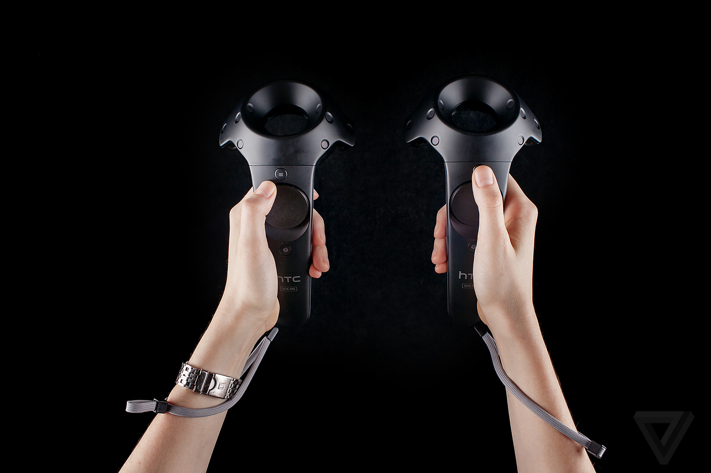
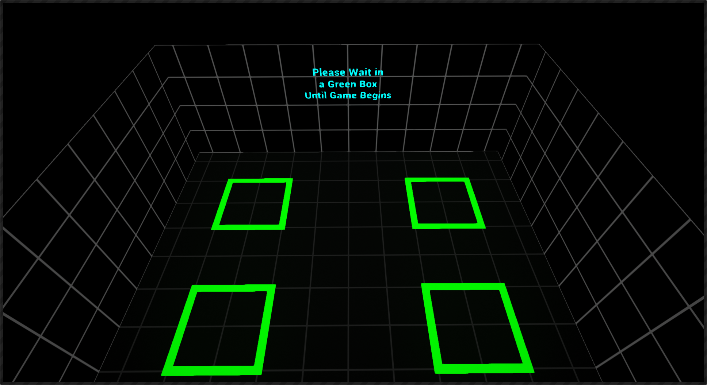

# Operations Guide

## Bringing the system online

(Starting the system from completely off)

1. Ensure that both lighthouses are plugged in, and that the router has been turned on.

2. Start the server computer, and launch the game in server mode by using the  **“LaunchVRCaveServer”** shortcut on the desktop.

3. Bring each of the VR Backpacks with attached VIVE Pros into the playspace, ensure each of them have fresh batteries installed.

    

4. Press the power buttons on each of the backpacks, after about a minute or so, they should be viewable from the server computer as each backpack powers up.

     

----

## Running an Experience

(System is fully online)

1. Bring each of the users into the play space and have them stand near a VR backpack. Power off and remove and unneeded backpacks, power on extra backpacks as needed.

2. One by one have your operator(s) suit of each of the players, starting with the backpack, then the VIVE Pro headset (start with the goggles first, before bringing down the back strap and tightening it to fit their head). The chest and belt straps are recommended.

    

3. Then have player reach out, then place the VIVE controller into each of their hands, adjusting their grip as necessary. Wrist straps are recommended.

     

4. Once a player is fully suited, having them wait in a green square in the room.

     

5. Press **Spacebar** on the server computer to start the experience.

6. Experience has ended, have each player stand in place and wait for their equipment to be taken off. Unequip each of the players starting with the controllers, then headset, then backpack. Placing each neatly on the ground.

7. Players leave the play space, operators should wipe down each VIVE Pro cushion mask with a cleansing wipe, and wipe the glass goggles as required.

----

## Pre-game User Instructions

### Technical Description

(After all players and suited up and are waiting in the starting green squares)

Welcome to VR!  For this experience, the only controls you need worry about are the triggers you use with your index fingers; this opens and closes your hands and is used to grab objects. If your hands every disappear or drift away during the game, this means that someone is blocking the controllers and waving them lightly above your head should bring them back. Similarly, if your headset goes white-grey this means that someone is standing too close to you, and you will need to spread out a bit more. Everyone notice the virtual walls around them, please don’t reach through them or over virtual railings. There are physical walls on the other side, and they will hurt if you walk into them. A thin red line will appear to warn you when you get to close. And finally, no running, no jumping, and be sure to give each other lots of space. Everyone ready for their mission…