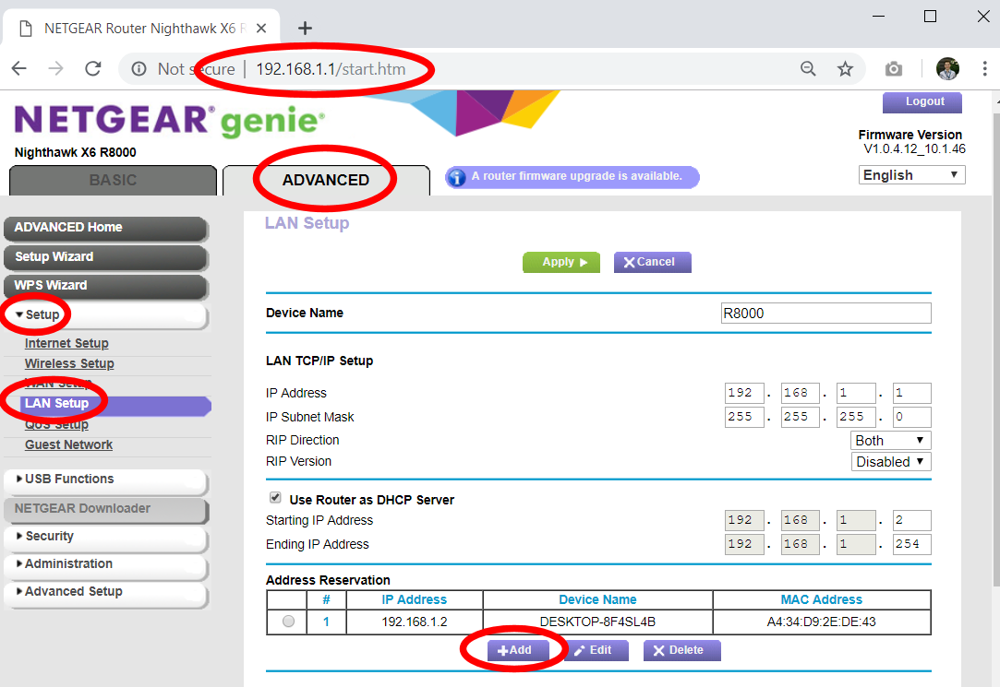
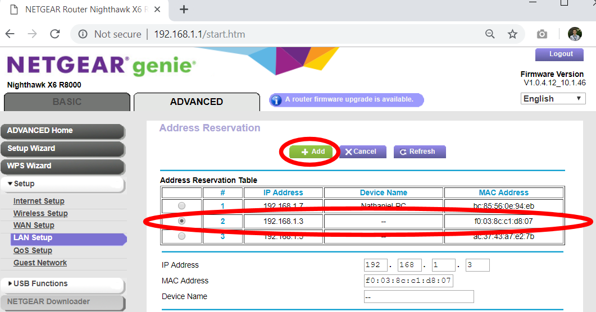

# Remote Control for VR Backpacks

**Note:** *Setting up remote control of the VR Backpacks is **optional**, but highly recommended because it makes troubleshooting and configuring the backpacks much more efficient.*

**Requirements:** *Before proceeding with this setup, each VR backpack requires an HDMI or DisplayPort "Dummy Plug" (also known as a "display emulator" or "headless ghost") plugged into it at the same time as the VR headset.*

## Downloading TightVNC

1. The recommended remote desktop tool for vrCAVE is tightVNC. The installer is free and can be downloaded from their website:  <https://www.tightvnc.com/download.php>

2. Once you download the TightVNC installer it should have a name like **"tightvnc-gpl-setup-64bit.msi"**. You can put this installer on a USB stick and copy it onto each VR Backpack, and also the vrCAVE server computer. 

## Setting up TightVNC Service on a VR Backpack

1. After you copy the tightVNC installer onto a VR Backpack, run it and choose all the Typical default install options for everything. If the installation completes correctly, it will pop up a message at the end for password setup.
2. For security reasons, it is best to **Require password-based authentication** for remote access. You'll need to choose a password that is about 8 characters or less. Make sure you write down the password somewhere so that you don't lose it. For convenience, you could use the same password for all VR Backpacks. You can set the **Administrative Password** to **"Do not Change"**.
3. If TightVNC was successfully installed on the VR Backpack, it should have an icon visible in the system tray (you can use this icon to change the password at a later time, if needed).

*Reminder: For security reasons, it's best to not have the VR Backpacks connected to the Internet.*

## Setting up TightVNC Viewer on the vrCAVE Server Computer

1. After you copy the tightVNC installer onto the **vrCAVE server computer** (i.e. the computer that controls the VR Games) run the installer, but select **"Custom"** install this time.
2. The vrCAVE server computer does *not* need the TightVNC Server service, so do not install this feature. The vrCAVE server computer only needs the **TightVNC Viewer**, so make sure this is the only thing installed on this particular computer.
3. The rest of the installation can use the default options. If installation succeeded, the **TightVNC Viewer** should show up in the list of programs in the Windows Start Menu.

## Finding and Fixing the VR Backpack IP Addresses

Before you can remotely connect to a VR Backpack, you need to know its IP address on the network, and make sure it doesn't change:

1. Turn on all the VR Backpacks and make sure they are connected to the VR WiFi router.
2. Using the vrCAVE server computer, open a web-browser and type in <http://192.168.1.1> to go to the router administration page. 
**Note:** If the page does not open (possibly because you are using a different router) you need to find your specific Default Gateway: <https://www.noip.com/support/knowledgebase/finding-your-default-gateway/> 
3. If prompted for the user name and password, the default is User name: **admin**, Password: **password** unless you have changed it in the past, or are using a different router model than the Nighthawk X6 R8000.
4. On the Router Configuration page, go to the **ADVANCED tab -> Setup -> LAN Setup** to get to the LAN Setup Page. Click on the **+Add** button on the bottom of this page.
5. On the **Address Reservation** page the **Address Reservation Table** should list the IP address of each VR Backpack that is currently powered and connected to the WiFi network, however, these addresses will change the next time the router or computers are rebooted. To prevent this, you need to click on the table entry for a VR Backpack and then click the **+Add** button on the top of the page. This tells the router to keep the IP Address static from now on. *Do this again for each VR Backpack that you own.* 
6. If the previous step was completed successfully, back on the **LAN Setup** page, the **Address Reservation** table should list all of the VR Backpacks and their IP Addresses. **Important:** Write down (or take a picture) the IP Address of each VR Backpack, you will need this list for later. If you ever lose this list, you can re-visit this page to find them again later. Finally, click on the **Apply** button on the top of the page to save to save all your changes (otherwise you'll need to go back to step 1 and do everything over again). 

## Using TightVNC to control a VR Backpack remotely

1. On the vrCAVE server computer, launch the TightVNC viewer from the Windows Start Menu.
2. The TightVNC Viewer will ask for an IP Address. Type in the IP Address of one of the VR Backpacks from the previous step, and then click on **Connect**. Use the password that you set when you first configured the TightVNC server service on the VR Backpack.
3. If everything worked correctly, a window should open up with a view of the desktop of the VR Backpack computer. After you are finished, just close the TightVNC Viewer window. **Note:** it is best to not leave the TightVNC Viewer window open for too long during a vrCAVE game because it tends to cause a lot of network latency while it is open.

### Useful Tips:

- To avoid needing to re-type the IP Address and password for each backpack, after you log in to a VR Backpack for the first time, click on the **Save Session** button and save it to the desktop with a name like "MSI_Backpack_1.vnc" or "Zotac_backpack_3.vnc". In the future, you can get back into that VR Backpack immediately by just double-clicking that icon on the desktop.
- You can can open a remote connection to a VR Backpack while a vrCAVE game is currently running. On the vrCAVE Server, simply press **Alt-Enter** to switch from full screen mode to Windowed mode (and back). 

## Troubleshooting

- If the TightVNC Viewer connects to the VR Backpack, but the screen stays blank, make sure that the HDMI or DisplayPort Dummy plug is connected. TightVNC does not work unless it believes there is a monitor plugged in to the computer. That is what the dummy plug is for.
- If the TightVNC Viewer fails to connect to the backpack, make sure that the backpack is currently on, and that it is connected to the correct WiFi network. Make sure that the TightVNC Server Service is present and running in the Windows task bar (look for the icon) on the VR Backpack.
- Another reason a connection may fail is that the IP address shifted for some reason. In this case, you need to go back to your router configuration page, and make sure that the VR Backpack shows up in the list of "Attached devices". If it is present in the list of Attached Devices, but it's IP address is different, you'll need to redo the IP Address Reservation step for this VR Backpack, and then use its new IP Address from now on.