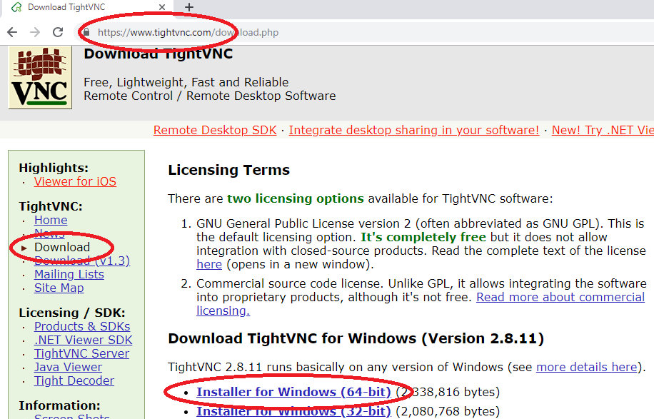
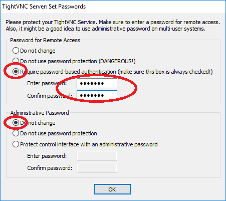
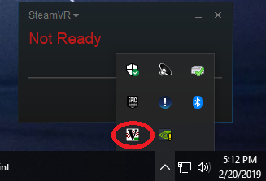

# Give Remote Control to VRCAVE Technical Support

## Downloading TightVNC

1. The recommended remote desktop tool for vrCAVE is tightVNC. The installer is free and can be downloaded from their website:  <https://www.tightvnc.com/download.php>

2. Once you download the TightVNC installer it should have a name like **"tightvnc-gpl-setup-64bit.msi"**. You can put this installer on a USB stick and copy it onto each VR Backpack, and also the vrCAVE server computer. 

## Setting up TightVNC Service as a server

1. After you copy the tightVNC installer onto a PC, run it and choose all the Typical default install options for everything. If the installation completes correctly, it will pop up a message at the end for password setup.

2. For security reasons, it is best to **Require password-based authentication** for remote access. You'll need to choose a password that is about 8 characters or less. Make sure you write down the password somewhere so that you don't lose it. Be sure to make the password something you can share with VRCave support. You can set the **Administrative Password** to **"Do not Change"**.
3. If TightVNC was successfully installed on the Computer, it should have an icon visible in the system tray (you can use this icon to change the password at a later time, if needed).

## Forwarding your Ports

Before you can be remotely connect to, you need to forward the ports on your router.

1. Using the vrCAVE server computer, open a web-browser and type in <http://192.168.1.1> to go to the router administration page. 
**Note:** If the page does not open (possibly because you are using a different router) you need to find your specific Default Gateway: <https://www.noip.com/support/knowledgebase/finding-your-default-gateway/> 
2. If prompted for the user name and password, the default is User name: **admin**, Password: **password** unless you have changed it in the past, or are using a different router model than the Nighthawk X6 R8000.
3. On the Router Configuration page, go to the Port Forwarding menu. Every router setup is different, but it is usually under Firwall or security sections. 

4. Fill in the LAN IP Address with your computers IPv4 address, this can be found by typing **ipconfig** into a command prompt.

5. For each port, fill it with **5900**. if you changed which port TightVNC Viewer is using, you will have to input that instead, by default it is set to 5900.

6. Repeat this step so that both **UDP** and **TCP** protocols are forwarded. 

Now your computer should be properly prepared for remote connection. just share your TightVNC password with your VRCave Technical Support Specialist and your public IP address, which can be found by following this link: [www.whatsmyip.com](www.whatsmyip.com)

