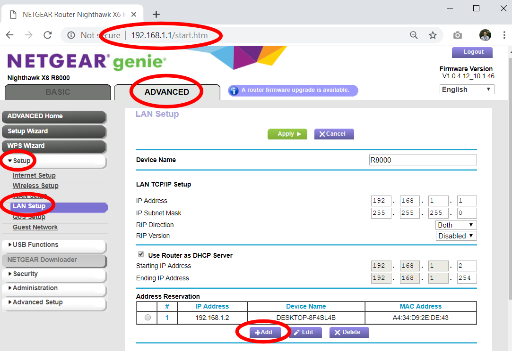
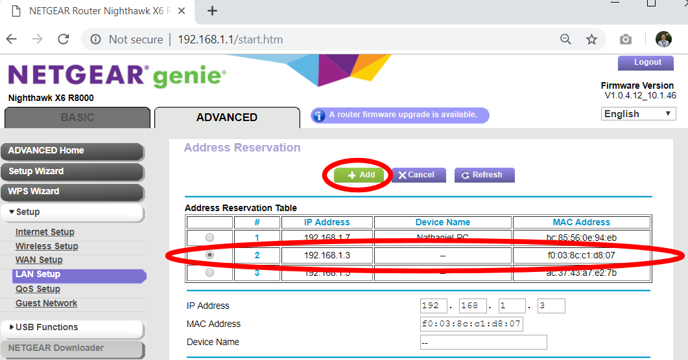
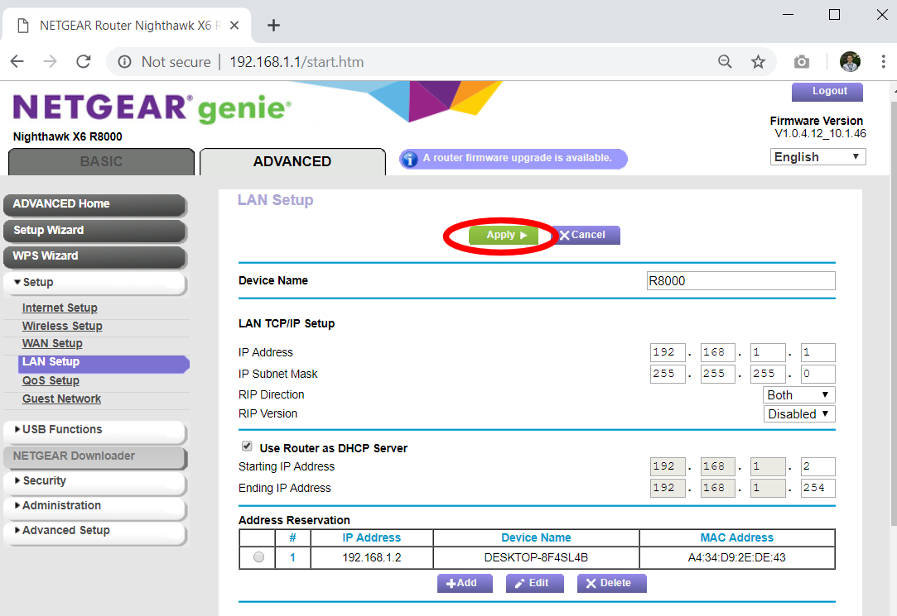

## Finding and Fixing the VR Backpack and Server Computer IP Addresses

Before you can remotely connect to a VR Backpack, you need to know its IP address on the network, and make sure it doesn't change:

1. Turn on all the VR Backpacks and make sure they are connected to the VR WiFi router.
2. Using the vrCAVE server computer, open a web-browser and type in <http://192.168.1.1> to go to the router administration page. 
**Note:** If the page does not open (possibly because you are using a different router) you need to find your specific Default Gateway: <https://www.noip.com/support/knowledgebase/finding-your-default-gateway/> 
3. If prompted for the user name and password, the default is User name: **admin**, Password: **password** unless you have changed it in the past, or are using a different router model than the Nighthawk X6 R8000.
4. On the Router Configuration page, go to the **ADVANCED tab -> Setup -> LAN Setup** to get to the LAN Setup Page. Click on the **+Add** button on the bottom of this page.
5. On the **Address Reservation** page the **Address Reservation Table** should list the IP address of each VR Backpack that is currently powered and connected to the WiFi network, however, these addresses will change the next time the router or computers are rebooted. To prevent this, you need to click on the table entry for a VR Backpack and then click the **+Add** button on the top of the page. This tells the router to keep the IP Address static from now on. *Do this again for each VR Backpack that you own.* 
6. If the previous step was completed successfully, back on the **LAN Setup** page, the **Address Reservation** table should list all of the VR Backpacks and their IP Addresses. **Important:** Write down (or take a picture) the IP Address of each VR Backpack, you will need this list for later. If you ever lose this list, you can re-visit this page to find them again later. Finally, click on the **Apply** button on the top of the page to save to save all your changes (otherwise you'll need to go back to step 1 and do everything over again). 

