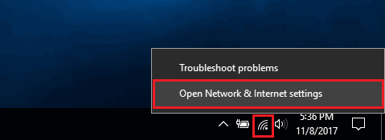
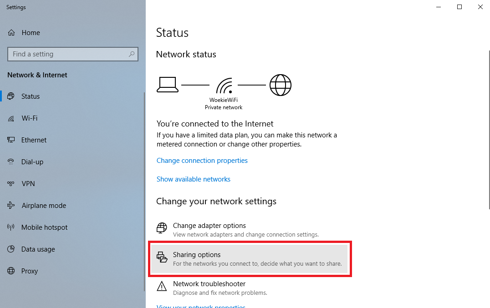
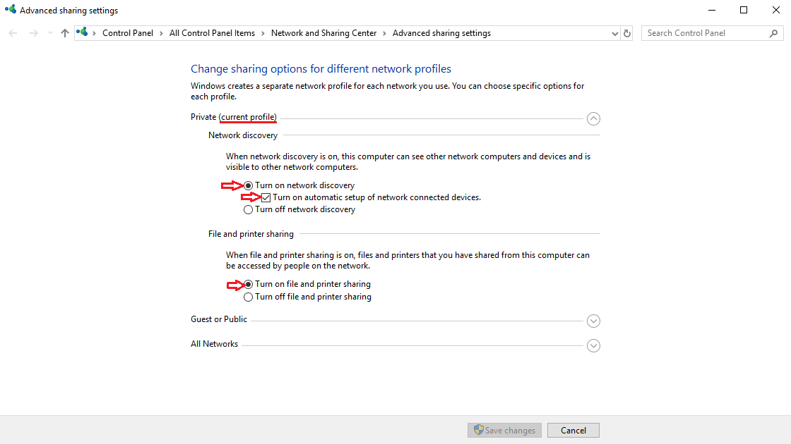

# Troubleshooting

While issues cropping up are rare, here is a list of some observed issues and their solution.  After checking for batteries and for loose cables, the most issues can be solved by power-cycling (i.e. turning the VR backpack off and turning it back on).

- **The VIVE headset sporadically goes white** - This is caused by something blocking the path from the headset sensors to the lighthouses.  Players should spread out in experience, and ensure that they do not hold their headset with their hands.

- **The VIVE headset constantly goes white and on the server computer, it appears to fly off in random directions** - This is caused by the headset receiving conflicting laser sweeps from the lighthouses.  Be sure that there are no shiny and/or reflective surfaces like windows or glossy floors.  Ensure that you have only a single pair of lighthouses for the playspace, and one is set to s-0 and the other is set to channel s-1; you can determine which channel each lighthouse is on by plugging a backpack into the helper station while SteamVR is running and hovering over the lighthouse icon.  In the case of a multi-roomed facility, ensure that there is sufficient physical blocking between room so that the lighthouse lasers from one playspace do not interfere with another.

- **The VIVE headset is only showing white** - A process in the background has stopped working, and is preventing rendering of the experience to the headset.  The best solution to this is a power-cycle.

- **The VIVE headset is only showing black** -  A process in the background has stopped working, and is preventing rendering of the experience to the headset.  The best solution to this is a power-cycle.

- **After repeatedly power-cycling, the headset still shows black** - At this point, the powered backpack needs to be plugged into the helper station (monitor, keyboard, and mouse).  Sometimes the act of plugging in the monitor will correct the black screen, if so, unplug and continue normal operations.  Else, the experience and *SteamVR* will need to be restarted

    To exit the experience, click on the main experience window, press tilde ( ` ),  type in ‘exit’, and hit return to close the experience. You can also exit by pressing *Alt+F4* (make sure the game window has been clicked on first).  Close *SteamVR* by right clicking on the window and choosing ‘Close Window’.

    Finally, restart the experience by double clicking on the *LaunchVRCaveClient.exe* located on the desktop or in *desktop->vrcave->WindowsNoEditor*.  The headset should now be working, and the backpack can now be unplugged from the helper station.

- **One or two hands of a player are no longer moving or their hands seem to be stuck in the floor in the middle of the room** - This happens when a controller has been shut off, simply hold the the button below the D-pad on the controller for 3 seconds to turn on the affected controllers.

- **Audio is no longer working** -  A process in the background has stopped working, and is preventing rendering of the experience to the headset.  The best solution to this is a power-cycle and/or changing audio devices the sound outputs to.  Additionally, sometimes changing which port the monitor is plugged into on the helper station fixes the issue.

- **Vive Pro headsets not hearing each other over mumble** - This could be caused by the Vive pro headsets physical mute button on the right headphone. pressing this button is unfortunately pretty easy to do accidentally. Press the mute button and check the audio, if nothing happens try pressing it again and checking the audio, sometimes this button just needs to be toggled on, off and on again. 

- **Players are all still in the experience, but can no longer see each other** - This is likely caused by the server having an unexpected error and it’s experience is crashing.  On the server computer, close the black-grey error report window and relaunch *LaunchVRCaveServer*.  Use the keyboard commands to restore the experience to it’s previous state before the crash.

- **A particular player head is noticeably taller/shorter than it should be** - This is due to the VIVE running a background process, and has incorrectly adjusted the height of the floor.  Place the headset on the ground and cover its face (the pitted plastic exterior) with a cloth.  The headset screen should initially go white, then after a few seconds it will black.  Then remove the cloth, and the head height should be readjusted.  You might need to perform this a few times, alternatively the problem will usually go away by itself after sometime after the headset has been placed on the ground.

- **A particular player keeps running into players and/or the virtual walls do not line up with the room’s physical walls** - This is due to a poor SteamVR Room Scale calibration, or the position of one or more of the lighthouses has shifted.  Plug the VR backpack into the helper station, and perform a fresh room calibration.

- **On startup, an error message says something like: “dx11 feature level 10.0 is required to run the engine”.** This means that your computer does not have up-to-date video drivers installed. This is normally installed automatically by Windows Update, but you can forcibly update the video drivers yourself while connected to the internet. Look at: <https://support.microsoft.com/en-ca/help/4028443/windows-update-drivers-in-windows-10>

    For windows 10 instructions. You can also search for “How to update video drivers” online to find videos and in-depth articles on how to do it.

- **On startup, the server computer is up and running, and each of the backpacks successfully boot up into the experience, but none of them show up on the server computer’s monitor** -  This is caused by the server computer and the VR backpacks not being on the same network.  Ensure that each of the backpacks are joined to the same network that the server computer is on (you will need to use the helper station to confirm this), and make sure that they are set to connect automatically to the server computer's.

If this still doesn't work, there might be an underlying issue with the Windows' Sharing settings.  This will need to be modified on the server computer and then each of the backpack:

- Right-click on the network icon in the system tray and select 'Open Network and Internet Setting'

    

- Click on 'Sharing Options'

    

- Under your current profile (likely private, but could be found under the public section as well), select: "Turn on network discovery", "Turn on automatic setup of network connected devices.", "Turn on file and printer sharing"

    

- Hit "Save Changes" at the bottom of the window, then restart the computer.