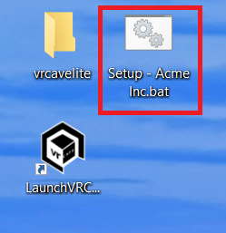

# Updating Guide Lite

*(Assumes a full install and successful operation of existing vrCAVE Library product)*

## Updating to the Latest vrCAVE Lite Version

*The best way to ensure a clean version is to first delete the exist software folder, and replacing it with the new version*

On the server computer:
1. Download the latest vrCAVE Lite software and unzip the folder using the URL provided to you from vrCAVE.

2. Delete the old vrcaveLite folder from the desktop

3. Unzip the new vrCAVE Lite software so that the vrcaveLite folder is located on the desktop

    

----

For each Quest headset:
1. Plug the headset into the computer using a USB cable

2. Navigate to the vrcaveLiteFolder, and click into the Android_ASTC folder.

3. Double click the **Install_VRcaveLibrary-arm64.bat** and let the script run. You will see a progress percentage, and the window will close on it's own when it is completed.

	
	

4. If it just says "-Waiting for device-" then you may need to accept a popup inside the headset. 

## Updating your License Information

1. On the server computer, download your version of the license setup script from the URL provided to you by vrCAVE.

2.  Place the .bat file on your desktop and double-click to run

    

3. You should receive a message stating "Updated license information successfully"

    

