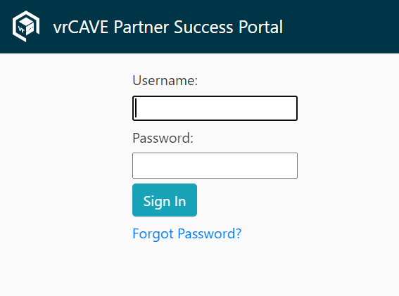
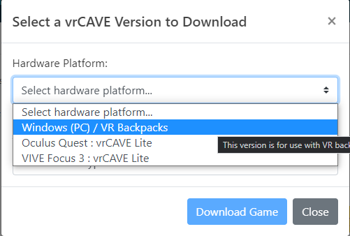
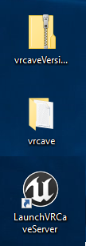
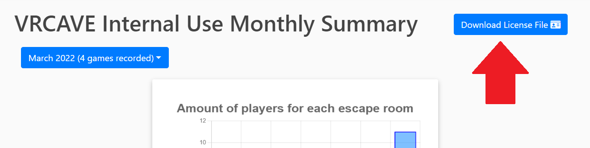
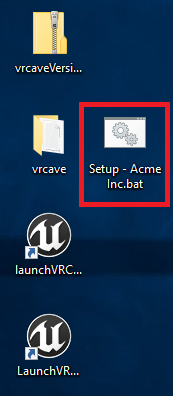
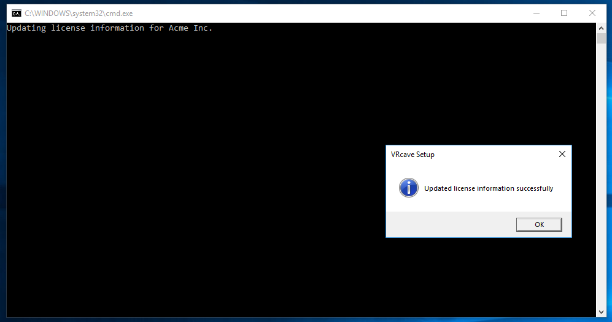

# Updating Guide

*(Assumes a full install and successful operation of existing vrCAVE Library product)*

## Downloading the Lastest Version 

1. Go to the [Partner Success Portal](https://partnersuccess.vrcave.ca/) 

	

2. Log in using the Login credentials provided by VRCave

3. Find the "Download Latest vrCAVE Version" Button

	
	
4. Select the Download details that best describe your VR Setup

	

## Updating to the Latest vrCAVE Library Version

*The best way to ensure a clean version is to first delete the exist software folder, and replacing it with the new version*

On the server computer and for each VR backpack:
1. Unzip the vrcaveLibrary zip file 

2. Delete the old vrcave folder from the desktop

3. Unzip the new vrCAVE Library software so that the vrcave folder is located on the desktop

    

----
<!--
## Updating your License Information

1. On the server computer, download your version of the license setup script from the Customer Success Portal.

	

2.  Place the .bat file on your desktop and double-click to run

    

3. You should receive a message stating "Updated license information successfully"

    

-->