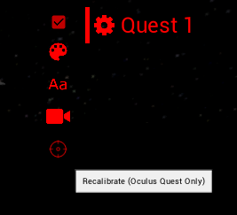
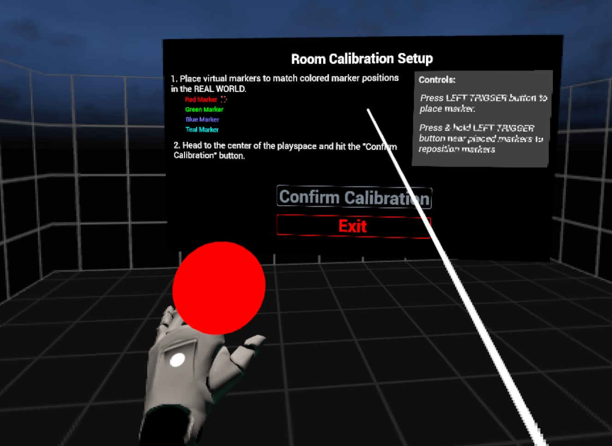

# vrCAVE Lite Calibration

## In Game Calibration

- To make sure that each player is where they are supposed to be in game, you will need to perform a calibration on each headset, you can start the calibration from the server by clicking on the gear next to the player name and then clicking the crosshairs that appear when the gear is clicked. 

	
	
-  In the selected headset, you will see the calibration window pop up and a red ball attached to the left hand. 

	
	
- You will need to touch the controller to all 4 corners of the room like the diagram below, It helps to mark out the corners with numbers so the first corner can be quickly identified when calibration needs to be done.  You must place the markers in the corners on the floor of your real world space as the calibration also sets the games floor height. You will need to keep the headset on, while also looking out from under the headset to see where you are going. 

	
	
	
- When you are done, point the laser pointer on the right hand at the Confirm Calibration button, the play area should visibly shift into position, you can test the calibration by performing a "high five" with another player who is calibrated in the game, you will know the calibration worked if the controllers clack against each other when your hands are close to each other. If the hands connect in game but miss In real life (or using the professional VR Developers term: "Meat Space") then the calibration was not successful and one or both of the players needs to calibrate again. 

### Fixing Calibration issues

- VRCAVE calibration should persist when the headsets go to sleep or are shut down. However, it is possible for the calibration to be lost. This usually happens if the headset lost the guardian, found another from memory, and returned to the previous guardian, or the guardian had to be redrawn. 

- In this case, the best thing to do is:
	1. Reboot the headset 
	2. Redraw the guardian (if it is not restored on it's own)
	3. Perform VRCAVE calibration 