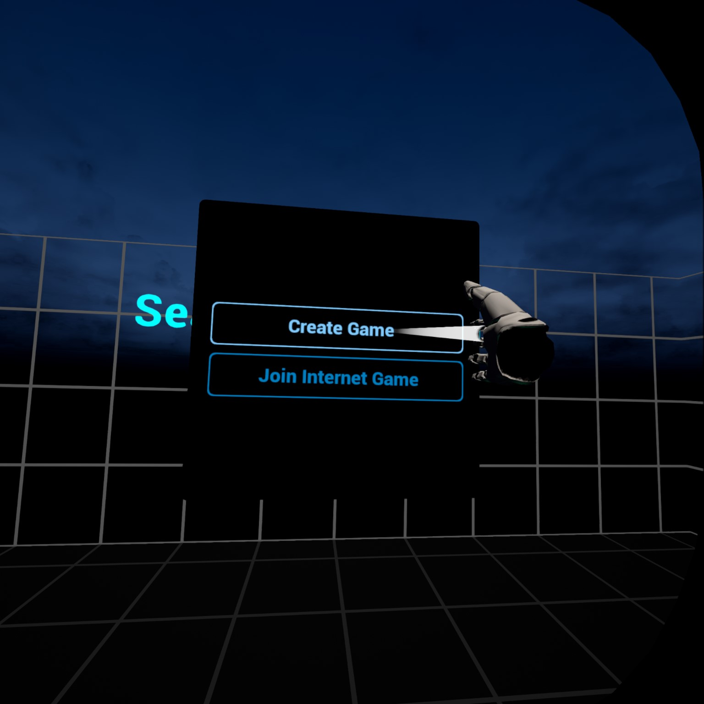

# vrCAVE Singleplay Setup

**NOTE: This is for demo purposes only**

## Navigating within VRcaveLibrary

In typical use, vrCAVE running on an PC Backpack connects to a Windows PC running the vrCAVE Server, and the game operator controls all navigation (switching between escape rooms, launching the auto intro, etc.) from the server PC.

For this scenario of trying out vrCAVE demo without a server PC, you’ll need to take some extra steps to select and launch the game from within VR, and skip through the rooms.

## Activating Single Player Mode

- First, to unlock the operator controls (which are not intended to be available to players), tap the following physical buttons on your Vive hand controllers: 

- **Right_Menu_Click , Right_Trackpad_Click , Right_Trackpad_Click , Right_Menu_Click , Left_Menu_Click , Left_Trackpad_Click , Left_Menu_Click**

	
	
	
- Or to reference the image above (R and L is Right Controller and Left Controller respectively): **R1, R2, R2, R1, L1, L2, L1**

- Next, press **Left_Trackpad_Click** to open the operator menu. From now on, you can close or open the operator menu with the **Left_Trackpad_Click** button.
- From here, point your right hand controller at the **VRcave at Home**, click the right trigger to activate it.
	
	
- A menu will appear in the lobby, close the operators menu by pressing **Left_Trackpad_Click** and select **Create Game** wait a few seconds: the screen will fade to black and you’ll be transported to the `Space Station Tiberia Lobby`.
	
	
	
## Playing Space Station Tiberia

- Press **Left_Trackpad_Click** again to reopen the operator menu.
- Point at **Start Game** and click on it with the right trigger
- You’ll be in the Observation Deck level. You can either try solving the puzzles as a player would, or to skip to the next level by pressing X and clicking on Request Level Victory
- Again, try solving the puzzles, or press **Left_Trackpad_Click** and click on **Request Level Victory** (or try **Request Level Failure** to see the bad ending). You’ll be taken back to the lobby level.

## Playing Depths of Osiris, Dragon Tower, and Laser Bots
	
- The remaining games can be tested in the same fashion: from the lobby press **Left_Trackpad_Click** to open the operator menu
- Click on one of the game lobby buttons
- Once the lobby loads, press **Left_Trackpad_Click** and click on **Start Game**
- Experiment with the puzzles in each room, and/or press **Left_Trackpad_Click** and click on **Request Level Victory** to skip ahead
