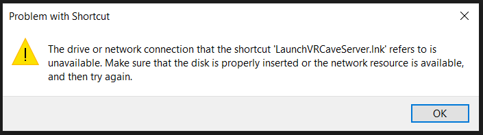
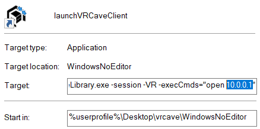
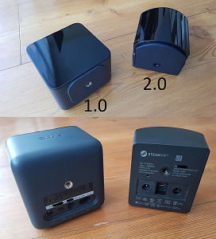

# vrCAVE Library BoothMode 

First, Download the latest version of the vrcave library in the link below

- Download: [vrCAVE Library Boothmode](https://drive.google.com/drive/folders/1j1snQwk93P9RR5ih0KRtLjCa1nqovh7a)

Once you have the **vrcaveVersionX.X.X-BOOTHMODE.zip** folder downloaded, please follow these steps:

1.  Unzip the folder to the **Desktop** of the “VR ready” computers for each headset so that the folder titled **vrcave** is on the desktop.

	

2.  Perform a room setup in SteamVR and create a play space that will allow players to reach out comfortably. **If you already have a working VR booth, you can skip this step.

3. For a **Dedicated Server**, designate one computer as the host 'server computer' (this controls the game and which level is selected). On this computer, you will want to use the **'LaunchvrcaveServer'** shortcut from the desktop (steam should not be running and no headsets connected). For all of the other backpacks, use **‘LaunchvrcaveClient’** shortcut.

-   If you get an error like the one below, either your vrcave folder is not on the desktop, or there is a problem with your folder path, [you can troubleshoot that here](Shortcut_Troubleshooting.md)

	

4. Players will be able to teleport using the touchpad on the left hand controller, and quick turn using the touchpad on the right hand controller. 

5. For multiplayer mode with a player as the server, create static IP addresses for each of the booth computers. Choose a ‘server’ player and start the game using the **LaunchVRCaveServerasPlayer** shortcut. For the booths that will connect to it, create a copy of the **launchVRCaveClient** shortcut, right click the shortcut and click properties, add the IPv4 address of the server player to the target path as shown below. Launch the game with this shortcut and they will join the designated server

	
 
## Operation

6. To access each of the games:
Shift+1 for Hospital of Horror
Shift+2 for Space Station Tiberia
Shift+3 for Depths of Osiris
Shift+4 for Dragon Tower
Shift+5 LaserBots
Shift+6 Time Travel Paradox
Shift+7 Manor of Escape

7.  Left click begin game or Press spacebar to begin. Alternatively, you can press ‘V’ to skip the brief explanation before players start.

---

# Common Issues 

### Head Mounted Display goes blank

1. Check HMD 3-in-1 cable connection. Most likely a cable has come loose and just needs to be plugged back in. 

2. If you have a link box, check if it is on, and that it is still plugged in. 

3. Check for SteamVR errors by plugging into a helper station or using TightVNC.

	

4. If 1 and 2 do not work you may need to replace either the 3-in-1 cable or the Link box. you shnuld be able to pinpoint which one is causing the issue by swaping 3-in-1 cables or the link box between backpacks and see if the problem moves to the other backpack.

### SteamVR Compositor Error

- Most common cause is the USB cable that is part of the 3-in-1 cable is not connected or damaged, securing it or replacing it should do the trick

### Headset Not Detected

- Similar to the compositor error, part of the 3-in-1 cable is not connected or damaged. Just unplugging and plugging back it might work, otherwise the cable may need to be replaced.

### Players Not Connecting at all

1. The most common occurance of this is version missmatch, the server computer and client are running different versions of the game. Deleting the vrcave folder on the backpack and replacing it with a copy of the server computer vrcave folder should resolve it.

2. Check the wifi network for both server and backpack. they both need to be on the same network.

3. Check the backpack is starting the game. the shell:startup folder needs to have a .bat file in it.

   - you can get into this by clicking the windows icon on the bottom left corner and typing "Run" and pressing enter, then entering `shell:startup` into the run program application that opens. 

	
	
4. Check the server computer and backpack's Windows Defender Firewall app permissions, if the **vrcaveLibrary.exe** is not allowed to use your network, then it cannot host or join a game. 

	- In the windows search bar, type *"allow an app through windows firewall"* and select the option of the same title. Look for vrcavelibrary.exe in the list and make sure it has both public and private selected.
	
	- If it is not in the list, select *"allow another app"* and then navigate to the vrcave folder, open *windowsNoEditor* folder, and select **vrcavelibrary.exe**. Finally allow that newly added application to use public and private networks
	
	

### Controllers Stop Tracking

1. check that each of the lighthouses are on and broadcasting. a lighthouse that is broadcasting will have a green status light on its face, as well as a channel letter in one of its corners. If you have lighthouse 2.0 units then it's just the green status light. *(lighthouse 2.0 has a curved face, where 1.0 has a flat face)*

	
	
2. check to see if there is anything blocking the controller from the lighthouses. This can include the player themselves or other players crowding around each other.

3.  check the play area for reflective surfaces. because of the way lighthouses work, having a mirror or shiny surface often cause unpredictable tracking issues. if you can see yourself reflecting off a surface, its best to get it out of the play area.

4. anything covering the Controller sensors. the dimples on the controller are how it tracks its position, anything covering those will cause tracking problems. 
	
	
	
5. check the controllers status on SteamVR `(While connected to the internet)`. if it requires a firmware update, an **i** icon will display infront of the controller icon. click the icon on the controller and click update firmware. then follow the prompts on screen.

	
	

### Players Suddenly Disconnect

- The most common occurance of this is version missmatch, the server computer and client are running different versions of the game. Deleting the vrcave folder on the backpack and replacing it with a copy of the server computer vrcave folder should resolve it.

### Backpack Not Shutting Down

- If the backpack does not shut down when you press the power button, plug it into a helper station to diagnose the problem.
   - **Steam VR not closing:** if not properly set up, steam vr will halt shutdown because it is running the vrcave library. If you go into the vrcave folder and follow the path vrcave->utilities and run the `AutoEndTasksOnShutdown.reg` this will force steam and the vrcave library to close when shutting down.
   - **Windows Update:** Its best to let the update finish. If you are in a hurry, pulling the batteries will force a shutdown and it should start up again *without too many problems.* do not forget to let it complete that update later or this will keep happening. 
	
### Players Start On The Ground

- Your Lighhouses are not on or on standby mode. Try unplugging the power and plugging it back in. If they do not turn on, you may have to replace them

### Steam Menu Pops up

- To disable this, you must go into steamVR menu on the backpack and select settings, then select the Developer Section and **Uncheck** VR Dashboard 

	
	
### Player Tracking is not Reliable

1. check that each of the lighthouses are on and broadcasting. a lighthouse that is broadcasting will have a green status light on its face, as well as a channel letter in one of its corners. If you have lighthouse 2.0 units then it's just the green status light. *(lighthouse 2.0 has a curved face, where 1.0 has a flat face)*

  

2. check to see if there is anything blocking the HMD (VR headset) from the lighthouses. This can include the player themselves or other players crowding around each other.

3.  check the play area for reflective surfaces. because of the way lighthouses work, having a mirror or shiny surface often cause unpredictable tracking issues. if you can see yourself reflecting off a surface, its best to get it out of the play area.

4. anything covering the HMD sensors. the dimples on the headset are how it tracks its position, anything covering those will cause tracking problems. 

