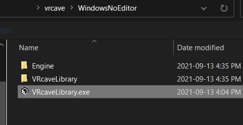

# vrCAVE Library Demo

First, Download the latest version of the vrcave library from the link given to you by vrcave

Once you have the vrcaveVersion1.6.3.zip folder downloaded, please follow these steps:

1.  Unzip the folder to the **Desktop** of the “VR ready” computers for each headset so that the folder titled **vrcave** is on the desktop.
	
	

2.  Mark out a completely empty 15' X 18' play space (4.5 metres X 5.5 metres) 

3.  For each of the Backpack or PC with vive wireless adaptors, have SteamVR installed and run the SteamVR room setup on the 15' X 18' space (4.5m X 5.5m). Ignore any warnings about the lighthouses being too far apart, and have the 'final green calibration box' be centered in the play space as best as possible. The white arrow in the green box should point at one of the longer 18’ (5.5m) walls. [click here a more detailed explanation of steamVR room setup.](https://vrcave.github.io/operationGuide/SteamVRRoomSetup.html)

4. For **Single Player** mode, launch **LaunchvrcaveClient**  shortcut located in the *vrcave/Utilities* folder.

5. For **Multi-Player** mode, designate one computer as the host 'server computer' (this controls the game and which level is selected). On this computer, you will want to use the **'LaunchvrcaveServer'** shortcut from the desktop (steam should not be running and no headsets connected). For all of the other backpacks, use **‘LaunchvrcaveClient’** shortcut.

-   If you get an error like the one below, either your vrcave folder is not on the desktop, or there is a problem with your folder path, [you can troubleshoot that here](Shortcut_Troubleshooting.md)

	

## Operation

6. Use Shift+1 for Hospital of Horror, Shift+2 for Space Station Tiberia, Shift+3 for Depths of Osiris, Shift+4 for Dragon Tower, shift+5 LaserBots, shift+6 Time Travel Paradox, shift+7 Manor of Escape.

7.  Press spacebar to begin. Alternatively, you can press ‘V’ to skip the brief explanation before players start.

# Common Issues 

### Head Mounted Display goes blank

1. Check HMD 3-in-1 cable connection. Most likely a cable has come loose and just needs to be plugged back in. 

2. If you have a link box, check if it is on, and that it is still plugged in. 

3. Check for SteamVR errors by plugging into a helper station or using TightVNC.

	

4. If 1 and 2 do not work you may need to replace either the 3-in-1 cable or the Link box. you shnuld be able to pinpoint which one is causing the issue by swaping 3-in-1 cables or the link box between backpacks and see if the problem moves to the other backpack.

### SteamVR Compositor Error

- Most common cause is the USB cable that is part of the 3-in-1 cable is not connected or damaged, securing it or replacing it should do the trick

### Headset Not Detected

- Similar to the compositor error, part of the 3-in-1 cable is not connected or damaged. Just unplugging and plugging back it might work, otherwise the cable may need to be replaced.

### Players Not Connecting at all

1. The most common occurance of this is version missmatch, the server computer and client are running different versions of the game. Deleting the vrcave folder on the backpack and replacing it with a copy of the server computer vrcave folder should resolve it.

2. Check the wifi network for both server and backpack. they both need to be on the same network.

3. Check the backpack is starting the game. the shell:startup folder needs to have a .bat file in it.

   - you can get into this by clicking the windows icon on the bottom left corner and typing "Run" and pressing enter, then entering `shell:startup` into the run program application that opens. 

	
	
4. Check the server computer and backpack's Windows Defender Firewall app permissions, if the **vrcaveLibrary.exe** is not allowed to use your network, then it cannot host or join a game. 

	- In the windows search bar, type *"allow an app through windows firewall"* and select the option of the same title. Look for vrcavelibrary.exe in the list and make sure it has both public and private selected.
	
	- If it is not in the list, select *"allow another app"* and then navigate to the vrcave folder, open *windowsNoEditor* folder, and select **vrcavelibrary.exe**. Finally allow that newly added application to use public and private networks
	
	

### Players Suddenly Disconnect

- The most common occurance of this is version missmatch, the server computer and client are running different versions of the game. Deleting the vrcave folder on the backpack and replacing it with a copy of the server computer vrcave folder should resolve it.

	
### Players Start On The Ground

- Your Lighhouses are not on or on standby mode. Try unplugging the power and plugging it back in. If they do not turn on, you may have to replace them

### Player Tracking is not Reliable

1. check that each of the lighthouses are on and broadcasting. a lighthouse that is broadcasting will have a green status light on its face, as well as a channel letter in one of its corners. If you have lighthouse 2.0 units then it's just the green status light. *(lighthouse 2.0 has a curved face, where 1.0 has a flat face)*

  

2. check to see if there is anything blocking the HMD (VR headset) from the lighthouses. This can include the player themselves or other players crowding around each other.

3.  check the play area for reflective surfaces. because of the way lighthouses work, having a mirror or shiny surface often cause unpredictable tracking issues. if you can see yourself reflecting off a surface, its best to get it out of the play area.

4. anything covering the HMD sensors. the dimples on the headset are how it tracks its position, anything covering those will cause tracking problems. 
