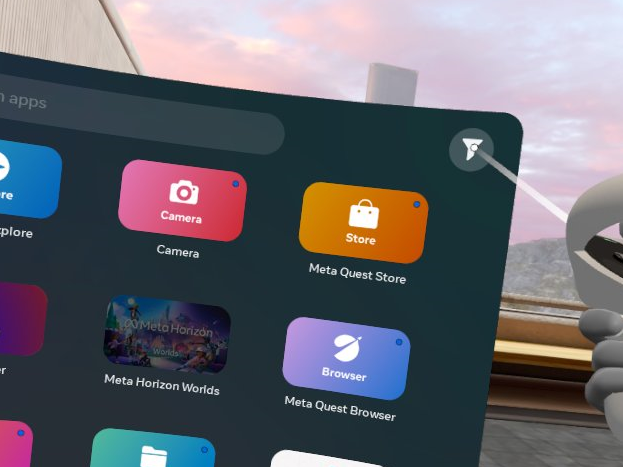
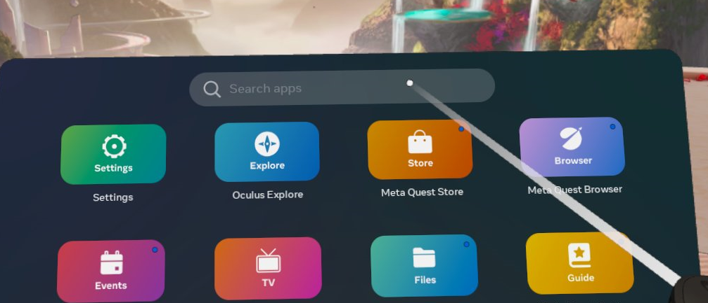
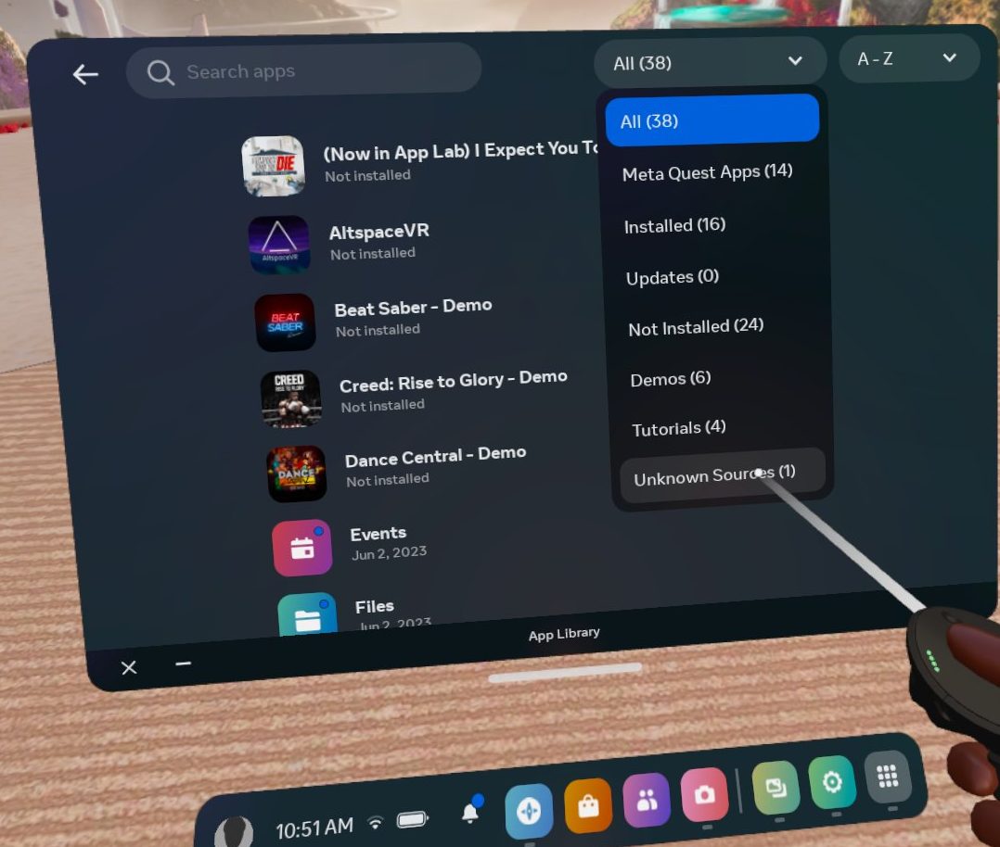
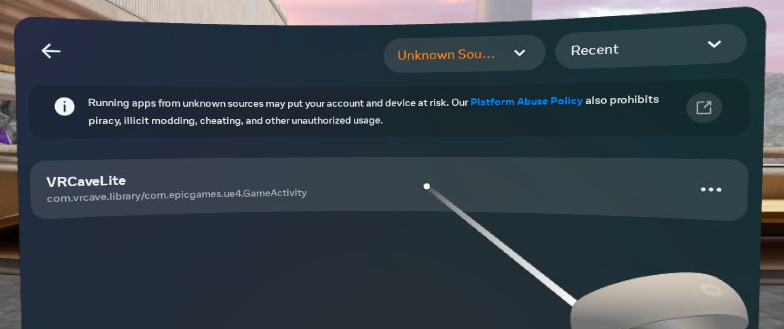
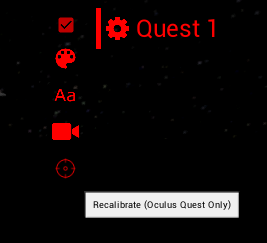
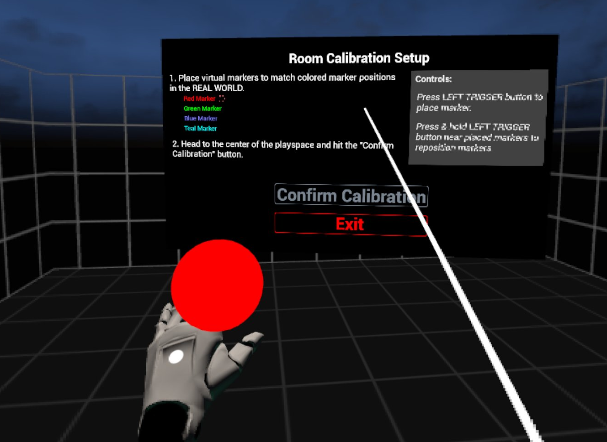
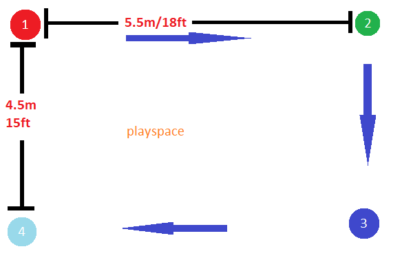
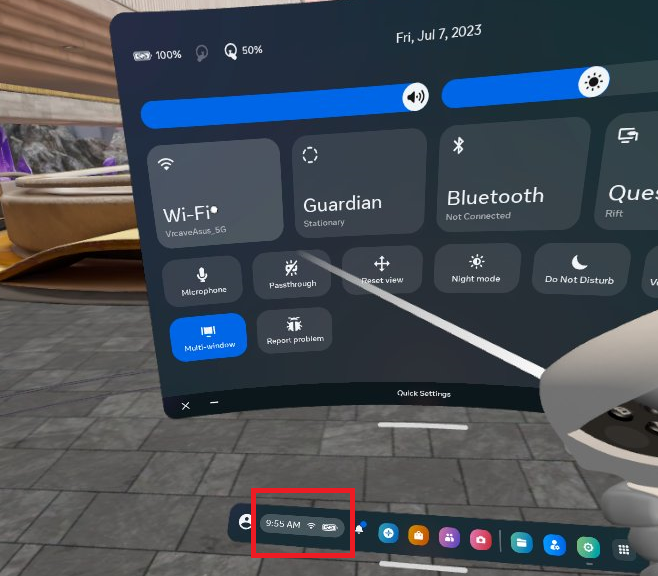
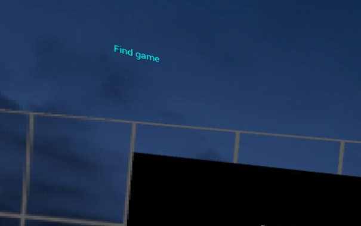
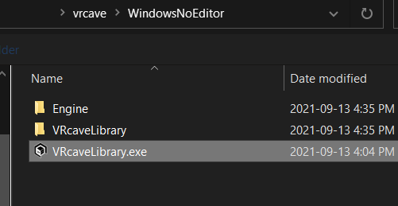

# vrCAVE Lite Multiplayer Demo

[Video Walkthrough](https://www.youtube.com/watch?v=sjQW4b5ruuU&ab_channel=vrCAVEInc.)
 
## Hardware Requirements
You’ll need an Oculus Quest, a Windows PC, and an iPhone or Android phone for running the Oculus app.

**NOTE: This is for demo purposes only**
First, Download the latest version of the vrcave library from the link given to you by vrcave

Once you have the vrcaveLite-x.x.x.zip folder downloaded, please follow these steps:

Unzip the folder to the **Desktop** of the computer you will be using to install the library on the Oculus Quests

	

## Room Requirements
Trying out vrcaveLite requires a play space of 15' x 18' (4.5m x 5.5m). We recommend having at least an additional 50cm of buffer beyond this to reduce the danger of bumping into walls.

Make sure your Quest’s guardian boundary is set up so you can walk freely around the entire 15' x 18' (4.5m x 5.5m) space. A brightly lit room is important for the Quest’s tracking.

## Preparation for Sideloading

Before installing the vrCAVE Lite demo, your Oculus Quest needs to be set up for sideloading. 

This will involve installing the Oculus app on an iPhone or Android phone, creating a developer account, enabling Developer mode on your Quest from the iPhone/Android app, and installing the ADB drivers on your Windows PC.

- [Follow the steps found here to prepare your headsets for sideloading](vrcave_Lite_Sideloading.md)

<!-- We recommend the following video for a step-by-step guide for preparing your Quest for sideloading: -->

<!-- *** **Follow steps 1 through 4 in the video, stopping at the beginning of “Step 5 - Download & Install SideQuest” (which is NOT needed):** 
[Simple Sideloading On Oculus Quest 2](https://youtu.be/RoIXxIfRNTw) -->

## Installing (Sideloading) the VRcaveLite app on to your Quest

Make sure your Quest is connected to your Windows PC via USB.

- Download and extract the `vrCAVELite-<version>.zip` from the provided link. Navigate into the **vrcaveLite\Android_ASTC\** folder and double-click on **Install_VRcaveLibrary-arm64.bat**. 

- The first time you sideload the software, you will need to put the headset on while plugged into the Windows PC Via USB and sellect **Allow** On the popup that appears. It should appear every time you connect via USB and try to install, but only needs to be allowed the first time. 

	

- It should take 2-3 minutes - if the install completes successfully, the window will close with no further feedback.

## Launching VRcaveLibrary on the Quest

In VR, from the main menu bar at the bottom of the screen, click on the **Apps** tab. In the Apps window, click on the **Filter Button** on the top right of the window.

If you do not see the filter button, click into the search bar to open the apps filter

Open the *All(#)* dropdown and select **Unknown Sources**

In the **Unknown Sources** category, click on **VRcaveLibrary** to launch it.

	

## Navigating within VRcaveLite

In typical use, VRcaveLite running on an Oculus Quest connects to a Windows PC running the VRcaveLite Server, and the game operator controls all navigation (switching between escape rooms, launching the auto intro, etc.) from the server PC.

## Setting up the Server Computer

- On the Windows PC, Navigate to the `vrCAVELite-<version>` folder and then move the folder titled **vrcaveLite** to the desktop as well as "LaunchVRCaveLiteServer" shortcut.

- Double click the launch server shortcut. 

- If you get an error that says some .dll files cannot be found, you may need to update your [DirectX drivers](https://www.microsoft.com/en-us/download/details.aspx?id=35) 

## In Game Calibration

- To make sure that each player is where they are supposed to be in game, you will need to perform a calibration on each headset, you can start the calibration from the server by clicking on the gear next to the player name and then clicking the crosshairs that appear when the gear is clicked. 

	
	
-  In the selected headset, you will see the calibration window pop up and a red ball attached to the left hand. 

	
	
- You will need to touch the controller to all 4 corners of the room like the diagram below, It helps to mark out the corners with numbers so the first corner can be quickly identified when calibration needs to be done. You must place the markers in the corners on the floor of your real world space as the calibration also sets the games floor height. You will need to keep the headset on, while also looking out from under the headset to see where you are going. 

	

	
- When you are done, point the laser pointer on the right hand at the Confirm Calibration button, the play area should visibly shift into position, you can test the calibration by performing a "high five" with another player who is calibrated in the game, you will know the calibration worked if the controllers clack against each other when your hands are close to each other. If the hands connect in game but miss In real life (or using the professional VR Developers term: "Meat Space") then the calibration was not successful and one or both of the players needs to calibrate again. 

# Common Issues 

### Quest headset not joining game
 1. Confirm the quest is connected to the correct wireless network. 
	
 2. Check that the quest is trying to connect to the server. You should periodically see a message pop up in the upper lefthand corner of the HMD. If the are no messages, then
	
 3. Close the VRCave Library application and start it up again. 

### Quest player is frozen in place in the game
 1. This usually happens because the quest lost tracking and a popup came up, This popup has a button on it and most peoples first reaction is to press the button. unfortunately, the button turns off tracking.
 2. Minimize the vrcave librabry by holding the oculus button and find press the tracking mode button. re-establish roomscale tracking. 
 
 
### Quest is not finding its guardian boundries
 1. This happens sometimes on startup, the quest does not recognize the room for whatever reason. put on the headset and look around the room slowly. eventually the guardian bounds will be found.
 2. If the guardian bounds do not recover, then you can ethier restart the Quest headset, or begin the process of redrawing new guardian bounds. 
 
### Players Not Connecting at all
1. The most common occurance of this is version missmatch, the server computer and client are running different versions of the game. Reinstalling vrcaveLite from the android folder in the server computers vrcaveLite folder should do the trick

2. Check the wifi network for both server and Quest headset. they both need to be on the same network.

	
3. Check the server computer's Windows Defender Firewall app permissions, if the **vrcaveLibrary.exe** is not allowed to use your network, then it cannot host a game. 

	- In the windows search bar, type *"allow an app through windows firewall"* and select the option of the same title. Look for vrcavelibrary.exe in the list and make sure it has both public and private selected.
	
	- If it is not in the list, select *"allow another app"* and then navigate to the vrcave folder, open *windowsNoEditor* folder, and select **vrcavelibrary.exe**. Finally allow that newly added application to use public and private networks
	
	

### Headset tracking is not Reliable

- If headsets constantly lose guardian bounds or players views are going blank with a message for lost tracking, then the room or it's surroundings may not be ideal for oculus Quest's inside out tracking. Below are a few best practices for setting up a playspace. 

  - [Ways to improve Tracking](vrcave_Lite_Tracking_Best_Practices.md)
  
  