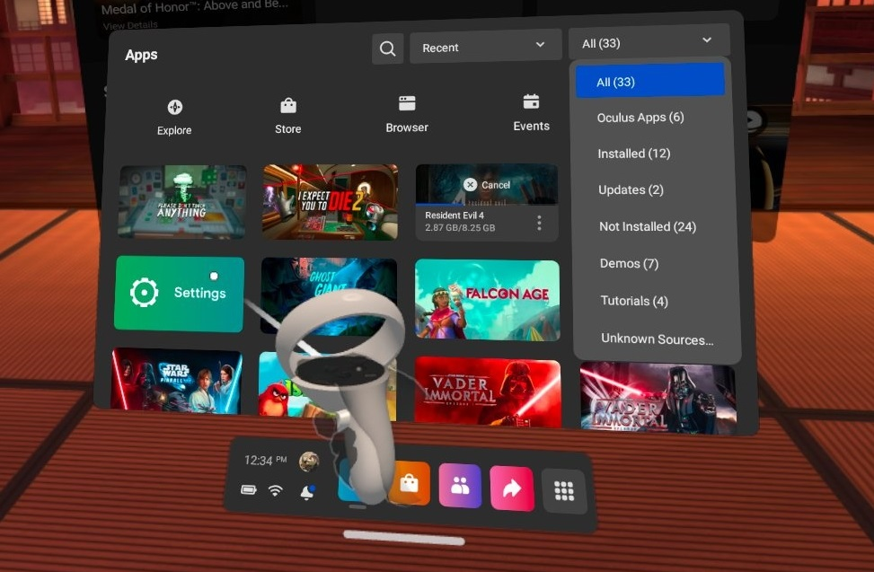
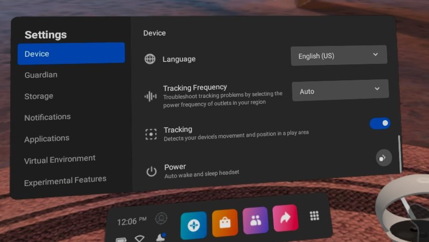
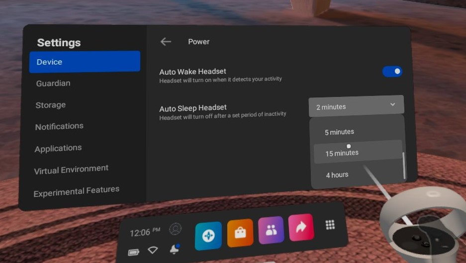

# vrCAVE Lite
We offer a *"Lite"* version of our software which has been specially redesigned for an optimal experience on the Oculus Quest headset.


## Hardware Requirements
1. ##### Oculus Quest Headset with Controllers
    - Recommended 5 sets (plus 1 backup)
	- one USB-A to USB-C sync cable
2. ##### Windows Computer
    - **OS:** Windows 10
    - **CPU:** anything above a [PassMark Score of 7,700](https://www.cpubenchmark.net/high_end_cpus.html)
    - **Graphics:**  anything above a [PassMark Score of 8,800](https://www.videocardbenchmark.net/high_end_gpus.html)
	- **RAM** 8Gb minumum, 16GB or more recommended 
    - **Peripheries:** Ethernet port, ports for mouse, keyboard, and monitor
3. ##### Router
    - Netgear Nighthawk X6 R8000 Tri Band Gigabit Wireless Router (or similar)
    - Recommended 2 bands of 5GHz (in case of future side by side rooms setup)
	- Connection to the internet is recommended
4. ##### Mobile phone 
    - iPhone or Android,  for running the Oculus app

## Room Requirements
vrCAVE Lite requires a play space of 4.5M x 5.5M (15'x18') . We recommend having at least an additional 50cm (20") of buffer beyond this to reduce the danger of bumping into walls.

Make sure your Quest’s guardian boundary is set up so you can walk freely around the entire 15' x 18' (4.5m x 5.5m) space. 

### Achieving Optimal Tracking
A brightly lit room is important for the Quest’s tracking. Oculus Quest also requires some room features to help with its visual insight tracking, posters or banners should be enough for the walls, the floor may be a bit more complicated. An example of a good tracking floor is a carpet with a non-symetrical design or carpet tiles of different colors. If that isn't possible, you can also mark the floor with some painters tape or duct tape. as long as the markings are non-symetrical and visible when viewed in the Quest headest guardian boundary cameras the Quests shouldn't have any troubles tracking.

(These suggestions are subject to change as Oculus continues to develop Inside-Out Tracking.)

## Before Setup

- [Watch the Technical overview video](https://youtu.be/sjQW4b5ruuU) 
- Measure out the 5.5m by 4.5m playspace and mark the corners. Number the corners from 1-4 so that the distance between 1 and 2 is 5.5m, going clockwise. the calibration section of this guide has a graphic to explain.
- You no longer will be required to have a facebook account linked to your oculus (or meta) account, Simply make a Meta account to be used for all headsets.


## Preparation for Sideloading
Before installing vrCAVE Lite, your Oculus Quest needs to be set up for sideloading.

- [Follow the steps found here to prepare your headsets for sideloading](vrcave_Lite_Sideloading.md)

## Installing (Sideloading) the VRcaveLibrary app on to your Quest
#### *PLEASE NOTE*
Your file path to the *vrcaveLite* software should to be free of any spaces. 
* **Bad:** *C:\Windows\Username with spaces\Desktop\Some folder with spaces\vrcaveLite*
* **Good:**  *C:\Windows\UsernameWithNoSpaces\Desktop\vrcaveLite*

Make sure your Quest is connected to your Windows PC via USB.

- Download and extract the `vrCAVELite-<version>.zip` from the provided link. Navigate into the **vrcaveLite\Android_ASTC\** folder and double-click on **Install_VRcaveLibrary-arm64.bat**. 

- The first time you sideload the software, you will need to put the headset on while plugged into the Windows PC Via USB and select **Allow** On the popup that appears. The popup should appear every time you connect via USB, but only needs to be allowed the first time. 

	

- It should take 2-3 minutes - if the install completes successfully, the window will close with no further feedback. Restart the Oculus Quest headset. 

## Launching VRcaveLibrary on the Quest

In VR, from the main menu bar at the bottom of the screen, click on the **Navigate** tab, then the **Library** button. In the Library window, click on the **Unknown Sources** category on the left-hand panel. (If you don’t see **Unknown Sources**, you’ll need to reboot your headset - hold the power button on the right side of the headset for 3 seconds, then, in VR, click on the **Restart** button.)

In the **Unknown Sources** category, click on **VRcaveLibrary** to launch it.
	
	
	

## Setting up the Server Computer

- On the Windows PC, Navigate to the `vrCAVELite-<version>` folder and then move the folder titled **vrcaveLite** to the desktop as well as "LaunchVRCaveLiteServer" shortcut.


- Double click the launch server shortcut. 

- If you get an error that says some .dll files cannot be found, you may need to update your [DirectX drivers](https://www.microsoft.com/en-us/download/details.aspx?id=35) 

## Router Setup

*The server computer communicates game data to the VR Headsets, this is done by setting up a local network with this router for the server computer and Quests to all be on. Having the Quest headsets connnected to the internet will allow them to update their firmware and software which allows for improvments to tracking and other features.*

- Connection: Make sure your Nighthawk Netgear X6 R8000 router is plugged in and powered on. Use its provided ethernet cable to connect the server computer to LAN port 1 on the back of the router (do NOT plug it into the port titled “INTERNET“).

- Connect the router to the internet by plugging an ethernet cable from a modem into the port titled “INTERNET“

- Put the server computer in airplane mode so that it doesn’t have any WiFi internet connection anymore, and is only connected to the Nighthawk X6 router.

- A playspace will need it's own router. If you are setting up multiple playspaces, **each space will need it's own dedicated router.**

## Network Environment

- To connect the clients to the server, all the Quests and the server need to connect to the Nighthawk X6

- In the Quest, On the main menu bar at the bottom of the screen, click on the **Wifi Symbol** or click the settings app and then the **Wi-fi** button. From there, find Router network you set up, it should be named something like NETGEAR##-5G-2. Enter the password provided for the router or the one you set up if you decided to do that. 

	
	
- Do this for each of the Quests and then return them to the VRcaveLibrary

- On the server computer, you should start to see players begin to connect on the top righthand corner of the UI, from there you can name the headsets and change the player color. 

## Other Settings 

- To help get ready for sessions and to easily verify calibration, it is best that you set the sleep timer on the headsets to something above 2 minutes. Otherwise as soon as you take off the headset, it will immediatly go to sleep and will no longer show up on the server. 
	
- In the Quest, go to the settings menu and scroll down to the bottom of the devices options.

	
	
- in that menu you will find a dropdown for *Auto Sleep Headset* Change that to 15 minutes. this will give the headset plenty of time to sit while not being too long as to drain the battery if accidentally left on. 

	


## In Game Calibration

- To make sure that each player is where they are supposed to be in game, you will need to perform a calibration on each headset, you can start the calibration from the server by clicking on the gear next to the player name and then clicking the crosshairs that appear when the gear is clicked. 

	
	
-  In the selected headset, you will see the calibration window pop up and a red ball attached to the left hand. 

	
	
- You will need to touch the controller to all 4 corners of the room like the diagram below, It helps to mark out the corners with numbers so the first corner can be quickly identified when calibration needs to be done. 


	
	
	
- When you are done, point the laser pointer on the right hand at the Confirm Calibration button, the play area should visibly shift into position, you can test the calibration by performing a "high five" with another player who is calibrated in the game, you will know the calibration worked if the controllers clack against each other when your hands are close to each other. If the hands connect in game but miss In real life (or using the professional VR Developers term: "Meat Space") then the calibration was not successful and one or both of the players needs to calibrate again. 

## Optional Features

- By clicking on the players name on the server, you can type out a new name for that headset, the sever will remember that name next time that headset connects. 


### Changing the number of given hints and default time limit

- Navigate to the vrcave library config folder by following this path: **vrcave\WindowsNoEditor\VRcaveLibrary\Saved\Config\WindowsNoEditor\Game.ini**

- open **Game.ini** with notepad and add these lines:

```
[/Game/Maps/DragonTower/DragonTower_GameState.DragonTower_GameState_C] 
defaultMaxGameTime=2100 
defaultMaxHints=2

[/Game/Maps/Manor/Manor_GameState.Manor_GameState_C]
defaultMaxGameTime=2100
defaultMaxHints=2

[/Game/Maps/SST/SST_GameState.SST_GameState_C]
defaultMaxGameTime=2100
defaultMaxHints=2

[/Game/Maps/TimeTravel/TimeTravel_GameState.TimeTravel_GameState_C]
defaultMaxGameTime=2700
defaultMaxHints=2

[/Game/Maps/underwater/USA_GameState.USA_GameState_C]
defaultMaxGameTime=2100
defaultMaxHints=2

[/Game/Maps/Pirate/Pirate_GameState.Pirate_GameState_C]
defaultMaxGameTime=2700
defaultMaxHints=2  

[/Game/Maps/LaserBlocks/LaserBlocks_GameState.LaserBlocks_GameState_C]
defaultMaxGameTime=600
defaultMaxHints=2  
```

- defaultMaxGameTime is measured in seconds, so 2100 seconds is 35 minutes.  
