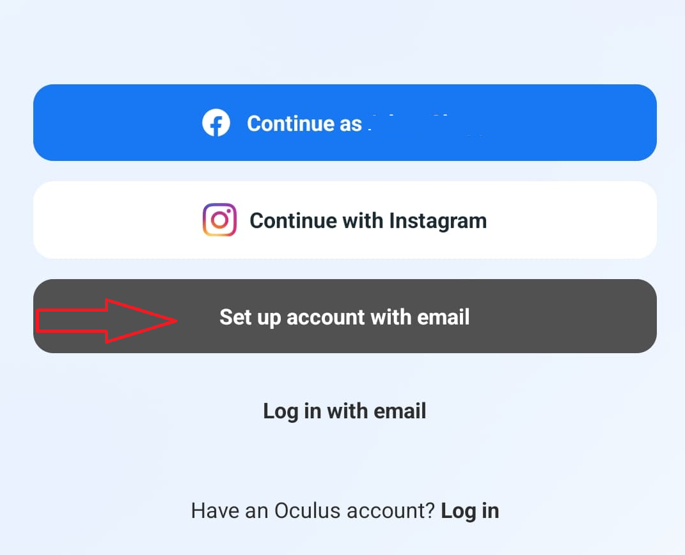
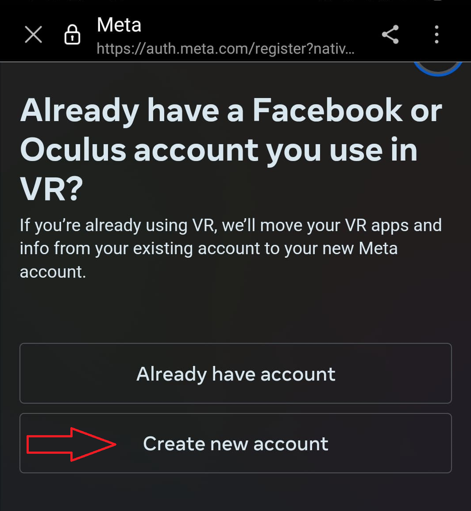
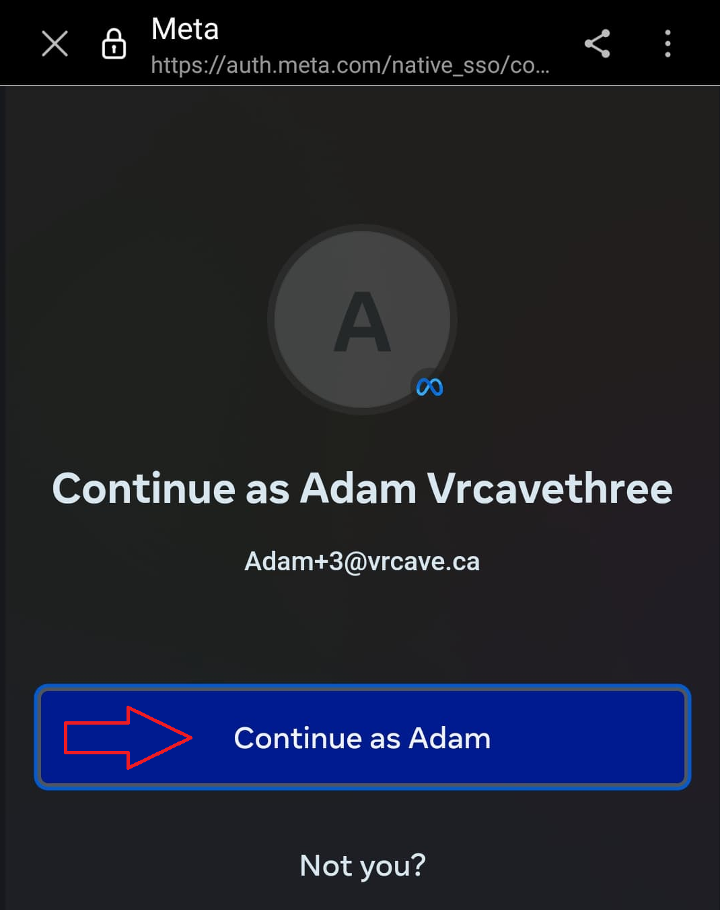
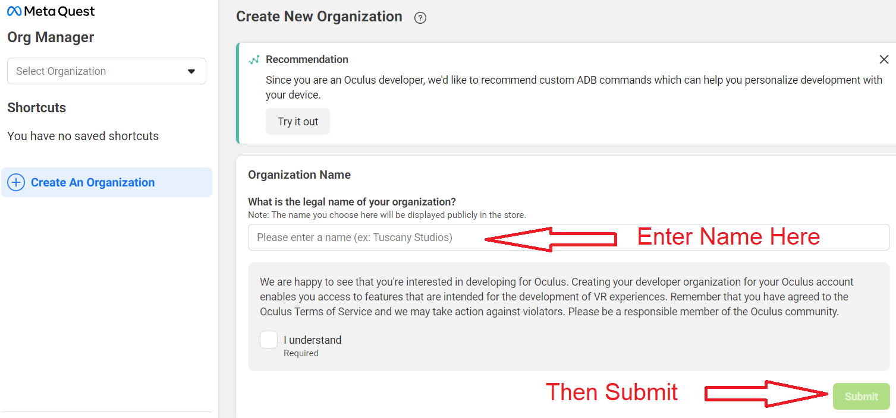
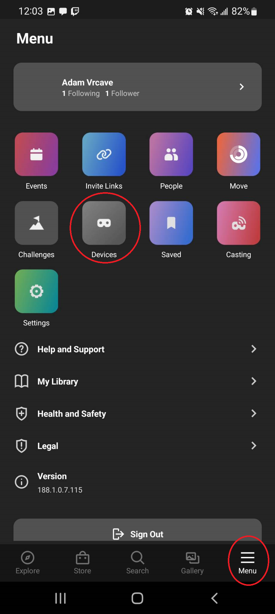
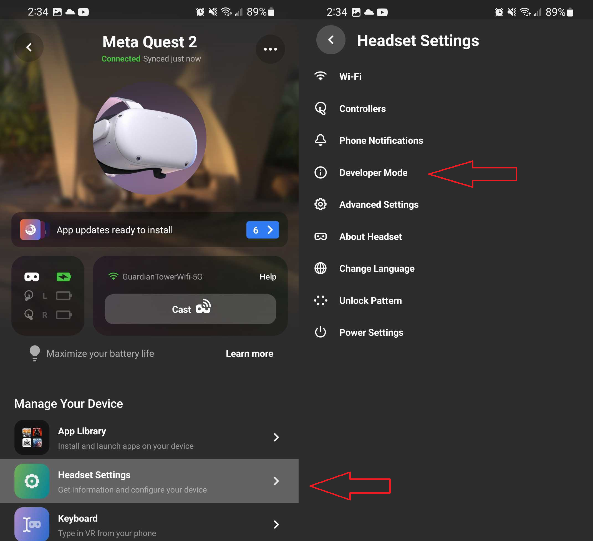
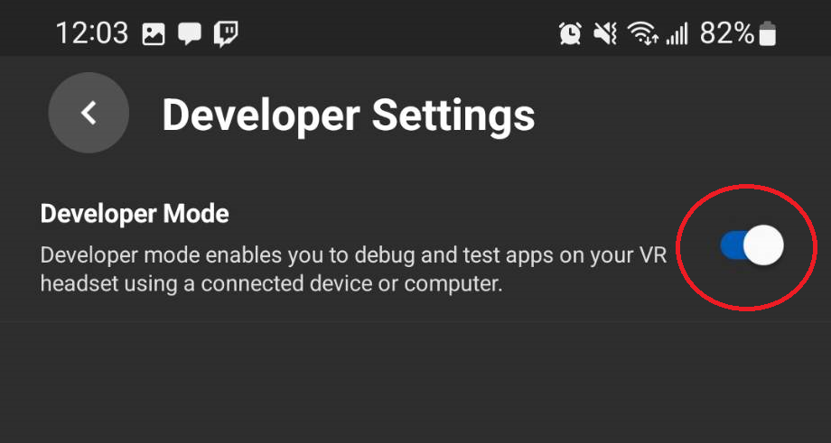
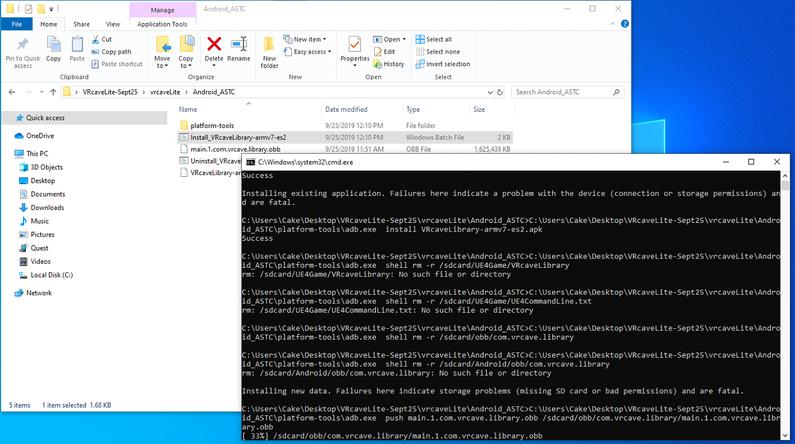

# Preparing for Sideloading 

Before installing the vrCAVE Lite demo, your Oculus Quest needs to be set up for sideloading. Follow the steps below to prepare for sideloading.

## Create a Meta Account

**If you have already set up your Quest headsets, then you can skip creating a Meta account and move on to Create a Developer Account.**

1. On the Oculus App, Choose **Set up account with email** If you are already logged in, then continue with that account.

	
	
2. The app should open a web browser, with another page asking if you want to use an existing account, choose **Create new account** 

	

3. Fill in the information for your account. 

	
4. When you are done, you will get a page that asks you to continue as (your new account). Choose continue and it should log you into the Oculus app as that account. 

	
	
5. From the app, you can begin the initialization of your headset. Follow the instructions in the headset to initialize. 

6. After the headset is initialized. Proceed with the instructions to create a developer account and turn on developer mode shown below. 

## Create a Developer Account 

To be allowed to sideload games onto an Oculus Quest, you will need a developer account which will allow any headset on your account to be set to developer mode. 

1. [Click here and Sign in to the Meta account you used to set up your Oculus Quest headsets.](https://developer.oculus.com/manage/organizations/create/) 

2. Once logged in, you will be prompted to enter an organization name, fill this out however you like, Organization name will not come up again. 

	

3. This is all that needs to be done for your account to allow you to enable Developer Mode on your Quest headsets

## Activate Developer Mode 

1. On the Oculus Phone app, navigate to the menu screen, then the devices screen

	

2. Select the headset from the list, and then touch the **Developer Mode** option in the headset settings section 

	

3. Enable Developer Mode 

	

## Installing (Sideloading) the VRcaveLibrary app on to your Quest
#### *PLEASE NOTE*
Your file path to the *vrcaveLite* software should to be free of any spaces. 
* **Bad:** *C:\Windows\Username with spaces\Desktop\Some folder with spaces\vrcaveLite*
* **Good:**  *C:\Windows\UsernameWithNoSpaces\Desktop\vrcaveLite*

Make sure your Quest is connected to your Windows PC via USB.

- Download and extract the `vrCAVELite-<version>.zip` from the provided link. Navigate into the **vrcaveLite\Android_ASTC\** folder and double-click on **Install_VRcaveLibrary-arm64.bat**. 

- The first time you sideload the software, you will need to put the headset on while plugged into the Windows PC Via USB and sellect **Allow** On the popup that appears. The popup should appear every time you connect via USB, but only needs to be allowed the first time. 

	

- It should take 2-3 minutes - if the install completes successfully, the window will close with no further feedback. Restart the Oculus Quest headset. 

