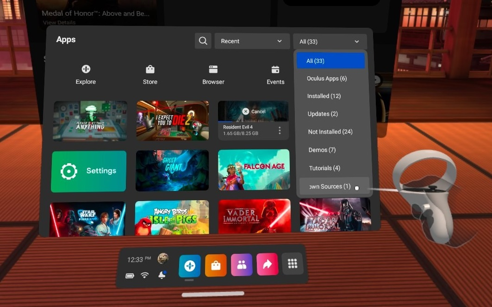
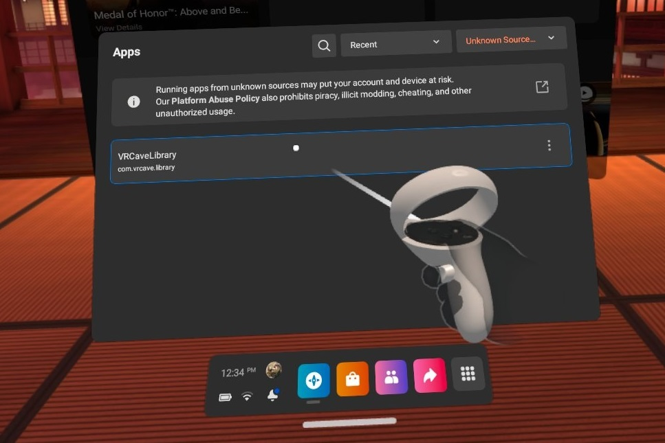
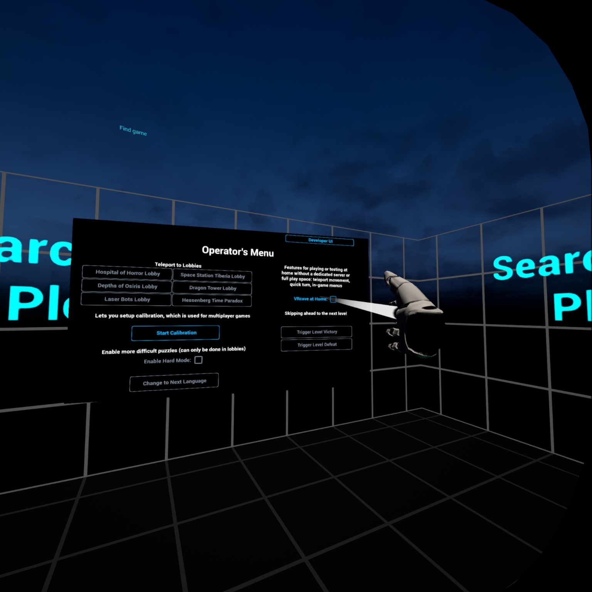
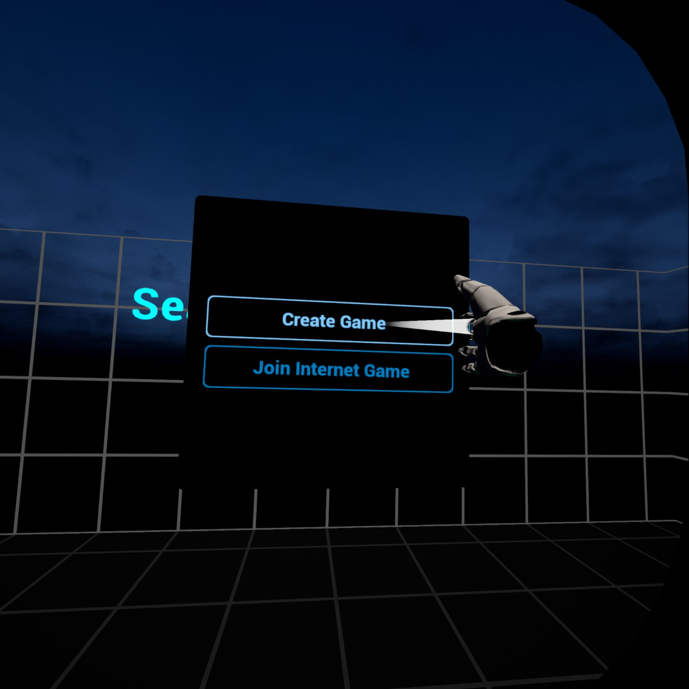
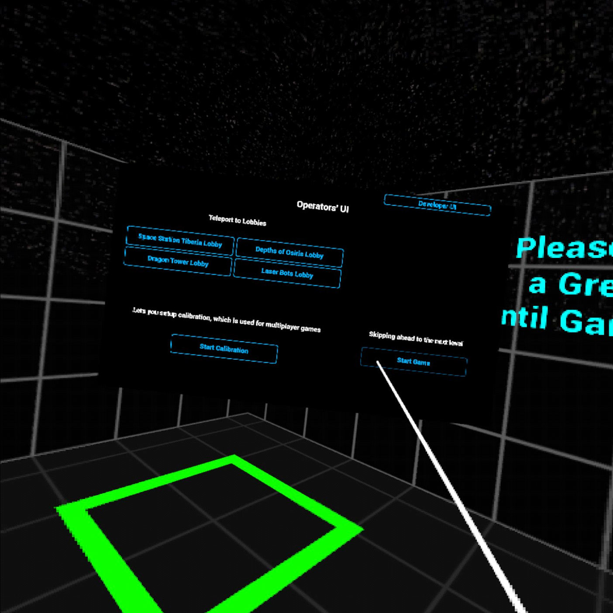
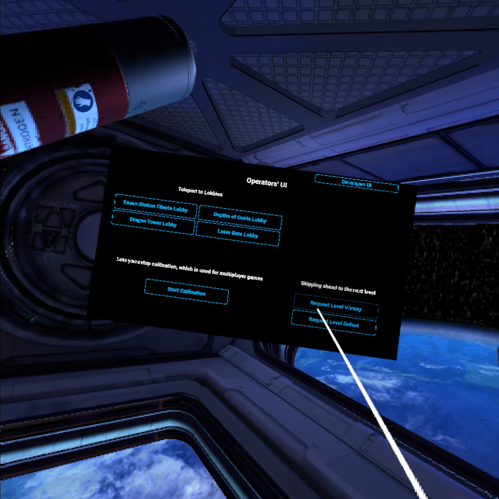

# vrCAVE Lite Single Player Setup

## Hardware Requirements
You’ll need an Oculus Quest, a Windows PC, and an iPhone or Android phone for running the Oculus app.

**NOTE: This is for demo purposes only**

First, Download the latest version of the vrcave library from the link given to you by vrcave

Once you have the vrcaveLite-x.x.x.zip folder downloaded, please follow these steps:

Unzip the folder to the **Desktop** of the computer you will be using to install the library on the Oculus Quests

## Preparation for Sideloading

Before installing the vrCAVE Lite demo, your Oculus Quest needs to be set up for sideloading. 

This will involve installing the Oculus app on an iPhone or Android phone, creating a developer account, enabling Developer mode on your Quest from the iPhone/Android app, and installing the ADB drivers on your Windows PC.

- [Follow the steps found here to prepare your headsets for sideloading](vrcave_Lite_Sideloading.md)

## Installing (Sideloading) the VRcaveLibrary app on to your Quest

Make sure your Quest is connected to your Windows PC via USB.

- Download and extract the `vrCAVELite-<version>.zip` from the provided link. Navigate into the **vrcaveLite\Android_ASTC\** folder and double-click on **Install_VRcaveLibrary-arm64.bat**. 

- The first time you sideload the software, you will need to put the headset on while plugged into the Windows PC Via USB and sellect **Allow** On the popup that appears. It should appear every time you connect via USB and try to install, but only needs to be allowed the first time. 

	

- It should take 2-3 minutes - if the install completes successfully, the window will close with no further feedback.

## Launching VRcaveLibrary on the Quest

In VR, from the main menu bar at the bottom of the screen, click on the **Navigate** tab, then the **Library** button. In the Library window, click on the **Unknown Sources** category on the left-hand panel. (If you don’t see **Unknown Sources**, you’ll need to reboot your headset - hold the power button on the right side of the headset for 3 seconds, then, in VR, click on the **Restart** button.)

In the **Unknown Sources** category, click on **VRcaveLibrary** to launch it.
	
	
	

## Navigating within VRcaveLibrary

In typical use, vrCAVE running on an Oculus Quest connects to a Windows PC running the vrCAVE Server, and the game operator controls all navigation (switching between escape rooms, launching the auto intro, etc.) from the server PC.

For this scenario of trying out vrCAVE demo on a Quest without a server PC, you’ll need to take some extra steps to select and launch the game from within VR, and skip through the rooms.

## Activating Single Player Mode

- First, to unlock the operator controls (which are not intended to be available to players), tap the following physical buttons on your Quest hand controllers: 

**A, B, B, A, X, Y, X**

- Next, press **X** to open the operator menu. From now on, you can close or open the operator menu with the **X** button.
- From here, point your right hand controller at the **VRcave at Home**, click the right trigger to activate it.
	
	
- A menu will appear in the lobby, close the operators menu by pressing **X** and select **Create Game** wait a few seconds: the screen will fade to black and you’ll be transported to the `Space Station Tiberia Lobby`.
	
	
	
## Playing Space Station Tiberia

- Press **X** again to reopen the operator menu.
- Point at **Start Game** and click on it with the right trigger
- You’ll be in the Observation Deck level. You can either try solving the puzzles as a player would, or to skip to the next level by pressing X and clicking on Request Level Victory
- Again, try solving the puzzles, or press **X** and click on **Request Level Victory** (or try **Request Level Failure** to see the bad ending). You’ll be taken back to the lobby level.

## Playing Depths of Osiris, Dragon Tower, and Laser Bots
	
- The remaining games can be tested in the same fashion: from the lobby press **X** to open the operator menu
- Click on one of the game lobby buttons
- Once the lobby loads, press **X** and click on **Start Game**
- Experiment with the puzzles in each room, and/or press **X** and click on **Request Level Victory** to skip ahead
