# vrCAVE Lite Tracking Best Practices

### Never taking a Quest headset outside play-space unless it is turned off:

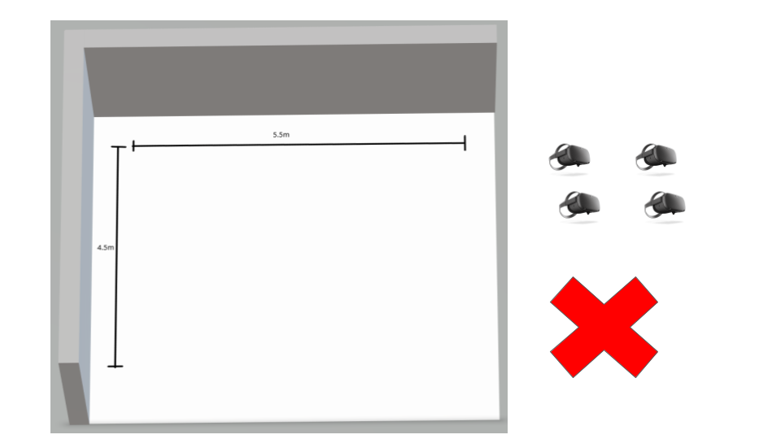

For some reason, if a Quest headset is ever outside the play space while powered on it seems to have more tracking issues *even after* it is brought back into the play-space again. We don't know exactly why this is happening, but it may have something to do with modifying/corrupting the Quest Software's internal room model.

**Advice:** We have had improved tracking accuracy by *never* allowing the quest headset to leave the Guardian Bounds. This means it should be powered-up in the play area, and shut-down in the play area. It can be difficult for employees to remember to not carry a powered Quest headset outside of the play-space boundaries. If it is done by accident, rebooting the headset (in the play-space) should make tracking a bit more reliable again. When we first prepare the headsets for a VR game with customers, we usually get the best results by leaving the Quest headsets on the floor of the play-space, pointing at a wall with lots of rigid details while we give instructions to the customers.

To maintain calibration, We recommend having your headsets stay in the guardian bounds. The best way to do this is to include your charging station in the guardian bounds so the headsets (in combination with an increased auto sleep timer) will stay connected to the server when not in use. Headsets that are not in the game can be hidden by unchecking them. 

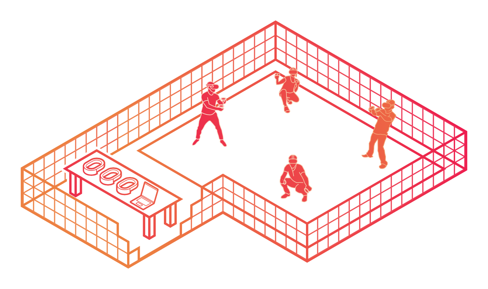
	
### Avoid moving large things like outdoor coats in and out of the room:

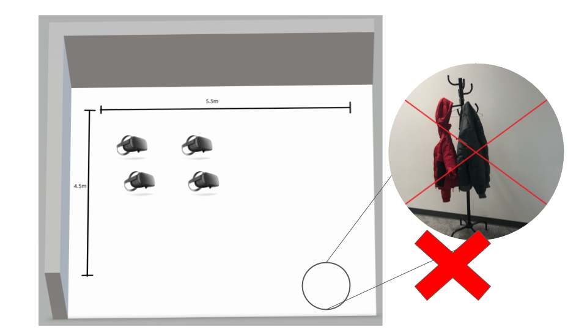

We have noticed that if the room has big visual changes in it since you created the guardian bounds, it can make the quest headset uncertain about its tracking environment. These changes can include: Adding or removing furniture, having certain doors open instead of closed. Moving posters or artwork around, having large coats or bags near the play-space. It is best to leave coats and bags far away from the room, and try not to move the furniture near the play-space.

**Advice:** If you make large visual changes to the room, it may be best to restart the headset, and re-draw new guardian bounds. Large personal objects like purses, backpacks, coats, and umbrellas should be kept far away from the play-area (ideally far enough so that the Quests can't see them) because they can confuse the Quest tracking. Any people inside the room should probably try to stay at least 1 meter away from the boundary of the play area, if possible (also safer for them). 

### Headsets Going to Sleep

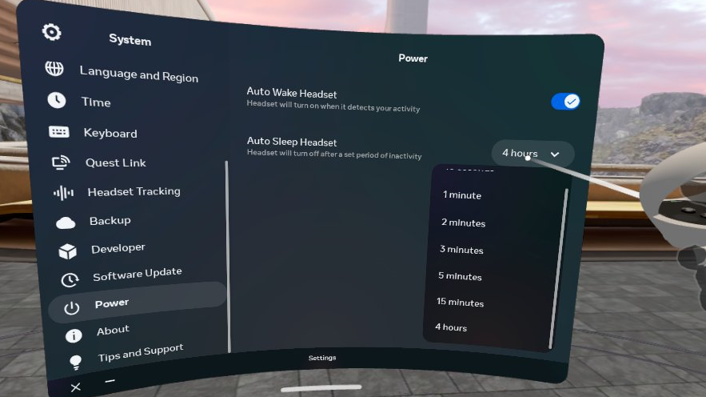

When a headset goes to sleep, they often require you to "Confirm the Guardian Bounds" and this can sometimes cause the calibration to get lost. 

**Advice:** Prevent the headsets from going to sleep when taken off the players head by changing the Auto Sleep Headset setting found in Settings->System->Power. This way the headsets will continue to track and stay in the server when not being worn. 

### Sunlight & Windows that look outside:

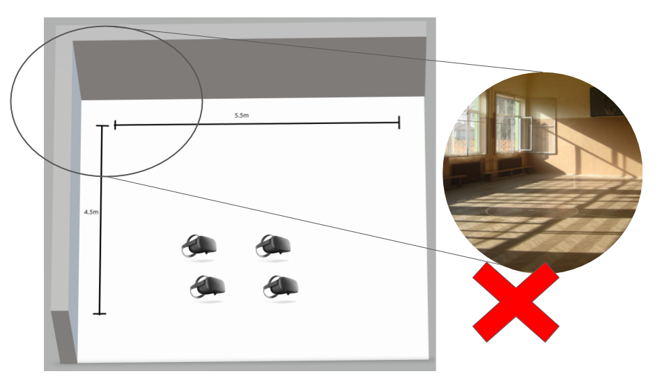

Windows that look outside can cause problems over time. If Oculus Quest guardian bounds are created when there is natural sunlight from outside, it may work well for a few hours, but the problem is that as the light fades (when day turns to evening, and then night) the Quest headset has difficulty recognizing the room or the windows because there is suddenly less light coming out of the windows at night.

**Advice:** Windows should be completely 100% blocked so that no natural light from outdoors can get into the room. Ideally, it is blocked by something thick and solid like a thick poster or artwork that never moves.

### Curtains, Drapes, move-able fabric

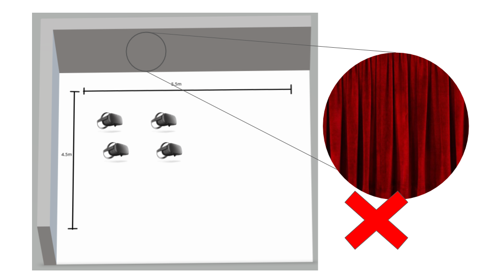

The Oculus Quest can only track rigid objects that never move like posters, artwork, tables, doors, window-frames, artwork. Flexible things like curtains or drapes can't be used by the quest for tracking, since curtains or drapes can sway and change shape. (due to a breeze, or accidentally being bumped by a player).

**Advice:** You can still have some curtains and drapes near the play area, but it should be understood that the Quest headsets can't track them, so there should always be something rigid nearby for the quest headset to use to track instead (like posters or artwork). Make sure any artwork is firmly attached to the wall, and won't sway in a breeze.

### Players often block Quest lenses with their hands

 The quest headsets have 4 lenses on the front facing corners of the headset. If the headset is not fitting well on the head (it is often too loose) people tend to hold one or both sides of the headset with their hands. This blocks the lenses and causes tracking failures.

 **Advice:** We usually have to remind customers to not touch the sides of their VR headsets. If they keep doing it in a game, usually the top head strap needs to be tighter.

_	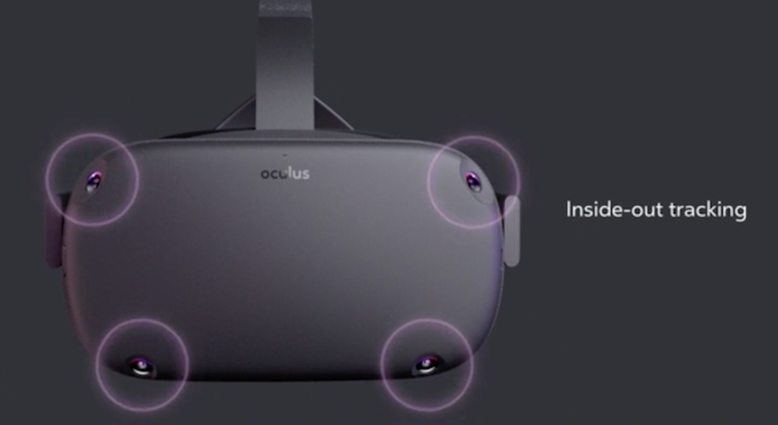

### Dirty tracking lenses
**Advice:** If the lenses are dirty or have too many fingerprints on them it can cause tracking issues. You can use a lens cloth to clean them.

### Lighting for Quest:

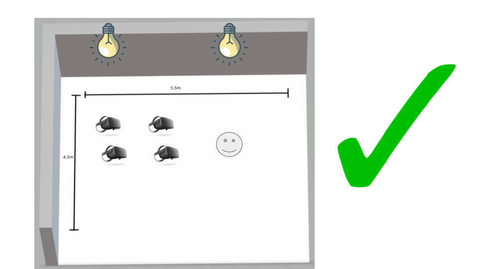

The Oculus Quest tracks best with very soft, consistent lighting in the room. Apparently, incandescent bulbs are the best (if you can find any) and LEDs are the worst. I have heard that LED lights can cause problems with the Oculus Quest because many of them they flicker 60 or 120 times per second like a strobe light (50 to 100 times per second in Europe). It is also important the the lighting doesn't change while the Quest headsets are powered on (i.e. always have the same amount of light while you are using the Quests).

**Advice:** Make sure the room is always the same brightness level when using the Quests, and try to avoid LED bulbs. you should also set the Oculus Quest 'Tracking Frequency' setting correctly for your region in the Device settings menu.

### Use Fiducial markers 

Sometimes your room is just too plain and you don't have any art, posters, or furniture to give one wall any type of distinction from the other, that is where Fiducial markers come in handy. The way they normally work is that software would know what the exact size of each square on the marker is, and is able to determine distance and rotation of the marker from camera input. our use of these are much simpler, they are a 6x6 grid of black and white squares in seemingly random order. this creates easily identifiable landmarks for the quest inside-out tracking. 

**Advice:** Print off these Fiducial markers and place them haphazardly in your room. I do mean haphazardly because a consistent placement on each wall could confuse the quests. each wall should look very different. 

-	[Download fiducial markers in PNG format](https://drive.google.com/drive/folders/1XNNQYsdU-wbNpcmlm5bfqt9JJG3s-ZTb?usp=sharing)
-	[Download fiducial markers in jpg format](https://drive.google.com/drive/folders/1JfFy14MAue73VsCbp2niQiJD-oUzkdWT?usp=sharing)

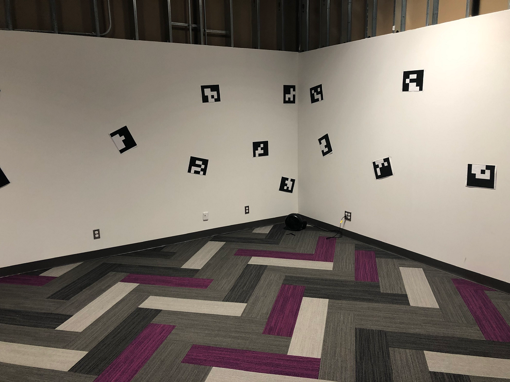

- Above is our current Quest testing space, and is an ideal tracking environment.

- Below is a tracking app that using a similar algorithm as the Oculus Quest and shows what kind of visual landmarks the Quest is using to keep track of where it is in the room.  

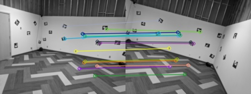

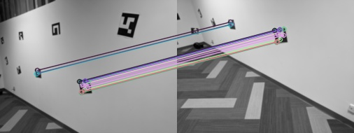

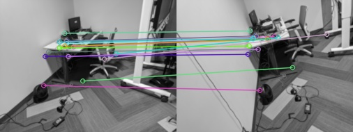

